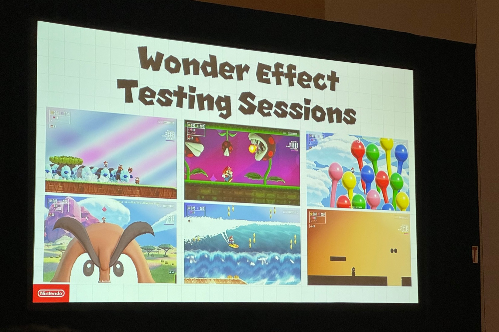

+++
title = "Pour Super Mario Bros. Wonder, Nintendo a dû faire le tri dans les idées les plus folles"
date = 2024-03-21T19:45:12+00:00
draft = false
author = "Mickael"
tags = ["Actu"]
+++

 

Durant la phase de prototypage de *Super Mario Bros. Wonder*, Shiro Mouri le directeur du jeu a [expliqué](https://www.wired.com/story/super-mario-bros-wonder-nintendo-switch-mouri-tezuka-interview/) que l’équipe de développement avait « *plus de 2 000 idées* » qu’il était évidemment impossible de toutes caser dans la cartouche. Il a donc fallu faire des choix et certaines n’ont pas forcément plu à tous les joueurs, mais ce qui est bien c’est que Nintendo a du stock pour un deuxième épisode, voire toute une saga.

À l’occasion de la Game Developers Conference (GDC), Shiro Mouri a dévoilé quelques unes de ces idées, dont certaines ont été poussées assez loin. C’était le cas de cet effet qui est finalement resté sur le carreau : une tête géante de Mario composée de carrés et qui devait avancer dans le niveau sans se faire dégommer par les ennemis !



Chris Kohler, présent à la conférence pour *Digital Eclipse*, a eu l’occasion de prendre [quelques photos](https://twitter.com/kobunheat/status/1770556415847125451) supplémentaires de ces idées un peu fofolles, comme ce niveau à pratiquer en surf, sur un monocycle, avec un hula-loop, sur des échasses, ou encore sous la forme d’une baie en évitant de se faire boulotter par des Yoshi. Allez Nintendo, un petit DLC ?