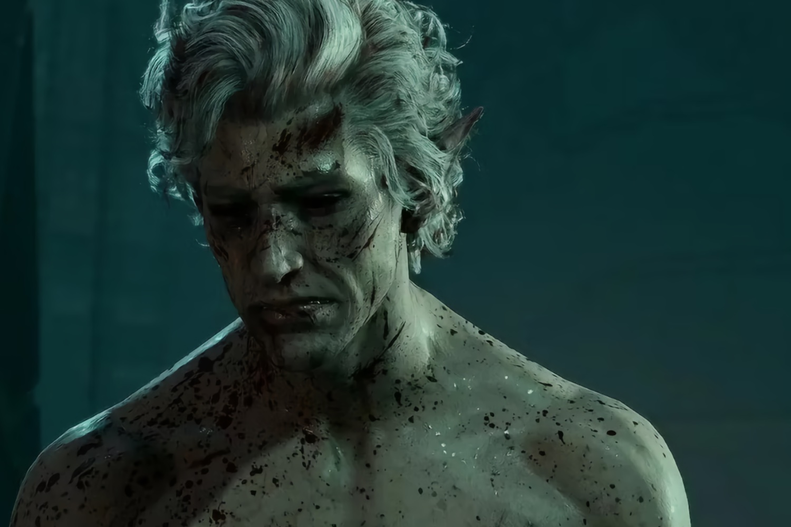
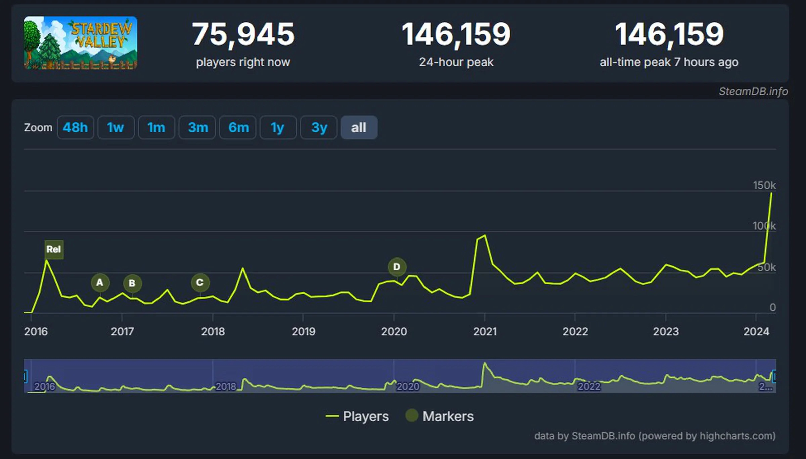
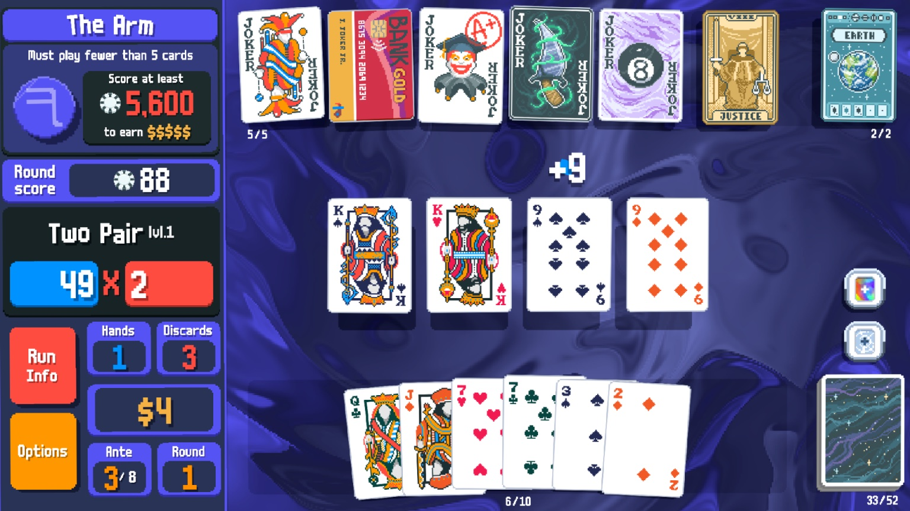

+++
title = "Tumultueuse, sexy, fatale : la folle semaine du jeu vidéo (23/03)"
date = 2024-03-23T10:29:12+00:00
draft = false
author = "Mickael"
tags = ["Actu"]
+++

L’actualité du jeu vidéo ne s’arrête pas aux articles certes sympathiques mais néanmoins sporadiques publiés sur *Nostick* ! Histoire de rattraper le retard accumulé, voici un retour rapide sur quelques unes des grosses (ou insignifiantes, n’est-ce pas Square Enix) infos de la semaine.

## Larian en a sa claque de Baldur’s Gate

Il n’y aura ni expansion, ni DLC de *Baldur’s Gate 3*, ni même de *Baldur’s Gate 4* chez Larian. Le studio belge, qui a rencontré un énorme succès l’an dernier avec le troisième volet des aventures situées dans l’univers de *Donjons et Dragons*, a déclaré qu’il en avait sa claque de D&D.

Le détenteur des droits du jeu de plateau, Wizards of the Coast, et son propriétaire Hasbro vont devoir se trouver un autre studio pour développer des jeux vidéo basés sur la licence (les deux premiers *Baldur’s Gate* ont été conçus par BioWare). S’il y a un *Baldur’s Gate 4*, ce qui ne fait aucun doute, ce n’est pas Larian qui s’en chargera.

Swen Vincke, le fondateur du studio, a [annoncé](https://nordic.ign.com/duplicate-baldurs-gate-3/80283/news/larian-studios-wont-make-baldurs-gate-3-dlc-expansions-or-baldurs-gate-4) pendant une conférence à la GDC que Larian allait se concentrer sur autre chose et ça ne sera pas *Divinity: Original Sin 3*. On adorerait voir le développeur se coltiner à un jeu de science-fiction !

## Konami fait mariner Solid Snake

Konami n’est pas encore sûr de valider une *Metal Gear Solid: Master Collection Vol. 2*. La première édition de cette compil’ comprend les hits increvables de Hideo Kojima (*Metal Gear Solid*, *Metal Gear Solid 2: Sons of Liberty* et *Metal Gear Solid 3: Snake Eater*), quelques vieilleries MSX2 et NES, et des goodies, le tout dans un paquet mal fagoté et bordélique… et, pire encore, avec des bugs.

 

Avec un score de [60 %](https://opencritic.com/game/15162/metal-gear-solid-master-collection-vol-1) sur OpenCritic, le premier volet n’a guère convaincu. Mais il n’empêche qu’il reste encore quelques jeux Metal Gear dans la nature, à l’instar de  *MGS4: Guns of the Patriots*, *MGS: Peace Walker* ou encore *MGSV: The Phantom Pain*. Le producteur Noriaki Okamura n’a pas voulu donner trop d’espoir à un fan lors d’une séance de questions/réponses, en [affirmant](https://youtu.be/IzHiVn1g6jA) que rien n’avait été décidé concernant le volume 2 de la collection.

Il parait évident que malgré ses défauts, le premier volume a certainement dû bien se vendre, le tout sans un gros investissement de la part de l’éditeur. Et qui sait, peut-être que Konami fera son boulot pour une fois et que ce Vol. 2 corrigera les défauts de la première collection.

## Smash a toujours de l’esprit

Cinq ans après son lancement, *Super Smash Bros. Ultimate* continue de recevoir des mises à jour et du contenu pour les fans hardcore du jeu de baston de Nintendo. L’éditeur leur [propose](https://twitter.com/SmashBrosJP/status/1770254177543033156) de batailler contre des esprits tirés de *Super Mario Bros. Wonder* et de *Princess Peach: Showtime*, et ce pendant encore quelques jours.

Il y avait eu ces dernières semaines des esprits provenant *Splatoon* ou encore *Xenoblade Chronicles*. Mais malheureusement, pas de nouveaux combattants en DLC ni de stages supplémentaires. Nintendo a peut-être loupé le coche ici, en ne voulant pas transformer Smash en jeu service ou, moins insultant, en un équivalent de *Mario Kart* pour la bagarre. On se rattrapera en achetant l'amiibo de Sora, le dernier et ultime pour compléter la collection.

## Stardew Valley récolte de nouveaux lauriers

Malgré son grand âge (plus de 8 ans au compteur !), *Stardew Valley* continue à rameuter les foules. À l’occasion de la sortie de la version 1.6 du jeu de farming, le titre a [dépassé](https://steamdb.info/app/413150/charts/#48h) les 146 000 joueurs en simultané sur Steam, battant son précédent record (95 000 en janvier 2021) ; c’était même tout simplement le jeu le plus populaire sur la plateforme, devant des poids lourds comme *Palworld*. Chapeau !

Cette grosse mise à jour comprend tout un tas de [nouveautés](https://www.stardewvalley.net/stardew-valley-1-6-update-full-changelog/) au niveau du contenu (sérieusement, il y en a trop pour les résumer) et des améliorations dans tous les sens.

## Square Enix toujours plus loin dans le Web3

S’il ne devait en rester qu’un (studio qui croit encore aux conneries de NFT et au mirage du Web3), c’est bien Square Enix. Pour une raison qui nous échappera toujours, l’éditeur de *Final Fantasy* s’est lancé comme un beau diable dans ce domaine passé de mode. L’entreprise a [mis des billes](https://www.pocketgamer.biz/deal/83656/square-enix-steps-further-into-web3-and-nft-gaming-with-hyperplay-investment/) dans HyperPlay, une espèce de plateforme Web3 qui vend du vent virtuel aux gogos.

Square Enix compte y distribuer SYMBIOGENESIS, une « expérience artistique numérique » centrée sur la propriété ~~de JPG~~ de tokens non fongibles moches. Du pognon jeté par les fenêtres mais que voulez-vous, la boîte a visiblement quelque chose à prouver.

## Le million pour Balatro !

En route vers son titre de jeu de l’année (cherchez pas, c’est lui), *Balatro* a déjà [dépassé](https://playstack.com/indie-sensation-balatro-sells-one-million-copies-in-one-month/) le million de copies vendues ! Le développeur LocalThunk, qui a conçu en solo le désormais fameux jeu de cartes ultraddictif — ça se dit je suis sûr —, et son éditeur Playstack sont bien sûr ravis de ce succès.

Et c’est évidemment loin d’être terminé, puisque des versions mobiles sont dans les tuyaux… pour le plus grand malheur de la productivité mondiale qui va piquer du nez cette année.