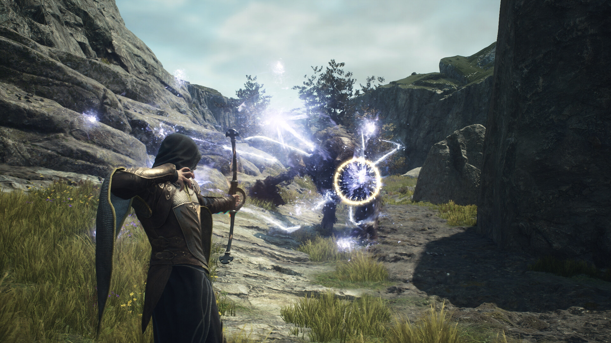

+++
title = "Les sorties de la semaine (24/03)"
date = 2024-03-23T14:47:32+01:00
draft = false
author = "Félix"
tags = ["C’est dispo"]
+++

**Entre le boulot, les courses et le sèche-linge qui rend l’âme, vous n’avez peut-être pas eu le temps de vous intéresser aux nouveautés du moment. Qu’à cela ne tienne : voici les sorties de ces derniers jours qui ont retenu notre attention.**

## Tout seul dans le noir : Reloaded

Avec un peu de retard sur le planning initial, le moyennement attendu remake d’***Alone in the dark*** est enfin disponible sur PC et consoles. Si comme moi ce nom ne vous évoque qu’[un jeu pas fou-fou](https://store.steampowered.com/app/259170/Alone_in_the_Dark_2008/) de 2008 et [un film d’Uwe Bowl](https://www.youtube.com/watch?v=qX1sQeJd9Mo), vous ne vous êtes sans doute pas jeté dessus. Et vous avez bien raison tant cette révision ne rend visiblement pas honneur au jeu d’origine. Les premiers retours sont très mitigés, certains louant une ambiance horrifique sympa malgré des combats très moyens et des puzzles oubliables. Quelques bugs viennent dégrader l’expérience tandis que le twist de fin est vu et revu : rien qui ne méritait vraiment d’aller déterrer la licence. 60 balles [sur PC](https://store.steampowered.com/app/1310410/Alone_in_the_Dark/), mais ça sera aussi très bien à 5 € sur Steam dans quelques années.

## À l’Ouest, rien de nouveau

La « Complete Edition » d’***Horizon Forbidden West*** est désormais disponible sur PC. Cette exclu PS5 sortie en 2022 propose d’incarner une chasseuse dans un monde post-apo qui a le mérite d’être original étant donné qu’il mélange maxi-robots et végétation luxuriante. Côté gameplay, c’est de l’open world avec pas mal de combats qui devrait vous occuper une trentaine d’heures. Pas trop ma came mais faut admettre que ça a l’air joli, et les critiques très positives de la presse donnent envie. Le portage PC est décrit comme « *une masterclass des studios Sony* » par l’utilisateur Striker dans les review Steam : si avec ça vous n’êtes pas en train de dégainer la CB, je ne sais pas ce qu’il vous faut. Rappelons que la version PC arrive directement avec l'extension Burning Shores, ce qui fait que le tarif de 60 € [sur Steam](https://store.steampowered.com/app/2420110/Horizon_Forbidden_West_Complete_Edition/?snr=1_1056_4_franchise_1059&curator_clanid=40425349) ne me semble pas si abusé.



## Capcom toujours dans les bons couts

Départ en catastrophe pour ***Dragon’s Dogma 2***, le nouveau RPG  de Capcom qui se fait actuellement *review-bomber* sévèrement par une horde de joueurs en colère. Le titre est sorti dans un état technique moyen-moyen, avec un seul emplacement de sauvegarde (en 2024, sérieux) en plus de différents plantages et autres chutes de FPS. Le jeu a surtout déçu par la présence de microtransactions permettant d’acquérir différents items très chers dans le jeu : on peut ainsi mettre la main à la poche pour modifier l’apparence de son perso ou obtenir un *fast travel* plus rapide. Payer pour tricher dans un jeu solo, bon. Malgré le mauvais accueil des clients et un désormais traditionnel [communiqué d’excuse](https://www.ign.com/articles/capcom-addresses-dragons-dogma-2-steam-backlash-we-sincerely-apologize-for-any-inconvenience), le jeu fait un carton avec plus de 180 000 joueurs en simultané lors du lancement. Les premiers tests sont positifs, alors pourquoi pas si vous êtes fans de RPG avec des dragons, des combats d’épées et tout le bordel. 65 € [sur Steam](https://store.steampowered.com/app/2054970/Dragons_Dogma_2/), 10 € de plus sur consoles.

## La saison des pêches

La grosse sortie de la semaine chez Nintendo c’était évidemment ***Princess Peach: Showtime!*** : un jeu très accessible dans lequel Peach peut se déguiser afin de changer le style de jeu. Les retours sont majoritairement positifs, évoquant une ambiance soignée et un level design bien fichu. Les quelques critiques mentionnent surtout une partie technique pas terrible et un gameplay qui a tendance à être parfois un peu répétitif. Ça devrait faire le taf pour les plus jeunes, d’autant plus qu’une démo est disponible sur le Nintendo Store. Le jeu complet [coûte 60 €](https://www.nintendo.fr/Jeux/Jeux-Nintendo-Switch/Princess-Peach-Showtime--2444445.html).