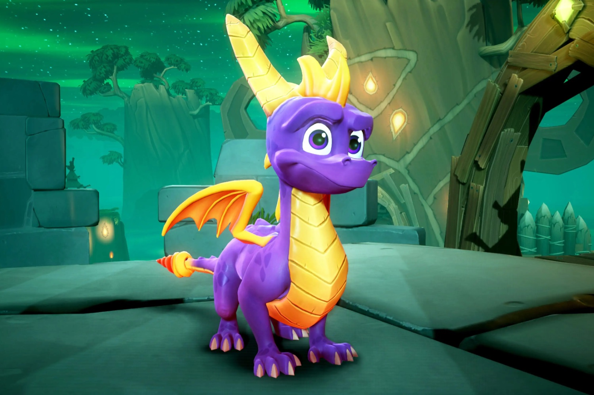

+++
title = "Désormais indé, le studio de Spyro et Crash Bandicoot publiera son nouveau jeu chez Xbox"
date = 2024-03-24T05:23:12+00:00
draft = false
author = "Mickael"
tags = ["Actu"]
image = "https://nostick.fr/articles/2024/mars/2403_spyrothedragon/spyro.jpg"
+++ 

En signant un gros chèque de plus de 70 milliards de dollars, Microsoft s’est offert les services d’Activision Blizzard King, mais l’opération a aussi donné une porte de sortie à des studios précédemment acquis par l’éditeur. Une opportunité saisie par Toys for Bob, qui a beaucoup travaillé sur Spyro[^1] et développé l’épisode 4 de *Crash Bandicoot* et *Skylanders*…

Avec la pandémie, Toys for Bob a muté en studio support pour *Call of Duty*. Une position confortable — travailler sur *Callof*, c’est l’assurance d’avoir du taf pendant des années et des années — mais aussi très limitée d’un point de vue créatif. C’est pourquoi l’indépendance du studio, [annoncée](https://www.toysforbob.com/blog/2024/WereGoingIndie) fin février, a fait naître (ou renaître) bien des espoirs chez les fans de Spyro et de Crash qui n’en peuvent plus d’attendre des nouvelles de leur héros préféré.

L’avenir de Toys for Bob semble assuré… toujours chez Microsoft ! Lors d’une réunion relatée par *[Windows Central](https://www.windowscentral.com/gaming/xbox/exclusive-xbox-has-reached-an-agreement-with-toys-for-bob-for-their-first-independent-game)*, Matt Booty le patron de la division contenus Xbox a ainsi révélé qu’un accord avait été trouvé avec le studio pour publier leur premier jeu. Le dirigeant n’a pas voulu préciser de quel jeu il s’agirait, néanmoins il a laissé entendre que ce serait « *similaire à ce que Toys for Bob faisait dans le passé* ». Plutôt un jeu de plateformes 3D qu’un FPS,  du coup !

Spyro vient immédiatement à l’esprit, mais il faut savoir que la propriété intellectuelle du dragon rigolo est entre les mains de Microsoft. Il s’agira peut-être d’une toute nouvelle IP… ou d’un nouvel épisode de *Banjo Kazooie* : Toys for Bob semble avoir les épaules pour ça ! En décembre dernier, Phil Spencer le grand manitou de Xbox, avait [adressé](https://www.windowscentral.com/gaming/phil-spencer-jez-corden-xbox-interview-2023) un gros clin d’œil envers la communauté de cette franchise criminellement délaissée.

[^1]: *Spyro the Dragon*, le premier jeu de la franchise sorti en 1998, a été développé par Insomniac Games pour le compte de la PlayStation. Le studio a été racheté par Sony et est devenu un pivot majeur de la plateforme avec *Spider-Man*. Toys for Bob a développé la compil’ *Spyro Reignited Trilogy* en 2018.