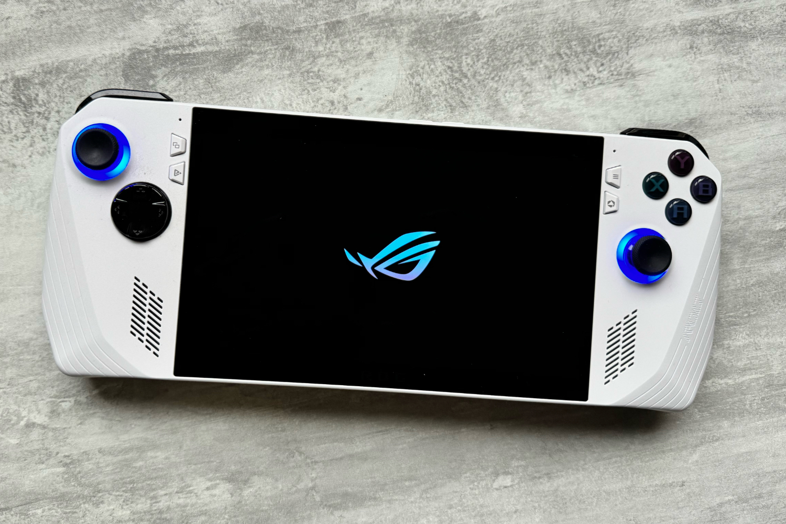

+++
title = "Chez Microsoft : une console PC, un logiciel Xbox optimisé, ou les deux ?"
date = 2024-03-25T18:03:12+00:00
draft = false
author = "Mickael"
tags = ["Actu"]
image = "https://nostick.fr/articles/2024/mars/2503_xboxconsole/ROG_Ally.jpg"
+++ 

La future console PC aux couleurs de la Xbox sera-t-elle réellement une console PC ou un simple logiciel Xbox adapté aux petits écrans ? Phil Spencer, le grand patron de la division gaming chez Microsoft, continue à faire planer le doute tout en instillant l'idée que les deux pourraient être possible.

Ce n'est un secret pour personne, Microsoft s'intéresse de très près au marché des consoles PC depuis le lancement du Steam Deck chez Valve début 2022. Et pour cause : l'appareil est capable de faire rouler — et plutôt bien — des jeux PC. Devant le succès de la console, la concurrence n'a pas traîné chez Asus (ROG Ally), Lenovo (Legion Go) et quelques autres.

Mais si le Steam Dock est parfaitement calibré pour le jeu vidéo  avec son système d'exploitation SteamOS et son interface, ce n'est pas le cas des rivaux qui fonctionnent sous Windows, dont la polyvalence dessert les consoles. Il n'y a rien de plus pénible que de plisser les yeux pour essayer de viser une icône ou un menu… 

C'est là que Microsoft entre en jeu. L'éditeur a toutes les cartes en main pour adapter l'application Xbox — fenêtre d'entrée privilégiée vers les jeux de la boutique Xbox bien sûr, mais aussi du Game Pass — à ces écrans de 7 ou 8 pouces. « *Je veux être capable de démarrer sur l'app Xbox en plein écran, mais dans un mode compact* », a décrit Phil Spencer à *[Polygon](https://www.polygon.com/24108660/xbox-handheld-console-phil-spencer-interview)*.

Une récente  mise à jour permet déjà de réduire le panneau latéral de l'application pour les petits écrans, mais on est encore très loin du compte. « *Je dirais que quand je joue sur ces appareils, cela ressemble plus à une console qu'à un PC, neuf fois sur dix* », raconte le dirigeant. « *Les choses qui me frustrent habituellement sont davantage liées à Windows qu'à l'appareil en lui-même. C'est un domaine dont je me sens en partie responsable. Par exemple, je veux pouvoir me connecter [à mon compte] avec la manette [de ces consoles]* ».

Phil Spencer, qui a une « *liste de choses que nous devrions faire* », ne s'arrête pas là. Il confirme que Microsoft planche bien sur « *différents designs* » d'appareils et « *d'autres choses que nous pourrions faire* » qui permettraient de rameuter de nouveaux joueurs. Il ne fait pourtant aucune annonce même si on sent bien que ça le titille.

Rien n'interdit de penser que Xbox planche sur une console à part entière *et* sur un logiciel Xbox adapté aux consoles existantes. Le marché semble de toute manière à même d'absorber plusieurs appareils du même tonneau : les capacités techniques des consoles PC sont telles qu'il est presque aussi agréable de jouer sur ces appareils que devant son PC ou sa télé. Et grâce à ces consoles, on peut jouer en tout temps, n'importe quand.

 