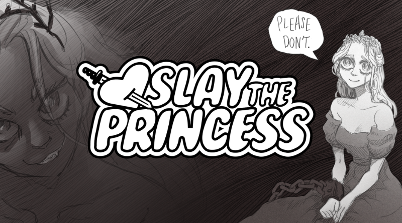

+++
title = "Ça va couper, chérie"
date = 2024-03-25T21:47:32+01:00
draft = false
author = "Félix"
tags = ["Actu"]
+++ 

On va pas se mentir : je n’ai pas spécialement accroché à *Slay the princess*, un visual-novel horrifique expérimental dans lequel votre seul objectif est, eh bien, de slayer la princesse. Malgré son idée de départ sympa proche de *[The Stanley Parable](https://store.steampowered.com/app/1703340/The_Stanley_Parable_Ultra_Deluxe/)* et ses graphismes originaux, le discours méta m’a laissé de marbre ce qui fait que j’ai assez vite décroché. J’en suis le premier désolé, et j’ai l’impression d’être passé à côté d’une belle expérience tant les critiques sont dithyrambiques dans la presse comme chez les joueurs (90% chez Metacritic tout de même).

Enfin bref, *Slay the princess* a reçu aujourd’hui une grosse mise à jour. On nous annonce « *environ 3 000 mots de nouveau contenu* » se concentrant sur la fin du jeu, ce qui amène donc tout un tas de scènes exclusives et autres embranchements. La BO a été bonifiée avec des interprétations orchestrales de certains morceaux, tandis que les fans acharnés pourront désormais revenir sur d’anciennes builds. C’est donc le bon moment pour acheter *Slay the princess* si le concept vous intriguait, d’autant plus que le jeu est actuellement à son prix le plus bas avec [-20 % sur Steam](https://store.steampowered.com/app/1989270/Slay_the_Princess/) (14 €). On nous promet qu’une autre grosse update allongeant le jeu d’environ 25 % sera déployée dans l’année : aucune honte à le laisser maturer quelques mois au fond de votre backlog.

