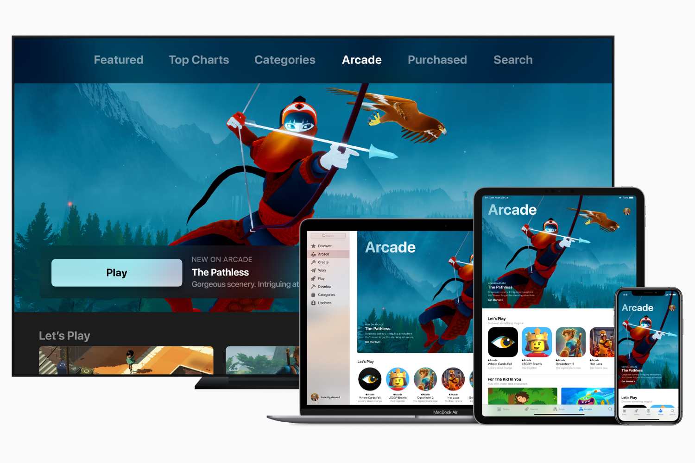

+++
title = "Cinq ans d'Apple Arcade : l'âge bête ou l'âge de raison ?"
date = 2024-03-26T11:03:12+00:00
draft = false
author = "Mickael"
tags = ["XXL"]
+++

**iOS est devenu par défaut la plus grande plateforme de jeux au monde, sans qu'Apple ait eu besoin de forcer son talent (historiquement médiocre dès qu'on parle de jeu vidéo). En 2019 pourtant, quelque chose s'est passé avec la présentation d'Apple Arcade qui aurait pu devenir cette étoile brillante au firmament de la nuit sombre qu'est devenu le jeu mobile. Que s'est-il passé pour que ça ne soit pas le cas ?**

La direction d'Apple gagnerait certainement à avoir un ou deux passionnés de jeux vidéo dans son organigramme, cela permettrait peut-être au constructeur de ne pas considérer le secteur uniquement comme une manne à commission. Malheureusement, ce n'est pas le cas et même quand Apple essaie quelque chose qui pourrait être sympa — à l'image d'Apple Arcade —, ça finit immanquablement par tomber plus ou moins à plat.

Apple Arcade a fait partie de ces fameux services dévoilés il y a cinq ans, le 25 mars 2019, durant un keynote où Tim Cook a  présenté Apple TV+, Apple News+, Apple Card et d'autres que j'oublie certainement. Un lever de rideau en fanfare avec des vedettes et des paillettes, et aussi beaucoup d'ambition pour chacun des services qui seront lancés quelques mois plus tard (le 19 septembre pour Apple Arcade).

## Une oasis pour le jeu mobile

Comme à son habitude, Apple en a fait des caisses. On allait bien voir ce qu'on allait voir ! Le constructeur a travaillé avec « *certains des plus innovants développeurs de jeux dans le monde* » pour offrir aux abonnés une centaine de titres exclusifs jouables sur iPhone, iPad, Apple TV et Mac — le tout sans publicité ni achats intégrés.

Sur le papier, l'offre est royale : pour 4,99 € par mois, qui ne sauterait pas sur l'occasion de se débarrasser enfin de ces jeux mobiles débilitants qui font les poches des joueurs tout en faisant du recel de données confidentielles ? Et au vu du panel de développeurs et de studios annoncés, il y avait tout lieu de croire au succès de l'opération. *Beyond a Steel Sky*, *Sonic Racing*, *Oceanhorn 2*, *The Pathless*, *Skate City*, *Shantae and the Seven Sirens*, *ChuChu Rocket!*, des titres signés Ubisoft, Sega, Square Enix, Devolver, Bandai Namco, Snowman, Annapurna, 2K…

 

Apple réussit même à obtenir de belles exclusivités, è l'image de *Fantasian*, un jeu de rôle produit et écrit par Hironobu Sakaguchi, le créateur de *Final Fantasy*. Un cocktail plutôt rafraîchissant de jeux indépendants et ambitieux, mélangés avec d'autres davantage destinés aux familles et aux minots. Il y avait de quoi être intrigué et même, pourquoi pas, séduit.

## Le pivot de l'engagement

Cinq années plus tard, que reste-t-il d'Apple Arcade ? Tout d'abord, un catalogue : le compteur a dépassé les 200 jeux. Toujours sans pubs ni achats in-app. Pour le reste, la stratégie a dévié de sa route. Les appels du pied auprès des indés se font beaucoup moins nombreux ; en avril 2021, Apple amorce un virage avec l'introduction de « classiques » — des jeux de plateau, des sudokus, des jeux de cartes — et de « légendes », autrement dit des jeux mobiles qui se paient une deuxième jeunesse à moindre frais.

Apple Arcade continue de financer le développement de jeux originaux, mais c'est beaucoup plus sporadique. Le constructeur a aussi annulé dans la foulée de nombreux projets, comme l'a raconté le site *[MobileGamer](https://mobilegamer.biz/inside-apple-arcade-axed-games-declining-payouts-disillusioned-studios-and-an-uncertain-future/)*, et fait bien des mécontents chez les studios. Le service est désormais clairement orienté vers les jeux familiaux connectés à des univers connus comme Hello Kitty.  Pas ou peu de prise de risques.

Il arrive encore à Apple Arcade de faire des coups, à l'image de *Pocket Card Jockey* de Game Freak (les développeurs des jeux Pokémon), adapté du jeu sorti sur 3DS à l'époque. Mais l'accent est clairement mis sur la rétention et l'engagement ; les titres plus courts, qui racontent une histoire ou qui nécessitent un effort de la part du joueur — ce qui faisait tout le sel d'Apple Arcade à ses débuts — ne sont plus la priorité du service. Dommage : ils ne sont pas non plus les bienvenus dans l'App Store, paradis des attrape-gogos ne cédant aucune place aux jeux plus fragiles.

Apple Arcade pouvait-il réellement se rêver en une sorte de « HBO du jeu mobile » ? On ne joue pas sur son iPhone comme on joue avec une console ou un PC, les sessions sont plus courtes, on prête peut-être moins d'attention à ce qui se passe sur l'écran… Les raisons sont multiples à ce changement de stratégie, et certaines peuvent même s'entendre du point de vue d'Apple. Moins du côté des développeurs, qui avaient probablement espéré qu'Apple Arcade allait leur donner les moyens de concevoir les jeux ambitieux dont ils rêvaient. Mais le Père Noël n'existe pas, surtout quand il a la tête de Tim Cook.

## Netflix en embuscade

L'histoire aurait pu s'arrêter là, mais un autre acteur s'est lancé sur ce même créneau : Netflix, qui a dévoilé son propre service de jeux sur abonnement fin 2021. Des titres très modestes pour commencer, et même franchement pas géniaux, mais le service de streaming a les moyens de son ambition et surtout, une feuille de route qu'il semble respecter.

Le catalogue ne cesse de s'étoffer avec de sacrés clients comme *Monument Valley*, *Twelve Minutes*, *TMNT: Shredder's Revenge*, *Hades*, ou encore rien moins que la trilogie *GTA* adaptée aux écrans mobiles. Netflix a aussi cassé la tirelire pour acheter des studios, à l'image de Night School (*Oxenfree II: Lost Signals*), et même pour en créer ex nihilo.

La plateforme mise sur un mix entre jeux originaux, classiques et titres adaptés de ses programmes vedettes. Difficile de dire si le succès est au rendez-vous, néanmoins Netflix cherche d'abord et avant tout à créer une offre alternative pour que ses abonnés restent dans l'écosystème — ce n'est pas une fin en soi. Cette concurrence nouvelle aurait même forcé Apple à reconsidérer, une fois encore, la stratégie d'Apple Arcade, toujours selon *MobileGamer*.

Alors verra-t-on un nouveau pivot d'Apple Arcade dans les prochains mois ? Si Netflix continue d'améliorer son offre et à sortir quelques gros lapins de son chapeau, ça n'a rien d'impossible. Au bénéfice des développeurs et des joueurs.