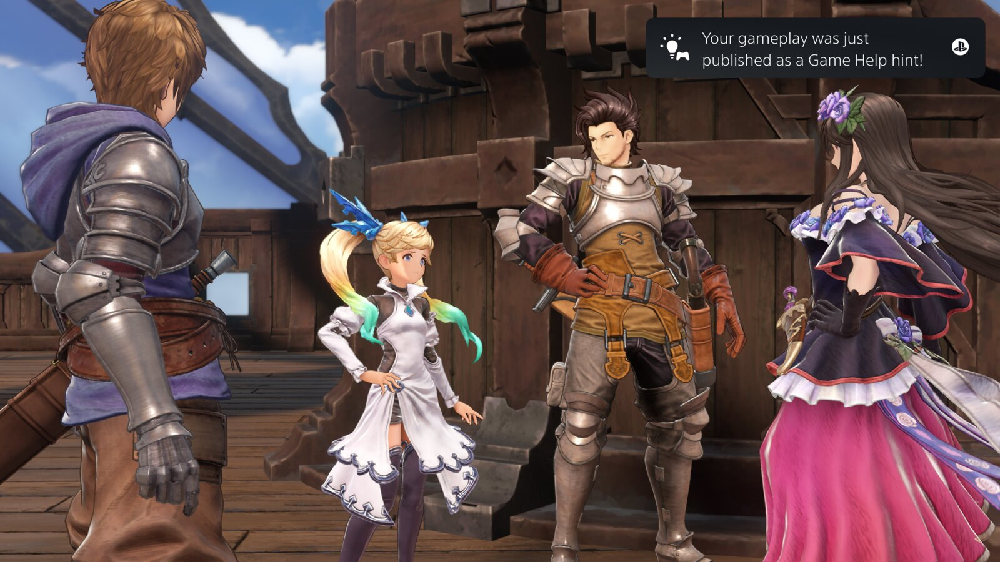

+++
title = "Plus besoin de chercher des vidéos walkthrough sur YouTube grâce à la PS5"
date = 2024-03-26T18:47:32+01:00
draft = false
author = "Félix"
tags = ["Actu"]
+++

Sony va gâter les propriétaires de PS5 avec [une nouvelle option](https://blog.fr.playstation.com/2024/03/26/decouvrez-laide-au-jeu-communautaire-une-nouvelle-amelioration-de-laide-au-jeu-alimentee-par-du-contenu-genere-par-les-utilisateurs/) d’aide de jeu améliorée. La console propose depuis son lancement un système d’indice affichant des conseils des développeurs, et la nouveauté cherche à rendre tout cela encore plus accessible en y greffant des vidéos enregistrées par d’autres joueurs. Dans l’idée, cela vous évitera de prendre votre portable pour taper « *[Crazy Chicken Shooter Edition](https://www.amazon.com/Crazy-Chicken-Shooter-Playstation-5/dp/B08ZVWQ46J)* FULL GAME Walkthrough (No commentary) » sur YouTube lorsque vous êtes bloqué dans un niveau.

Les PGM désireux de partager leur savoir devront s’inscrire au programme depuis le menu de Paramètres de la console. La PS5 capturera ensuite automatiquement une vidéo « *lorsqu’une activité spécifique sera effectuée* », par exemple quand vous débloquerez un trophée ou trouverez un objet rare. L’enregistrement sera visionné par des modérateurs et publié auprès des autres joueurs si tout est en ordre. Une notification vous préviendra lorsque votre gameplay est en ligne, et les nullos s’appuyant sur votre expertise pourront l’évaluer pour indiquer si ça les a aidés.

Sony insiste sur le fait que tout se fera de manière automatique, en supprimant au passage le son du micro ou de la webcam. On pourra dans tous les cas aller jeter un œil à ses vidéos publiés pour les virer si jamais celle-ci venait à montrer des détails embarrassants, comme des bouts de tchat ou des ID en ligne (qui ne seront pas nettoyés pour l’occasion). Le fabricant explique avoir fait les choses bien en supprimant les vidéos du SSD une fois que celles-ci sont en ligne. Cette « Aide au jeu communautaire » sera disponible plus tard dans l’année et accessible à tous les joueurs, qu’ils soient ou non abonnés à PlayStation Plus.