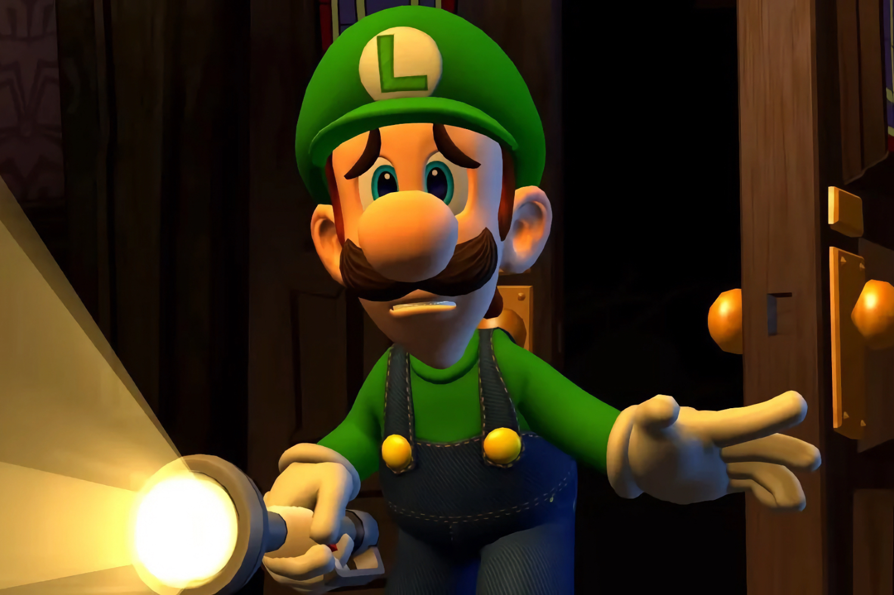

+++
title = "Sans grosses nouveautés à l'horizon, Nintendo taille dans les équipes qui testent les jeux"
date = 2024-03-27T17:55:12+00:00
draft = false
author = "Mickael"
tags = ["Actu"]
image = "https://nostick.fr/articles/2024/mars/2703_licenciementsnintendo/LuigiMansion.jpg"
+++ 
 

La fin de l'année s'annonce calme et tranquille chez Nintendo. Alors certes, il y a bien eu quelques jeux maison qui sont déjà sortis et d'autres qui sont dans les tuyaux. Si *Princess Peach: Showtime!* et les remakes de *Mario vs Donkey Kong*, *Luigi's Mansion 2* et *Paper Mario : La Porte Millénaire* sont bien sympathiques, c'est quand même difficile de déborder d'enthousiasme. Ces jeux vont plus ou moins nous occuper jusqu'à cet été, mais la deuxième partie de l'année va sembler bien longue.

Courage, le Nintendo Direct du mois de juin donnera une meilleure visibilité sur ce qui attendra les joueurs Switch dans les prochains mois. Il ne faudra sans doute pas attendre de miracles : il y aura peut-être de nouveaux remakes comme ces deux jeux Zelda, *Twilight Princess* et *Wind Waker*, qui reviennent régulièrement dans la boucle, ou encore *Metroid Prime* 2 et 3. Quant au jeu Pokémon annuel qui aurait pu « sauver » l'année de Nintendo, il va louper 2024. *Légendes Pokémon Z-A* est en effet prévu pour l'année prochaine.

Le joker de Nintendo pour cette année pourrait bien être *Metroid Prime 4*, annoncé en 2017 (!), rebooté deux ans plus tard, et dont on est toujours sans nouvelles depuis. Mais en attendant le prochain Direct, il n'y a pas grand chose à l'horizon chez l'éditeur qui planche dans le plus grand secret sur le lancement de la Switch 2 ([dans un an…](https://nostick.fr/articles/2024/mars/1803_consoles/#switch-2--nintendo-se-hâte-lentement)) et du line-up accompagnant la nouvelle console.

Cette accalmie relative des jeux *first party* a fait une victime : Nintendo of America (NoA) a [confirmé](https://kotaku.com/nintendo-switch-2-layoffs-testing-zelda-totk-1851369539) une charrette de licenciements chez les sous-traitants qui aident à tester les jeux et le matériel. NoA va certes créer un « *nombre significatif* » de postes à temps plein pour compenser en partie, mais il n'empêche que cette restructuration va toucher une centaine de sous-traitants.

Ces licenciements semblent confirmer l'absence de « gros » jeux développés par les studios de Nintendo à moyen terme. En attendant, on l'espère, une pluie de nouveautés à partir du début de l'année prochaine.

