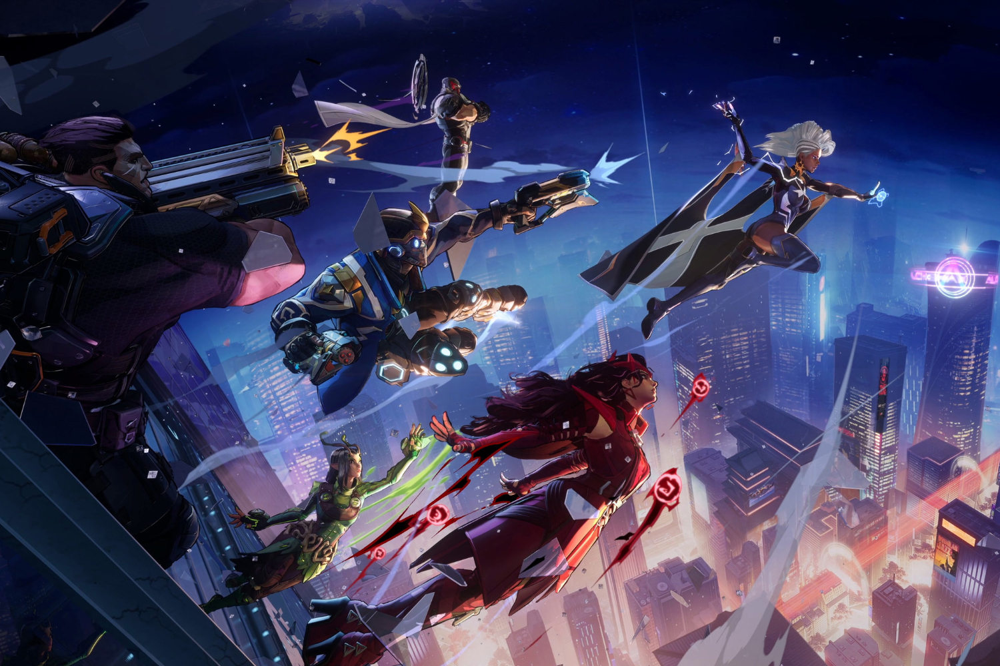

+++
title = "Marvel Rivals : baston free to play entre héros et vilains "
date = 2024-03-27T16:02:12+00:00
draft = false
author = "Mickael"
tags = ["Trailer"]
+++ 

 

On n'arrête plus Marvel, qui multiplie les annonces de nouveaux jeux ces derniers temps. Après *[1943: Rise of Hydra](https://nostick.fr/articles/2024/mars/2103_1943riseofhydra/)*, la maison des idées a banané la bande-annonce de *[Marvel Rivals](https://www.marvelrivals.com)* qui joue dans une toute autre catégorie. Il s'agit d'un jeu de tir dans lesquels 6 joueurs en affronteront 6 autres dans des arènes, et bien sûr en endossant la défroque d'un super-héros de l'écurie.

16 personnages seront disponibles, dont Black Panther, Groot, Hulk, Doctor Strange, Black Panther, Magneto, Félix, Spider-Man, Iron Man… Il y a quelques absents de marque comme Wolverine, mais au vu de la nature free to play du titre, nul doute qu'il sera possible d'acheter de nouveaux héros et vilains. NetEase, qui développe le jeu, promet d'ores et déjà de renforcer le roster, le catalogue est bien fourni.

 

C'est sûr que l'aspect free to play et l'inspiration *Overwatch* et *Valorant* font craindre le pire. Néanmoins, on appréciera la possibilité de détruire les décors et a priori, NetEase semble vouloir respecter les capacités et techniques des différents bagarreurs, contrairement au dernier jeu *Suicide Squad* où tout le monde a des flingues et baste.

Autre originalité, en dehors des graphismes sympas en cell shading, des mouvements en duo sont possibles pour un maximum d'impact : l'exemple qui vient en tête immédiatement est la paire Rocket Racoon et Groot, mais d'autres duos plus étonnants seront aussi proposés comme Hulk qui pourra recharger le laser d'Iron Man avec son rayon gamma. *Marvel Rivals* sera dispo sur PC, avec probablement des versions consoles et/ou mobiles qui suivront. On peut s'inscrire à la phase de test alpha.