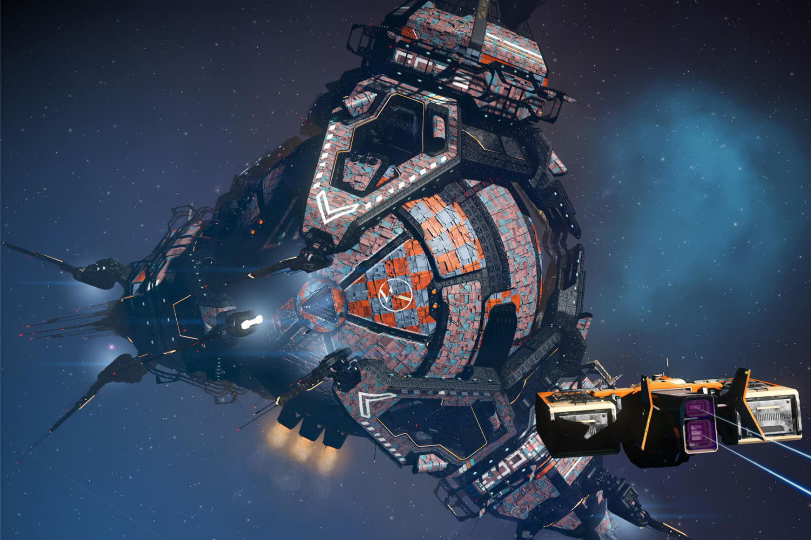

+++
title = "De nouvelles stations spatiales et des vaisseaux enfin personnalisables dans No Man's Sky"
date = 2024-03-27T16:33:12+00:00
draft = false
author = "Mickael"
tags = ["Actu"]
+++

Difficile d'offrir un meilleur suivi que celui de Hello Games pour *No Man's Sky*. Malgré une sortie en 2016, le survival d'exploration spatiale et de combat continue d'être mis à jour et ce n'est pas seulement pour corriger des bugs. La livraison du jour baptisée « Orbital » ajoute à l'univers déjà foisonnant du jeu des stations spatiales générées de manière procédurale : à l'image des innombrables planètes, aucune station ne sera identique à une autre.

Jusqu'à présent, les stations spatiales de *No Man's Sky* étaient créées « à la main ». En utilisant les mêmes algorithmes que pour les planètes, chacune sera désormais unique. Outre les « *vastes espaces intérieurs et extérieurs* », elles bénéficient aussi d'un coup de polish sur les surfaces métalliques et les reflets ; les stations proposent également de nouvelles boutiques et des quêtes inédites adaptées à la localisation, aux races extra-terrestres et aux habitants du système.

 

Et comme si cela ne suffisait pas, cette version 4.6 embarque aussi un nouvel éditeur de vaisseau : en utilisant des composants et des pièces détachées provenant d'autres appareils, il sera possible de se bâtir un vaisseau entièrement personnalisé. Enfin, le joueur pourra rejoindre plus facilement des Guildes pour recevoir des objets et en donner afin d'améliorer sa réputation dans la faction de son choix.

Les nouveautés sont en fait tellement nombreuses qu'il est impossible de toutes les résumer ici ! Pour avoir la tête qui tourne, rendez-vous dans les [notes](https://www.nomanssky.com/orbital-update/) de version du jeu.

 