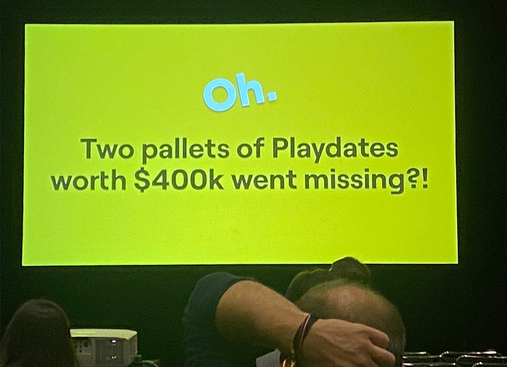

+++
title = "Panic et le mystère des Playdate disparues"
date = 2024-03-27T18:47:32+01:00
draft = false
author = "Félix"
tags = ["Actu"]
+++ 

Vous pensiez pouvoir rapidement mettre la main sur une [Playdate](https://play.date) maintenant que les grosses pénuries de composants sont derrière nous ? Mon pauvre ! Deux palettes de Playdate d'une valeur d'environ 400 000 dollars ont récemment disparu d’un centre d’expédition à Las Vegas. « *C'est un peu comme dans une série policière* », a déclaré le cofondateur de Panic Cabel Sasser. Celui-ci a donné quelques détails sur l’affaire pendant une conférence pour développeurs à laquelle a pu assister Stephen Totilo de *[Game File](https://www.gamefile.news/p/playdate-missing-venba-jedi-survivor)*. 

L’histoire est nébuleuse : FedEx dit avoir livré les palettes alors que le centre d’expédition n’a rien reçu. Deux semaines après ce loupé, le coursier a visiblement livré une fournée identique… à un site de construction voisin. La personne qui a signé pour les deux palettes retrouvées est la même que celle qui a signé pour celles disparues. Plusieurs consoles du lot ont été enregistrées au nom de personnes vivant à North Las Vegas, ce qui semble montrer qu’un petit malin cherche à écouler les stocks. Panic n’en sait pas plus, et en l’état, le mystère reste entier.

La mésaventure n’a visiblement pas trop attaqué les stocks, et la petite console à manivelle est expédiée sous 2 à 3 jours d’après [le site officiel](https://shop.play.date). Cabel Sasser a également confié que la Playdate n’était toujours pas rentable malgré des résultats honorables, notamment à cause du fort taux d’employés travaillant sur la bécane. L'entreprise prévoit d'affecter certaines personnes à d'autres projets, par exemple à sa branche d’édition de jeux. Celle-ci a un paquet de trucs de prévu pour cette année, comme *[Time Flies](https://store.steampowered.com/app/2000120/Time_Flies/?l=french)*, le très mignon *[Thank Goodness You're Here!](https://store.steampowered.com/app/2366980/Thank_Goodness_Youre_Here/?curator_clanid=44044337)*, *[Arco](https://store.steampowered.com/app/2366970/Arco/)* ou encore *[Despelote](https://despelote.game)*. L’intrigant *[Big Walk](https://store.steampowered.com/app/1478500/Big_Walk/?curator_clanid=44044337)* arrivera par la suite, en 2025.

