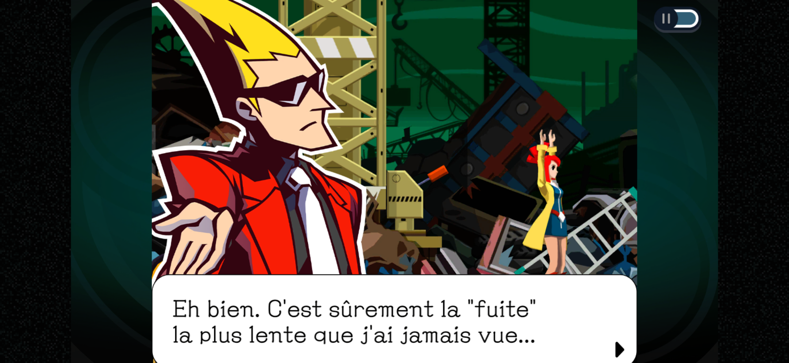
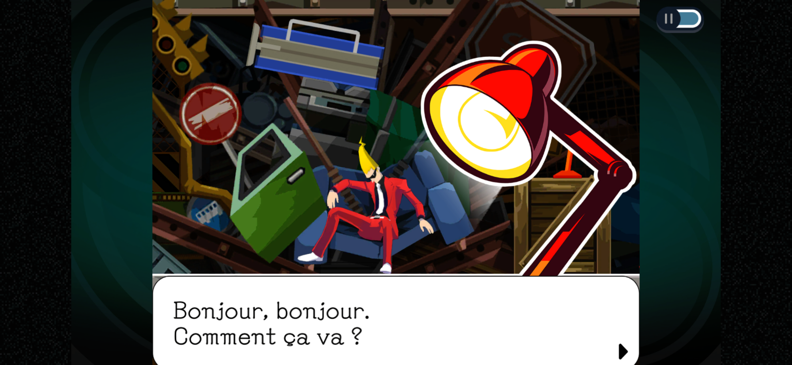

+++
title = "Le remaster de *Ghost Trick* vient hanter les mobiles"
date = 2024-03-28T17:59:32+01:00
draft = false
author = "Félix"
tags = ["Actu"]
+++ 

*Ghost Trick: Phantom Detective* est désormais disponible sur [iOS](https://apps.apple.com/fr/app/ghost-trick/id6473715300) et [Android](https://play.google.com/store/apps/details?id=jp.co.capcom.ghosttrick&hl=fr), ce qui me fait un bon prétexte pour vous en parler. Ce jeu initialement sorti sur DS en 2010 a eu droit à un très chouette remaster sur PC l’été dernier. Il a été créé par Shu Takumi, à qui l’on doit également les trois premiers *Ace Attorney* : ça vaut le coup d’y jeter un œil si vous êtes client de ce type d’aventure. 

On y retrouve un style similaire aux tribulations de Phoenix Wright, avec différents personnages hauts en couleur et des situations rocambolesques. L’histoire est sympa : on incarne l’âme d’un détective fraîchement assassiné au milieu d’une décharge, qui peut se mouvoir de quelques mètres et déplacer des objets. Il va au fil de l’aventure comprendre les circonstances de sa mort tout en empêchant celle de plusieurs protagonistes. Ça a l’air plutôt glauque dit comme ça, mais l’ambiance de *Ghost Trick* reste fun et tient en haleine grâce à un mystère maîtrisé.

Le côté visual novel est un peu mis en retrait par rapport aux *Ace Attorney*, le jeu disposant d’une bonne dose de puzzle. On assistera régulièrement à la mort d’un personnage, avec la possibilité de revenir dans le temps 4 minutes avant le drame : il faut alors faire tomber des objets, activer des alarmes ou encore éteindre des lumières pour éviter qu’un accident (ou un meurtre) ne se produise. Le jeu réussi plutôt bien à se renouveler pendant la grosse douzaine d’heures que dure l’aventure, et le système de chapitrage sous forme d’épisodes pousse à y retourner.

Ce portage mobile est donc celui du récent *remaster*, qui a apporté des graphismes revus fait sous le *RE Engine* de Capcom (*Resident Evil*, *Street Fighter*) et quelques pistes originales. Le jeu est proposé gratuitement, avec un achat in-app à 30 € pour débloquer tous les chapitres. Le tarif n’est pas si excessif étant donné qu’il est identique [à la version Steam](https://store.steampowered.com/app/1967430/Ghost_Trick_Dtective_fantme?snr=1_7_15__13) et que Capcom offre 10 € de remise jusqu’au 3 avril. Une démo est disponible sur les deux plateformes qui devrait vous occuper quelques heures histoire de vous faire une idée.

Je n’ai pas testé la déclinaison mobile de fond en comble, mais les contrôles tactiles m’ont semblé bien foutus (pas étonnant pour un ancien jeu DS). Ce genre de jeu assez lent et sans trop d’interaction se prêt bien au format smartphone, et on pourra le lancer dans le train ou à la pause du midi. *Ghost Trick* est un incontournable si vous êtes client des *Phoenix Wright* et que vous n’êtes pas allergique aux puzzles. En espérant que ça motive Capcom à nous fournir un portage de *The Great Ace Attorney Chronicles*.