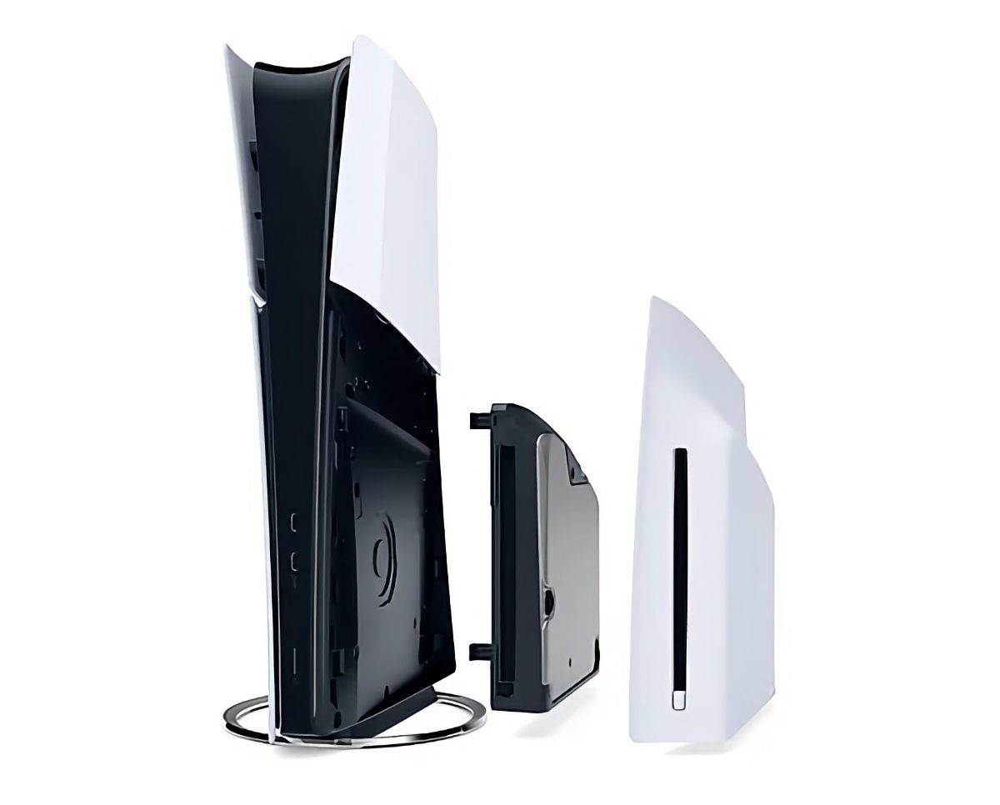
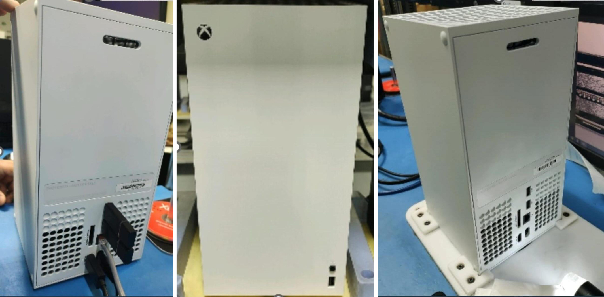

+++
title = "Les galettes sentent le pâté dans les consoles"
date = 2024-03-29T15:02:12+00:00
draft = false
author = "Mickael"
tags = ["XXL"]
+++ 
") 

**Les galettes tournent toujours dans leurs lecteurs, sans savoir qu'elles sont déjà mortes ! La marche du progrès est cruelle et inéluctable, et les supports physiques sont dans la ligne de lire depuis longtemps. Y compris, et surtout, dans les consoles.**

Trouve-t-on encore des PC équipés de lecteurs optiques ? Les joueurs PC ont depuis longtemps basculé sur la distribution en ligne, que ce soit par des boutiques comme Steam, itch.io ou GOG.com, les launchers des éditeurs (chez EA ou Ubisoft) ou tout simplement en téléchargeant les jeux directement sur les sites des développeurs.

Il reste néanmoins un bastion d'irréductibles qui résistent encore et toujours à l'envahisseur dématérialisé, ce sont les consoles bien sûr. Chez Nintendo, Microsoft et Sony, les supports physiques (cartouches comme CD) demeurent une part importante du business. Et les joueurs savent en tirer le meilleur profit : un jeu physique a plus de valeur que son équivalent purement numérique en seconde main. Un marché toujours bien vivant… et qui ne rapporte rien aux constructeurs.

Microsoft avait bien essayé, au début de la Xbox One, d'encadrer la pratique du don et de la revente des jeux physiques. L'entreprise a bien vite reculé devant la bronca suscitée par son dispositif léonin qui a largement contribué à la réputation désastreuse de cette génération. Au plus grand bénéfice de PlayStation qui a pu prendre la tête du marché des consoles de salon pour ne plus jamais la lâcher. La pub ci-dessous est d'ailleurs restée célèbre.

 

Mais les consoliers savent que la solution au « problème » des supports physiques, c'est *plus de support physique du tout*. Ils s'y préparent activement : la neuvième génération lancée fin 2020 se décline chez Microsoft et chez Sony en deux modèles, dont un sans lecteur optique. Et le constructeur japonais est allé un cran plus loin avec la PS5 Slim, avec ce lecteur optique qui peut se détacher du modèle standard et s'installer sur l'édition numérique.

Chez Microsoft, la balance penche très nettement en faveur de la Xbox Series S, qui représente quasiment 75 % des ventes de Xbox toutes Series confondues. Un chiffre [révélé](https://metro.co.uk/2023/09/20/xbox-series-s-outsells-xbox-series-x-consoles-by-up-to-3-to-1-19532440/) au détour d'un procès et qui confirme la popularité du boîtier blanc moins puissant mais aussi moins cher que le parallélépipède noir en absence de lecteur optique.

La ventilation des ventes pour les PlayStation n'est pas connue, néanmoins Sony a [relevé](https://gamingbolt.com/67-of-playstation-software-sales-in-fy-22-23-were-digital) que le dématérialisé représentait 67 % de l'ensemble des ventes de jeux durant le dernier exercice fiscal (1 point de plus d'une année sur l'autre). 

## Pourquoi sont-ils si méchants ?

Pour les constructeurs, forcer la main des joueurs pour qu'ils téléchargent leurs jeux est tout bénéfice. D'abord parce qu'il n'y a pas besoin de payer des intermédiaires pour mettre les jeux dans les rayons et les vendre (sans parler de la fabrication des galettes à proprement parler). Et puis c'est aussi un moyen d'enfermer un peu plus les joueurs dans un jardin fermé où ils n'ont pas d'autre choix que d'acheter des jeux dans la boutique officielle.

Phil Spencer, le grand manitou de Xbox, a juré ses grands dieux que la plateforme soutenait les supports physiques, comme il l'a martelé chez *Game File* en février dernier. Mais il a aussi indiqué que Xbox n'avait pas l'intention d'en faire plus que nécessaire : « *Notre rôle est de répondre aux attentes de nos clients, et actuellement la majorité de nos clients achètent des jeux en format numérique* ».

Il faut dire que Xbox mise gros sur le dématérialisé, ne serait-ce que via le Game Pass. Dans ce contexte, la plateforme n'a guère d'intérêt à soutenir les supports physiques. D'ailleurs, la prochaine Xbox Series X qui devrait sortir dans le courant de l'été pourrait bien remiser son lecteur optique, à en croire des images en fuite sur *[Exputer](https://exputer.com/news/xbox/white-digital-xbox-series-x-photos/)*.

Cette future console reprendrait donc le design et toutes les caractéristiques de la Series X actuelle — à l'exception de son lecteur optique, évidemment —, à un prix plus abordable. C'est peut-être la carotte qui fera passer la pilule auprès des joueurs… Il faudra voir alors si la Series X avec son lecteur restera au catalogue au même prix qu'actuellement. Et qu'adviendra-t-il de la Series S, son tarif va-t-il baisser ? On peut même se demander si Microsoft continuera de la commercialiser tout simplement.

Phil Spencer, toujours lui, avait expliqué que les consoles étaient quasiment les derniers appareils électroniques grand public à intégrer des lecteurs optiques. Ce qui est de plus en plus un problème au niveau industriel : un marché qui meurt, ce sont autant de fournisseurs en moins, ce qui enchérit le prix des composants. 

Les constructeurs vendent leurs consoles sans marges, et parfois à perte. Ils se refont la cerise grâce aux commissions prélevées sur les ventes de jeux, et au fil du temps le coût des composants baisse, ce qui permet d'équilibrer les comptes et de gagner en rentabilité. Mais les coûts ont du mal à refluer et avec les prix des lecteurs optiques qui ne risquent pas de s'effondrer, la solution pour les fabricants est tout simplement de supprimer de l'équation financière le lecteur de CD.

D'un point de vue économique, cela peut effectivement se comprendre… Mais cela ne va pas faire les affaires du marché de l'occase, ni des historiens du jeu vidéo qui vont perdre l'accès à des supports physiques. Ils sont l'unique moyen de préserver des jeux qui, distribués uniquement en dématérialisé, vont définitivement se perdre dans les limbes. 

