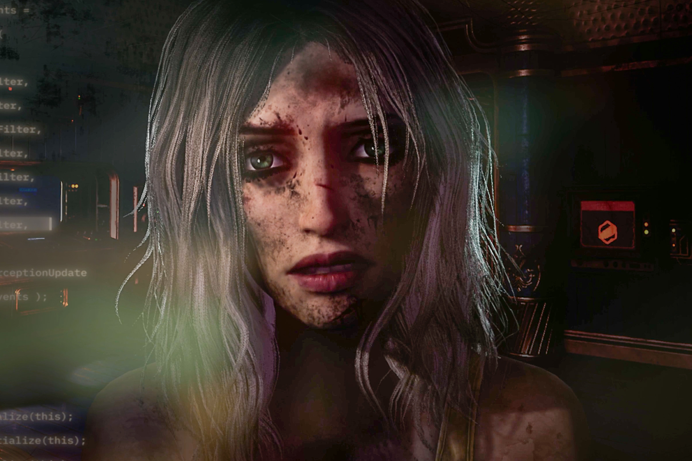
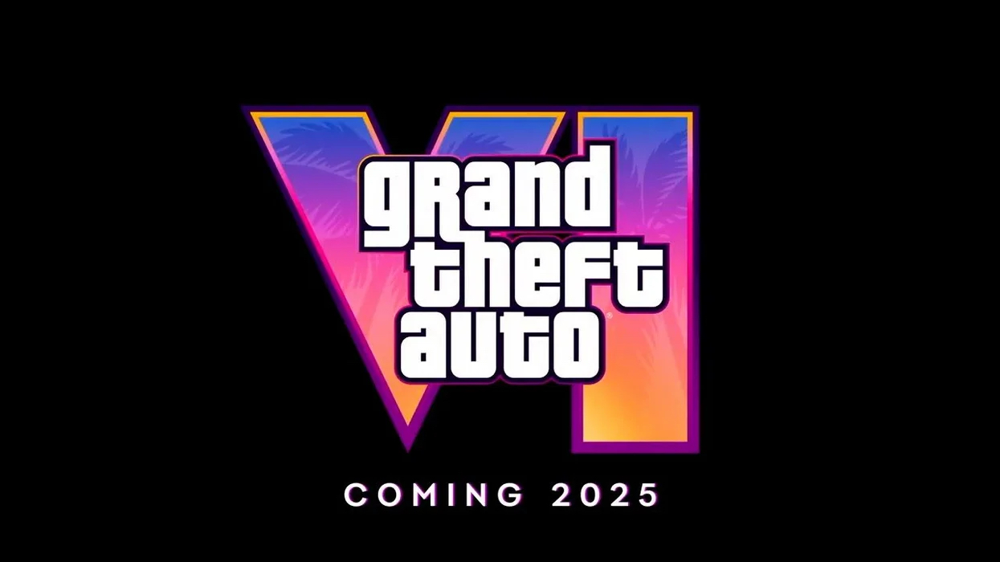

+++
title = "Engageante, passionnante, un peu chiante : la folle semaine du jeu vidéo (30/03)"
date = 2024-03-30T11:30:32+01:00
draft = false
author = "Mickael"
tags = ["Actu"]
+++ 

L’actualité du jeu vidéo ne s’arrête pas à la poignée d'articles  publiés sur *Nostick* ! Histoire de rattraper le retard accumulé, voici un retour rapide sur quelques unes des plus importantes ou insignifiantes infos de la semaine.

## Grosse panique pour GTA 6

Des millions de milliards de joueurs (au bas mot !) ont arrêté de respirer depuis le premier trailer de *GTA 6*. On va leur souhaiter bien du courage, et espérer qu'ils aient vraiment bien retenu leur respiration car l'attente pourrait — le conditionnel est important — être plus longue que prévu.

Des sources de *[Kotaku](https://kotaku.com/gta-6-development-2026-delay-rockstar-office-release-1851359831)* ont en effet rapporté que Rockstar aurait pris du retard dans la dernière ligne droite. La direction montrerait des signes de nervosité, le jeu pourrait en effet louper la fenêtre de 2025 et repousser la sortie du jeu phénomène en 2026.

Néanmoins, il pourrait s'agir d'une tempête dans un verre d'eau.  Les rumeurs sont en effet contradictoires : Mike Straw, journaliste bien informé d'*Insider Gaming*, a [obtenu](https://twitter.com/MikeStrawMedia/status/1772349615284645941) de ses propres sources que GTA 6 était sur les bons rails et qu'un retard dans le développement n'est que de la « *pure conjoncture* ». Allez comprendre.

L'affaire va au-delà d'un problème de quelques mois. Toute l'industrie du jeu vidéo — [et surtout les constructeurs de consoles](https://nostick.fr/articles/2024/mars/1803_consoles/) — mise gros sur *GTA 6* pour relancer le marché. 

## Xbox veut devenir un supermarché

Maintenant que la Xbox est largement distancée dans la course aux consoles, Microsoft joue la carte de l'ouverture pour gratter de l'argent au-delà de sa seule plateforme. On l'a vu avec le lancement de quatre titres jusqu'à présent exclusifs Xbox sur la Switch et PlayStation, mais cela pourrait aller encore plus loin. 

Dans une interview à *[Polygon](https://www.polygon.com/24108670/xbox-epic-games-store-phil-spencer-interview)*, Phil Spencer a en effet clairement laissé entendre que des boutiques rivales — comme l'Epic Games Store ou, soyons fou, Steam — pourraient avoir droit de cité sur la Xbox ! Voilà qui aurait le mérite de rapprocher un peu plus la console du PC, ce qu'elle est déjà largement en termes matériel.

Si le patron de la division gaming de Microsoft avance les grands arguments de la liberté du joueur et de l'ouverture de la plateforme, l'entreprise y gagnerait aussi de juteuses commissions sur les jeux vendus par les échoppes concurrentes. Mais après tout, pourquoi pas : davantage de concurrence profite toujours aussi aux consommateurs qui bénéficieraient de promotions plus importantes et plus régulières.

## Palworld inspire Tencent

*Palworld* est très clairement le jeu surprise de ce début d'année, non seulement en termes de popularité (plus de 25 millions de joueurs) mais aussi pour sa conception disons très « libérée » du copyright. Mais puisque la Pokémon Company n'y a rien vu de répréhensible, d'autres éditeurs songent eux aussi à se lancer sur le créneau des « Pokémon avec des flingues », et pas n'importe lesquels.

L'agence *[Bloomberg](https://financialpost.com/pmn/business-pmn/tencents-next-big-gaming-bets-draw-on-viral-phenom-palworld)* rapporte en effet que le géant chinois Tencent plancherait sur des jeux mobiles inspirés de *Palworld*. Deux équipes développeraient des titres dans le même style qui mêle gestion de bestioles, violence graphique et survival dans un monde ouvert.

Tencent organiserait une sorte de compétition en interne pour faire mousser les talents et accélérer le développement de ces jeux. Il faut dire que le groupe est à la recherche de sa prochaine poule aux œufs d'or après *Honor of Kings*. Ça ne serait pas très grave si cette poule ressemblait à un Poussifeu…

## Judas a un petit quelque chose de BioShock

Chassez le naturel… Le studio Ghost Story Games, confonde par Ken Levine, planche sur son premier jeu baptisé *Judas*. Et bon sang ne saurait mentir, le titre commence à beaucoup ressembler à *BioShock*, une création d'un certain… Ken Levine ! 

 

*Judas* a été annoncé il y a deux ans, et le développement va bon train puisqu'on a eu droit à une bande annonce en début d'année. Et le jeu a été présenté à plusieurs médias cette semaine, avec une constante : il y a beaucoup de *BioShock* dans cette aventure solo, qui place le joueur dans le Mayflower, un vaisseau spatial géant transportant l'humanité sur une nouvelle planète.

« *Tout ce que vous attendez d'un jeu BioShock est là dedans* », [affirme](https://www.youtube.com/watch?v=J5wjyC1P1Jc&t=88s) ainsi Geoff Keighley. Néanmoins, Levine a aussi tenu à se démarquer de sa franchise phase avec ce qu'il appelle un « Narrative LEGO » : l'histoire s'adapte de manière dynamique aux actions du joueur. C'est moins procédural que dans un *Minecraft*, mais manifestement il y a aura un certain degré de liberté narrative. En revanche, il n'a pas annoncé quand *Judas* fera son apparition.

