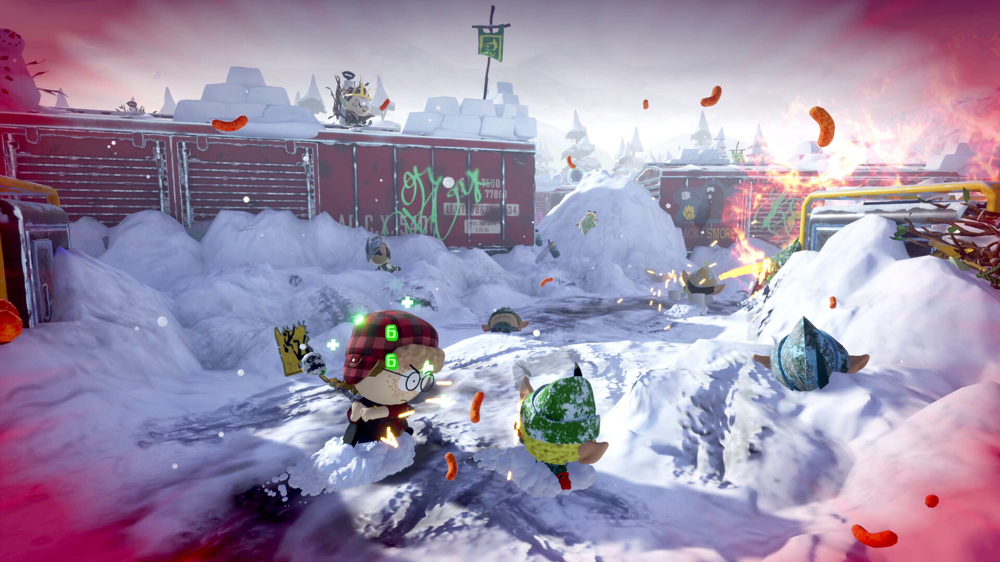

+++
title = "Les sorties de la semaine (31/03)"
date = 2024-03-31T07:00:32+01:00
draft = false
author = "Félix"
tags = ["C’est dispo"]
image = "https://nostick.fr/articles/2024/mars/3103-les-sorties-de-la-semaine-3103/southpark.jpg"
+++ 

Entre le boulot, les courses et ce devis pour le ravalement de façade qui va vous coûter un bras, vous n’avez peut-être pas eu le temps de vous intéresser aux nouveautés du moment. Qu’à cela ne tienne : voici les sorties de ces derniers jours qui ont retenu notre attention.

## Douche froide pour les fans de South Park

Vous vous souvenez du chouette RPG *South Park* : *Le bâton de la vérité* et de sa très correcte suite *L'Annale du destin* ? Pas les créateurs de la série visiblement, qui viennent de lancer le tout naze ***Snow Day***. Exit le RPG blindé de gags, place à un hack-and-slash en 3D moche pensé pour le multijoueur et la coopération. La partie scénario a été mise de côté (🙄) pour se concentrer sur un gameplay pas folichon. *[IGN](https://www.ign.com/articles/south-park-snow-day-review)* y voit un jeu « *fade, vide* » et un « *grand pas dans la mauvaise direction pour les jeux South Park* ». Aucune raison de vous pencher dessus donc, le jeu [étant facturé 30 €](https://store.steampowered.com/app/1214650/SOUTH_PARK_SNOW_DAY/) pour une campagne qui se boucle en moins de 6h. En promo à 5 € dans quelques mois pour les plus grands fans, à la limite.

## La mauvaise stratégie de Paradox

Autre déception cette semaine avec la sortie du 4X **Millennia**, qui se veut inspiré par la série des *Civilization* sans vraiment être au niveau. Le titre avait de quoi intriguer avec son système « d’ères » qui peuvent être influencées par les décisions prises par le joueur, permettant  d’évoluer jusqu’à l’âge du steampunk ou dans celui des cités sous-marines. Malheureusement la mayonnaise ne prend pas, les testeurs évoquant un jeu moyen sans vraiment de personnalité et avec des graphismes datés. Un coup dans l’eau pour Paradox, qui édite ce jeu [vendu 40 € sur Steam](https://store.steampowered.com/app/1268590/Millennia/#app_reviews_hash).

## La PS5 aura son Nier;Automata

Une démo d’environ une heure est désormais disponible pour la prochaine grosse exclu PS5 : ***Stellar Blade***, dont la version complète sortira le 26 avril. Malgré son nom aussi inspiré qu’un MMORPG chinois mobile, le jeu a tout de même l’air sympa avec un univers post-apo intrigant et des combats aussi nerveux qu’exigeants. Le titre a pas mal fait parler de lui par son aspect « héroïne-sexy-qui-fait-des-pirouettes », la poitrine et les fesses du personnage principal rebondissants jusque dans les menus. Reste à voir s’il s’agit d’une astuce fainéante pour vendre des palettes d’un AAA bof-bof ou si l’on aura entre les mains un réel bon jeu avec des personnages attachants. Les premiers retours sur la démo sont tous très positifs, on part visiblement plutôt sur la seconde option. Vous pouvez le précommander pour 80 € sur [la boutique de la PS5](https://www.playstation.com/fr-fr/games/stellar-blade/), et aucun portage PC n’a été annoncé pour le moment.

## Un launcher dans ton launcher

Les signes du rachat d’Activision-Blizzard par Microsoft commencent à se faire sentir : ***Diablo 4*** est désormais disponible sur le Game Pass. Comme on pouvait s’y attendre, cela passe par un enchevêtrement de *launchers* et de comptes divers à relier. Le jeu en vaut la chandelle étant donné que le célèbre hack 'n' slash va bientôt avoir droit à [une giga mise à jour](https://www.pcgamer.com/games/action/psa-diablo-4-is-now-on-pc-game-pass-just-in-time-to-prepare-for-its-biggest-update-ever/) revoyant en profondeur certains aspects du jeu, qui sera mise en ligne le 14 mai.

## Fini de rire

Il y a bien peu de chance que vous ayez acheté le dernier jeu ***Suicide Squad***, qui s’est fait défoncer par les critiques avant d’être laissé agonisant la tête dans le caniveau. Eh bien d’après *[Forbes](https://www.forbes.com/sites/paultassi/2024/03/29/suicide-squad-kill-the-justice-leagues-joker-season-is-unbelievably-bad/?sh=17570182131d)*, même le suivi est naze : Rocksteady propose depuis peu de jouer avec le Joker, que l’on peut débloquer en faisant plein de missions répétitives ou en mettant la main au porte-monnaie. Le personnage est visiblement correct, mais n’apporte pas de nouveau type de missions ou une histoire très développée. Les quelques-uns qui n’avaient pas lâché l’affaire sont logiquement très mécontents, et l’éditeur a promis d’autres mises à jour pour la suite qui auront bien du mal à empêcher le naufrage.

#

 