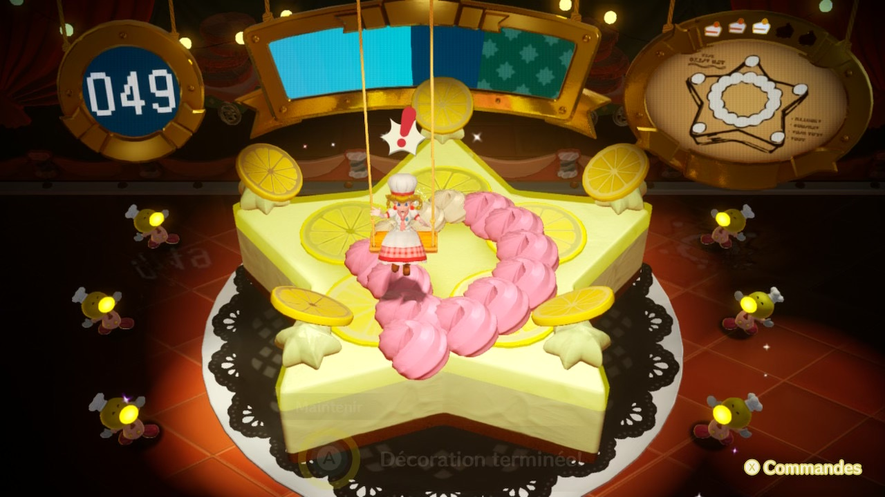

+++
title = "Princess Peach Showtime confirme qu'il est temps de lancer la Switch 2"
date = 2024-03-11T10:47:32+01:00
draft = false
author = "Mickael"
tags = ["Actu"]
+++

Depuis sept ans qu'on l'a entre les mains, on n'y fait plus attention mais il est tout de même déprimant de subir toujours et encore des micro-ralentissements sur la Switch, y compris — et surtout — dans les jeux *first party* de Nintendo. La démo de *Princess Peach Showtime* en est plein, et pas nécessairement lorsque des tas de personnages sont à l'écran.

Ces ralentissements sont visibles lors de certains passages scriptés, par exemple lors de la transformation de la princesse ou quand le jeu laisse la main au joueur. La cible visée par *Showtime* (les plus jeunes) n'y verra sans doute que du feu, mais il est tout de même malheureux que Nintendo et le studio Good-Feel qui a développé le titre n'aient pas su régler le problème avant la sortie du jeu. Certes, d'ici sa sortie le 22 mars, il est toujours possible qu'une mise à jour de dernière minute vienne régler le problème, mais le doute est permis.

Ces ralentissements sont malheureusement chroniques dans de nombreux jeux édités par Nintendo et par d'autres studios. La Switch 2 fera-t-elle mieux dans ce domaine ? On ne peut que l'espérer, en tout cas ce *Princess Peach Showtime* montre s'il en était encore besoin qu'il est grand temps pour le constructeur de passer à une console plus puissante.

Quant au jeu en lui-même, il s'annonce comme une collection de mini-jeux dans lesquels la princesse Peach va jouer de l'épée, du rouleau à pâtisserie ou de la loupe de détective, chacune des transformations amenant son propre gameplay. Par conséquent, on en aimera davantage un plutôt que l'autre ; le niveau « Peach Pâtisserie » ressemble à un jeu mobile mal fichu pour ce qui me concerne, mais je ne suis plus dans la cible !