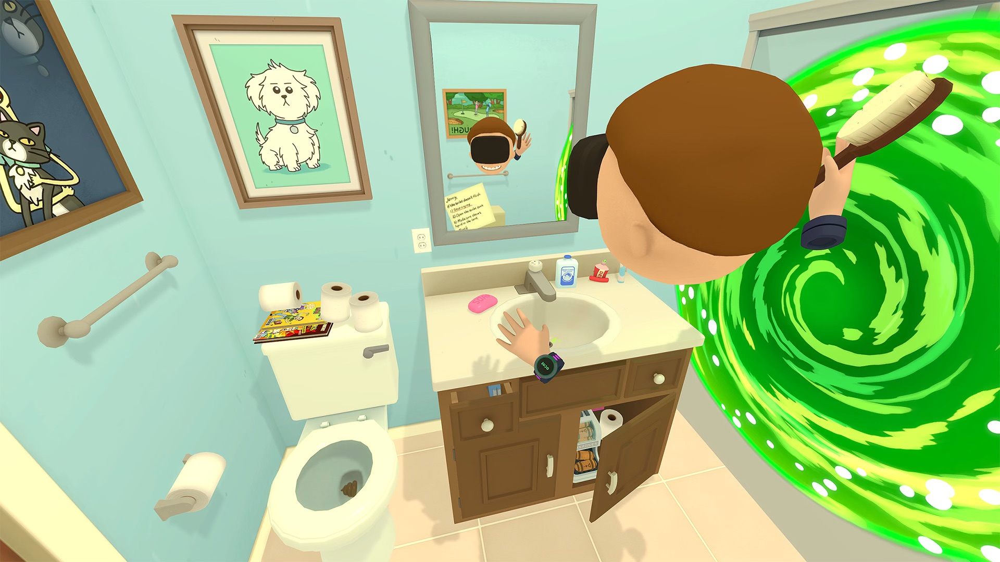

+++
title = "Warner Bros a tout pour devenir la pire boîte au monde"
date = 2024-03-10T19:47:32+01:00
draft = false
author = "Mickael"
tags = ["Papiers longs"]
+++

**La forme finale de Warner Bros Discovery est en phase d'approche : le géant du divertissement veut chiper la place d'Electronic Arts et d'Activision au classement des entreprises les plus détestées au monde ! Et il faut bien avouer que si c'est son objectif, alors le chemin lui est largement ouvert.**

Sur un coup de tête (probablement fiscal), le groupe a ainsi décidé de retirer de nombreux jeux de Steam et du PlayStation Store. Ces titres, parmi lesquels *Rick and Morty: Virtual Rick-ality*, *Fist Puncher*, *Soundodger+*, *Headlander* ou encore *Duck Game*, sont édités par le studio Adult Swim — propriété de WB Discovery — et développés par des indépendants. Ce sont plus de 18 jeux qui vont disparaitre corps et biens dans les 60 prochains jours, a [confirmé](https://steamcommunity.com/app/238630/discussions/0/4286935452896532419) Matt Kain, un des développeurs de *Fist Puncher*.

L'entreprise a décidé qu'il n'était pas question de transférer le jeu vers le compte Steam du développeur. Studio Bean, créateur de *Soundoger+*, a [confirmé](https://twitter.com/onemrbean/status/1765826777501372521) la mauvaise nouvelle et la mauvaise volonté de WB Games qui apparemment, refuse de lancer la procédure de transfert par manque de ressources. Une procédure qui prend 3 clics et 2 minutes.

Il y a néanmoins un peu d'espoir pour ces développeurs : Studio Bean devrait finalement être en mesure de publier son jeu par ses propres moyens sur Steam, au prix du retrait de toutes références à Adult Swim (et le jeu repartira de zéro sur la boutique, perdant ainsi tout son historique). Bizarre, mais c'est un moindre mal non seulement pour les joueurs, mais aussi pour la préservation des jeux.

WB Discovery est coutumier du fait : le groupe a en effet annulé la sortie de plusieurs films quasiment terminés, dont *Batgirl* et *Coyote vs. Acme*, et retiré des séries sur des plateformes de streaming, a priori pour de bêtes histoires d'impôts.

## Tout pour le jeu service

Toujours au rayon du jeu vidéo, WB Discovery a récemment martelé sa volonté d'« ajuster » sa stratégie vers les jeux mobiles et le jeu service. « *Nous renforçons notre engagement dans le domaine des jeux* », a [affirmé](https://www.gamespot.com/articles/warner-bros-discusses-volatile-aaa-console-games-will-lean-into-free-to-play-and-mobile/1100-6521597/) J.B. Perrette le patron chargé du jeu vidéo au sein de la société pendant une conférence Morgan Stanley (un moment parfait pour s'adresser aux ~~actionnaires~~ fans de jeux vidéo…). 

« *[C'est] un secteur où il existe encore de nombreuses opportunités de croissance que nous pouvons exploiter grâce à la propriété intellectuelle que nous possédons et aux capacités de notre studio. Nous occupons une position unique, à la fois en tant qu'éditeur et développeur de jeux* », poursuit-il. Mais pas question de tenter de refaire le carton planétaire de *Hogwarts Legacy* et ses 22 millions de copies l'an dernier.

WB Discovery n'est pas sûr de se refaire la cerise avec ces aventures solo AAA jugées trop « *volatiles* ». C'est pourquoi l'entreprise double la mise sur le marché mobile et du free to play, qui permet de multiplier à peu de frais (pour l'éditeur, du moins) toutes sortes de microtransactions. Et on a bien vu à quel point ça avait bien fonctionné avec *Suicide Squad: Kill the Justice League*, non ? Hum…

« *Plutôt que de simplement lancer un jeu sur console à usage unique, posons nous la question de savoir comment développer le jeu autour, par exemple, un Hogwarts Legacy ou un Harry Potter, qui soit un service en ligne où les gens peuvent vivre, travailler, construire et jouer dans cet univers de manière continue* » a décrit le dirigeant.

C'est une perspective peu enthousiasmante pour de nombreux joueurs, c'est certain, mais WB Discovery marche sur du velours : le groupe détient quelques unes des plus belles franchises culturelles au monde, entre les univers de DC, Cartoon Network, Adult Swim (plus pour longtemps visiblement)  Bugs Bunny et compagnie, ou encore *Mortal Kombat* (en passe de se transformer en jeu service) et *Game of Thrones*. Il serait dommage de ne pas en tirer un peu plus profit en faisant la poche des fans.