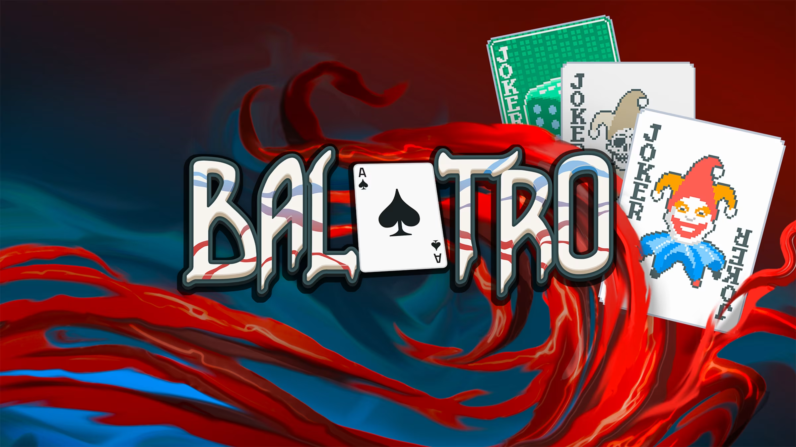

+++
title = 'Balatro fait péter le million'
date = 2024-03-02T10:30:18+01:00
draft = false
author = "Félix"
tags = ["Actu"]
+++

Tout roule pour Balatro, ce jeu mélangeant poker et roguelike d’ores et déjà considéré comme une potentielle drogue dure par la FDA américaine. Sorti le 25 février dernier, le jeu a rapporté 1 million de dollars en 8 heures, un très joli score pour un projet indé créé par un unique développeur. Plus de 250 000 copies se sont [déjà écoulées](https://twitter.com/BalatroGame/status/1761055772065010040) sur PC, Switch, PS5 et Xbox. Une version Mac est dans les tuyaux, tandis qu’un portage mobile « *pourrait arriver après le lancement officiel* ».

Pas besoin d’être Patrick Bruel pour s’amuser sur Balatro. L’objectif est de recréer les mains du poker afin de faire un maximum de points, ceux-ci étant multipliés par différents jokers débloqués en cours de route. L’un va octroyer plus de points en cas de paire, là où un autre autorisera à faire des quintes (5 cartes à la suite) avec seulement 4 cartes. La progression se fait sur un système de niveaux en 3 parties, la dernière étant un boss appliquant différents malus pouvant réduire le score.

Ça a l’air compliqué, mais il ne faut que quelques parties pour devenir accro. Le titre est vendu 14 € sur [Steam](https://store.steampowered.com/app/2379780/Balatro/), sans achat in-app ni mécanique de free-to-play. Notons que le jeu est temporairement indisponible sur certaines boutiques dont [le Nintendo Store européen](https://twitter.com/PlaystackGames/status/1763614758043795909), Balatro ayant été pris à tort pour un véritable jeu d’argent avant de se voir passé 18+ par un régulateur peu regardant. L’éditeur promet que la situation devrait revenir à la normale prochainement. 
