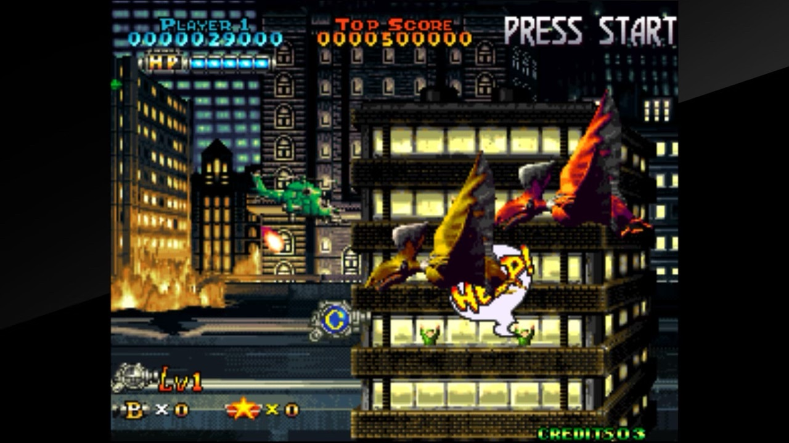

+++
title = 'Passion acheter des shmups et ne pas y jouer'
date = 2024-03-04T08:45:05+01:00
draft = false
author = "Mickael"
tags = ["Humeur"]
+++ 

Les shoot'em up parlent directement au cerveau reptilien. Difficile en effet de faire plus simple et plus efficace qu'un bon vieux shmup ! Certes, depuis ses débuts primitifs en 1978 avec *Space Invaders*, le genre s'est considérablement élargi, affiné, raffiné même, et tout simplement anobli. Mais au bout du compte, c'est toujours un vaisseau ou un bidule à diriger au milieu d'un tsunami de projectiles et d'ennemis.

Et c'est certainement la catégorie de jeux le mieux représenté sur mes machines à jouer, avec un net penchant pour les shmups des années 90 — le sublimement idiot *[Prehistoric Isle 2](https://en.wikipedia.org/wiki/Prehistoric_Isle_2)* est un chouchou — et évidemment, les bullet hell de Cave (*[DoDonPachi DaiFukkatsu](https://fr.wikipedia.org/wiki/DoDonPachi_DaiFukkatsu)*, chef d'œuvre évidemment).

Sous leur apparence simple, les shoot'em up cachent des trésors de sophistication, certains plus que d'autres évidemment, qui demandent de s'y atteler sérieusement pour pouvoir en tirer tout le suc. Bref, quand on lance un *Radiant Silvergun* ou *Gleylancer*, ce n'est pas pour tuer le temps entre deux épisodes de Netflix !

Est-ce pour autant une raison de *tous* les acheter ? Évidemment non. Et pourtant, c'est bien de ce mal dont je souffre, il me les faut tous même si cela fait bien longtemps que je n'ai plus le temps de tous y jouer (la honte étant que j'ai à peine touché à bon nombre d'entre eux). Attendez, *Natsuki Chronicles* est à [1 €](https://store.steampowered.com/app/1175190/Natsuki_Chronicles/) sur Steam en ce moment ?! Foutu cerveau reptilien.