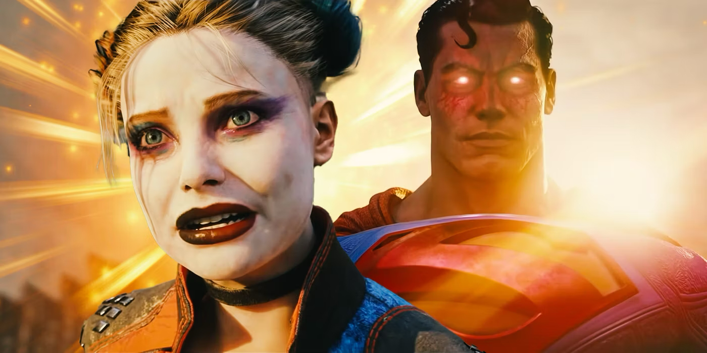
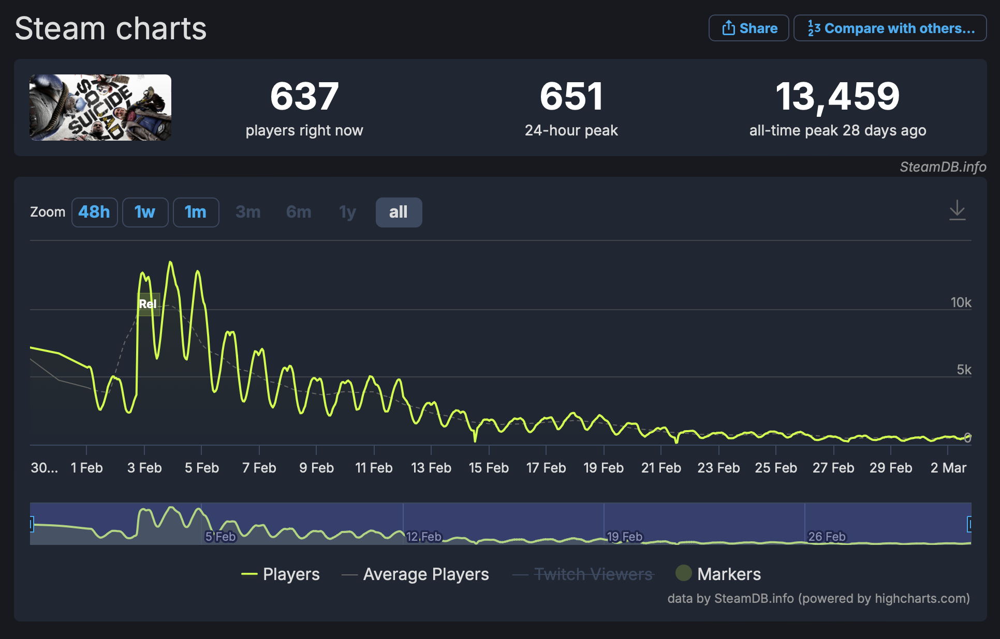
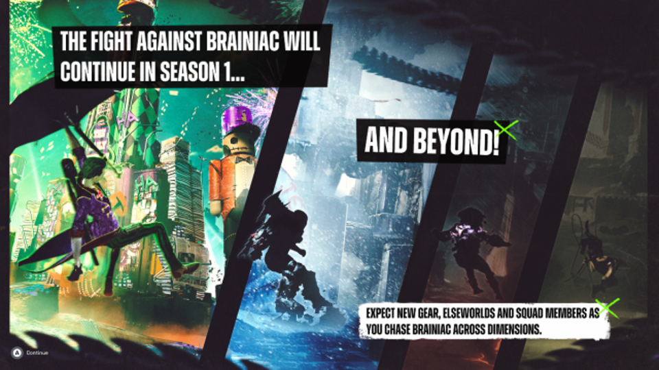

+++
title = 'Suicide Squad: kill the Suicide Squad'
date = 2024-03-03T08:45:05+01:00
draft = false
author = "Mickael"
tags = ["XXL"]
image = "https://nostick.fr/articles/2024/mars/suicidesquad/suicidesquad1.jpg"
+++ 

**Un nouveau jeu dans l’Arkhamverse qui suit une bande de bras cassés de DC prêts à en découdre avec la Justice League ? Pourquoi pas. Le projet était intriguant et puis c’était Rocksteady à la barre, les créateurs des meilleurs jeux de superhéros de tous les temps !**

Il y avait moyen d’y croire : le studio Rocksteady, alors tout auréolé du succès des jeux de la saga *Batman: Arkham*, avait annoncé la mise en chantier de *Suicide Squad: Kill the Justice League* en 2020[^1].

Mais au fil des années de retard et des trailers, il a fallu se rendre à l’évidence : ça sentait le caca. Enfin plutôt le jeu service, ce qui pour beaucoup de joueurs est la même chose : les microtransactions, skins et autres costumes hors de prix sont assez peu appréciés dans ce bas monde. 

Mais enfin, après toutes ces années d’attente et d’angoisse, le voilà enfin le nouveau chapitre de l’Arkhamverse… transformé en *looter shooter* en coop 4 joueurs, un gameplay aux antipodes des jeux Batman où un type costumé de mauvaise humeur tabasse à lui tout seul la pègre de Gotham à grand coup de latte.

Précédé d’une réputation épouvantable — la campagne marketing a été désastreuse —, *Suicide Squad* [sort](https://store.steampowered.com/app/315210/Suicide_Squad_Kill_the_Justice_League/) le 2 février auprès du grand public et très vite, c’est l’hallali. Au lendemain du lancement, le nombre de joueurs sur Steam atteint les 13 459 selon [SteamDB](https://steamdb.info/app/315210/charts/#48h), un sommet que le jeu ne retrouvera plus jamais. 

Pour donner un ordre d’idée de la catastrophe industrielle, le record de *Marvel’s Avengers*, comparable à *Suicide Squad* avec son univers de superhéros et son modèle économique, affiche rien de moins que le double (31 165). Et *Marvel’s Avengers* n’a pas vraiment été qualifié de chef d’œuvre…

Alors certes, le jeu est resté quelques jours numéro 1 du classement de la PS5 (que Steam ne prend évidemment pas en compte), mais il a déguerpi très vite. Il a aussi passé une tête dans le top 20 de la Xbox, mais sans y faire plus d’étincelles.

Et aujourd’hui, *Suicide Squad* louche ostensiblement vers le seuil des 500 joueurs en simultané sur Steam. Pour Warner Bros Games, l’éditeur du jeu, c’est un cataclysme : par essence, les jeux service doivent absolument avoir un certain nombre de joueurs car sinon, qui pourrait envier cette skin achetée à prix d’or ? La rentabilité du jeu est dans les chaussettes.

WG Games ne donne pas de chiffre, mais le directeur financier a [admis](https://www.ign.com/articles/suicide-squad-kill-the-justice-league-has-fallen-short-of-our-expectations-warner-bros-says) que le jeu n’avait pas été à la hauteur des attentes de l’éditeur. Il faut dire que la comparaison n’est pas en faveur de *Suicide Squad* : l’an dernier à la même période, WG Games cartonnait avec *Hogwart’s Legacy*, qui a gagné la palme de jeu le plus vendu de l’année devant *Call of Duty* !

Et pour Rocksteady, l’affaire est très mauvaise également. On ignore le budget exact de *Suicide Squad*, mais personne ne sera étonné d’apprendre qu’il tourne autour des 150 à 200 millions de dollars vu le nombre d’années de développement — et c’est sans compter ce fichu marketing. Alors que l’industrie du jeu vidéo essuie une purge de talents sans précédent, le studio pourrait bien être frappé aussi par des coups de hache dans ses effectifs.

Quant aux joueurs, c’est la soupe amère également. Une petite communauté de fans s’est formée autour de *Suicide Squad*, qui apprécie réellement les qualités du jeu (il y en a !). Et ils attendent maintenant avec impatience les prochaines saisons, avec une première livraison prévue en mars mettant en vedette le Joker. WG Games n’a toujours pas annoncé de date de lancement. Et la promesse d’une année de contenus supplémentaires au minimum parait maintenant impossible à tenir au vu du désastre financier.

[^1]: Le projet avait en fait débuté dès 2015 sous l’égide de WB Montréal, mais le développement s’est arrêté au bout d’un an.

 