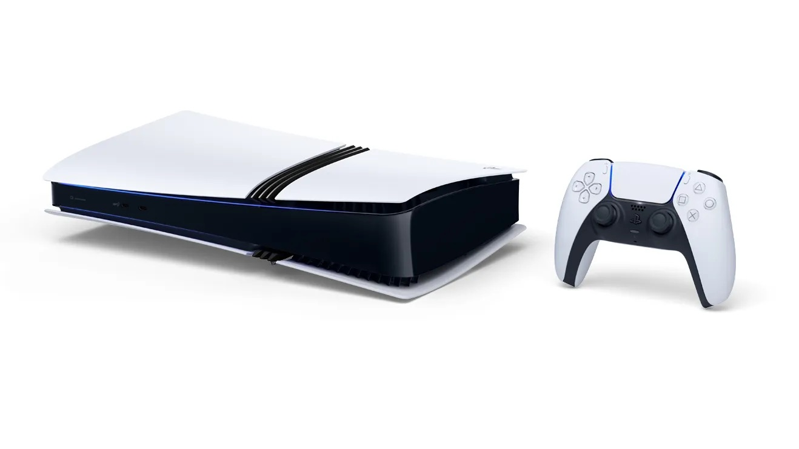

+++
title = "La PS5 Pro était en développement avant même la sortie de la PS5"
date = 2024-11-01T13:20:32+01:00
draft = false
author = "Félix"
tags = ["Actu"]
image = "https://nostick.fr/articles/2024/novembre/0111-ps5-pro-developpement-avant-ps5/PS5Pro.jpeg"
+++

 

Sony a de la suite dans les idées : la PS5 n’était pas encore sur les étals que le consolier pensait déjà à la PS5 Pro. Le directeur général du groupe d'activités « plates-formes » de SIE Hideaki Nishino a pris le temps d’aller papoter avec *[Variety](https://variety.com/2024/gaming/news/playstation-ceos-hideaki-nishino-hermen-hulst-1236194125/)*, donnant quelques détails sur la création de cette nouvelle machine pour les Pro™.

Nishino explique avoir tiré les leçons de la PS4 Pro, dont les ventes ont été satisfaisantes. « *Lorsque nous vendions la PS4 Pro aux côtés de la PS4, 20 % des clients achetaient le modèle Pro* ». Il note que ce ne sont pas seulement les *power-users* qui se sont tournés vers la grosse bécane, mais aussi de nouveaux arrivants. Selon lui, Sony ne sort jamais de nouvelle console sans avoir déjà planifié ce que son successeur pourrait devenir. « « *Nous concevons tout en pensant à l'avenir. Ce n'est pas comme si nous faisions un pas en avant sans savoir ce qu'il en est des deux pas suivants.* ». Autrement dit, les premiers plans de la PS5 Pro étaient en train d’être dessinés en parallèle du lancement du modèle classique.

Hideaki Nishino balaye les critiques ne voyant pas l’intérêt d’une PS5 Pro à l’heure où la PS5 fait encore du très bon boulot et alors que les avancées techniques sont de moins en moins impressionnantes. « *Il y a des technologies que l'on peut développer en trois ou cinq ans. L'innovation et les progrès technologiques sont plus rapides dans le monde moderne* », estime-t-il avant de rappeler que les PC et les smartphones ont droit à des mises à jour annuelles. « *Je ne pense pas que nous ferons des mises à jour tous les ans, mais il y a des choses que nous pouvons mettre ensemble pour apporter les meilleures choses dans le segment des consoles de jeu.* ».

Si la présentation de la PS5 Pro en a déçu certains à cause de son prix onéreux (800 €), les avancées côté graphismes devraient tout de même être [bien visibles](https://nostickreloaded.substack.com/i/149175982/la-bonne-nouvelle-de-la-semaine-finalement-cest-pas-si-pourri-la-ps-pro). On en saura plus dans les jours qui viennent : la console sera officiellement lancée vendredi, et les premiers tests fouillés ne devraient plus trop tarder à tomber.