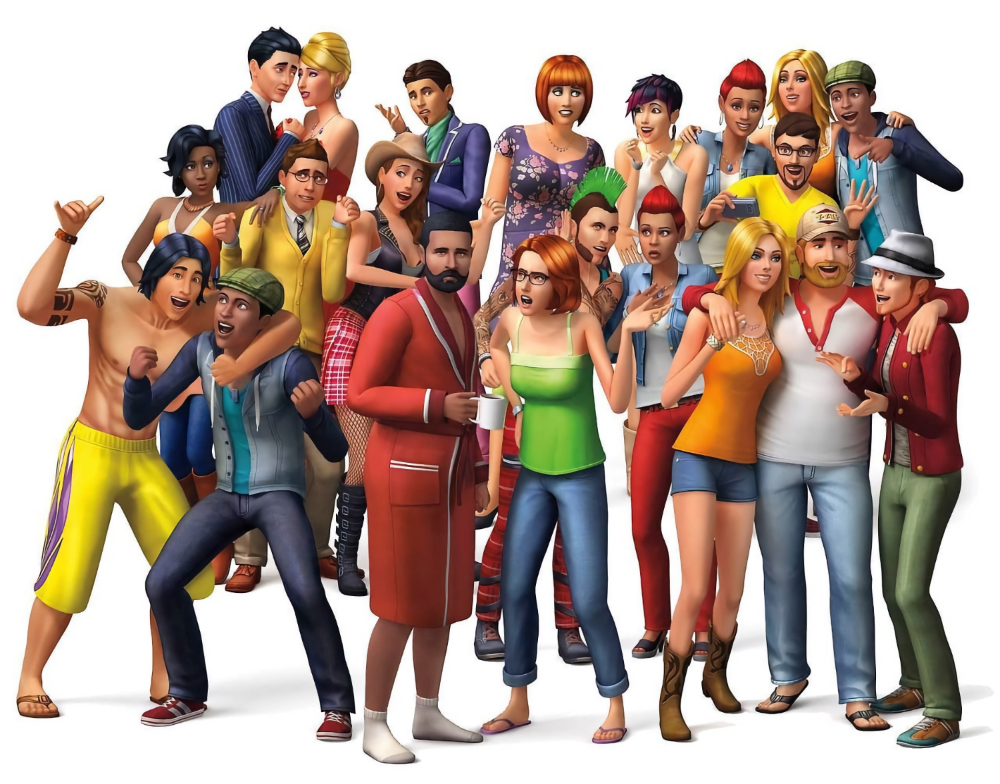
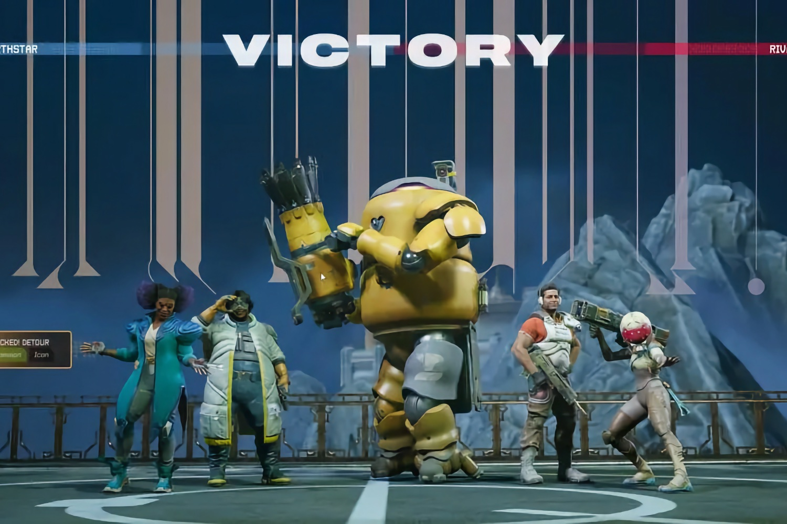
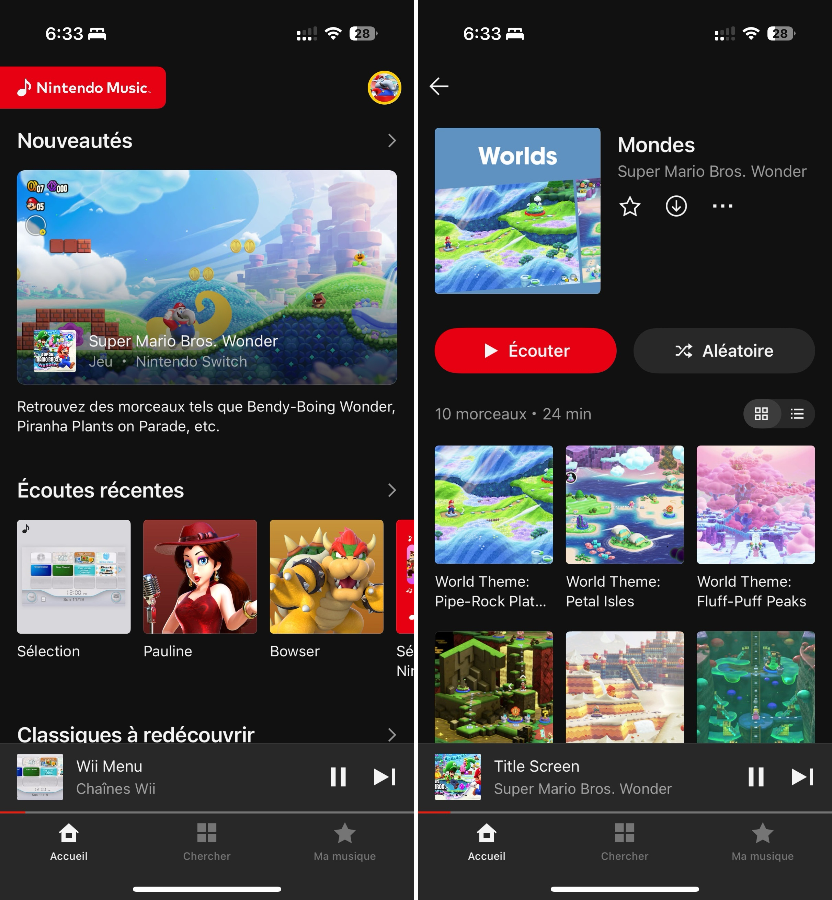
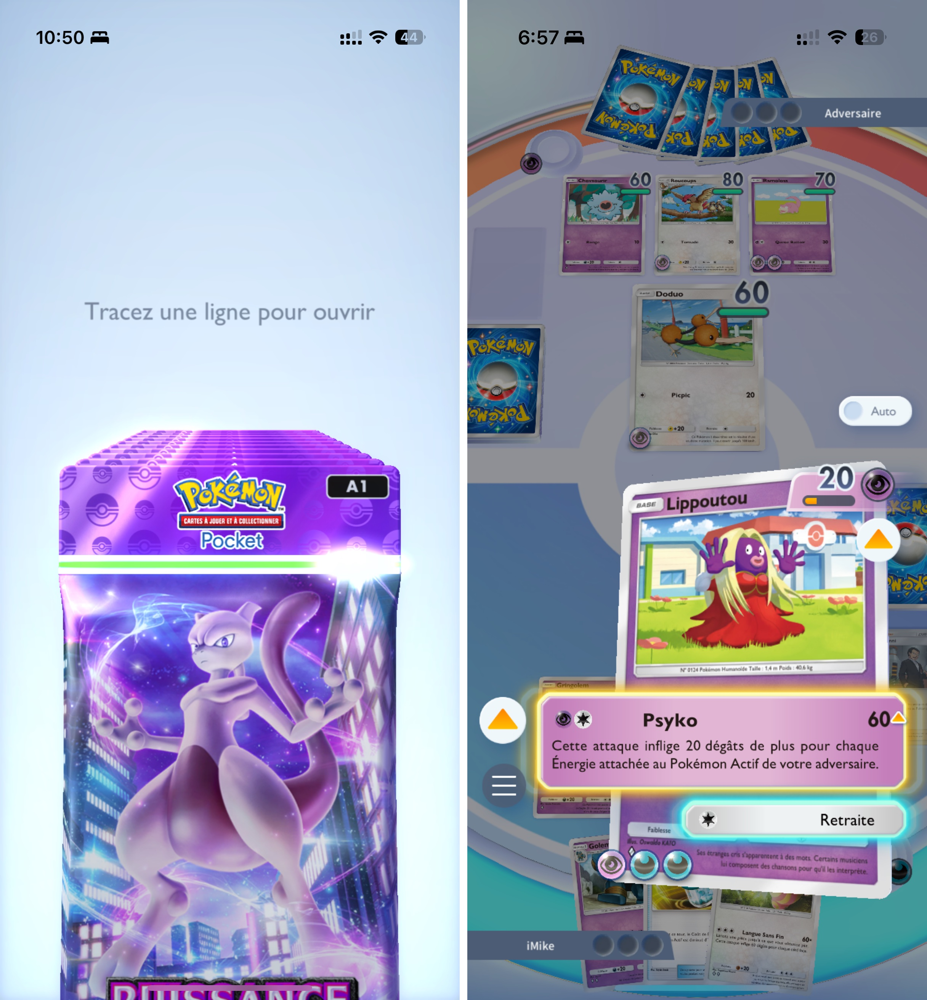
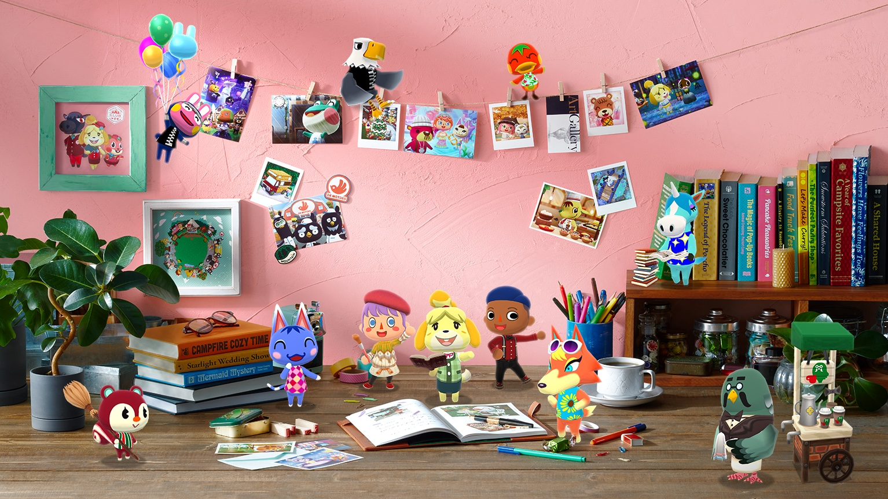
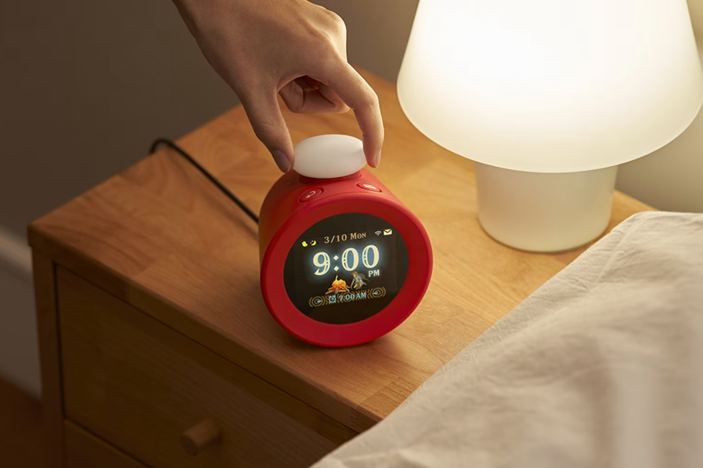
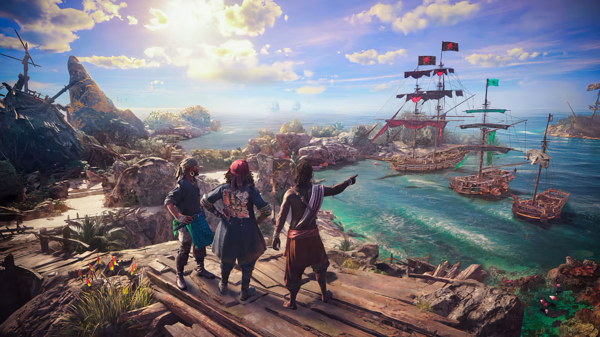
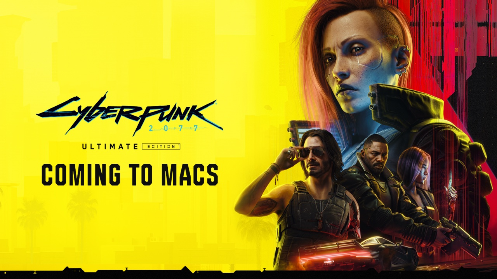

+++
title = "On vide le backlog de la semaine : retour sur Concord, Les Sims 4, le vrai faux direct de Nintendo, et la boîte à baffes d'Ubisoft"
date = 2024-11-02T07:47:32+01:00
draft = false
author = "Mickael"
tags = ["XXL"]
image = "https://nostick.fr/articles/vignettes/novembre/cyberpunk-2077.jpg"
+++

L’actualité du jeu vidéo ne s’arrête pas à la poignée d’articles publiés sur *Nostick* ! Histoire de rattraper le retard accumulé, voici un retour rapide sur quelques unes des infos les plus importantes (ou insignifiantes) de la semaine.

## Le chiffre de la semaine : 15 millions…

… comme le nombre de nouveaux joueurs qui se sont [lancés](https://www.ign.com/articles/ea-earnings-the-sims-4-manages-to-adds-15-million-new-players-in-2024-despite-being-more-than-10-years-old) dans l'aventure des *Sims 4* ces douze derniers mois ! Pas si mal pour un jeu qui a 10 ans au compteur. Ce chiffre étonnant est tiré des résultats du deuxième trimestre d'EA. 

Alors certes, la simulation de vie est passée avec armes et bagages au free-to-play en 2022, ce qui lui avait permis d'engranger rien moins que 31 millions de nouveaux joueurs, pour un total de 85 millions en mai dernier. 

*Les Sims 4*, ça eut payé… et ça paie toujours, visiblement. Pas étonnant qu'[EA ait décidé de remiser *Les Sims 5* au placard](https://nostick.fr/articles/2024/septembre/1809-il-ny-aura-pas-de-sims-5/) pour continuer à profiter du succès du jeu actuel.

## La nouvelle déprimante de la semaine : l'épilogue pour Concord

Inutile de se mentir, ça sentait le sapin très fort pour Firewalk depuis que PlayStation a débranché son jeu *Concord*… deux semaines seulement après son lancement. Le shooter 5v5 n'a pas convaincu grand monde, et surtout pas les joueurs qui ont ostensiblement boudé le jeu service de Sony.

Cette semaine, [le constructeur a donc annoncé la fermeture de Firewalk](https://nostick.fr/articles/2024/octobre/2910-firewalk-studios-ferme-ses-portes/). Les employés, environ 200, vont devoir retrouver du boulot ailleurs (certains devraient se frayer une place au sein des studios PlayStation), bon courage à eux au vu de la conjoncture.

Au-delà, ce flop historique de *Concord* devient une tâche indélébile sur le pedigree de PlayStation, largement immaculé jusque-là. Comment en est-on arrivé là ? On vous propose de revenir sur les différentes dates importantes de cette triste histoire [dans cette chronologie du désastre](https://nostick.fr/articles/2024/octobre/3110-concord-chronologie-desastre/).

## La grosse info de la semaine : le vrai faux Direct de Nintendo

Il y a des événements qui auraient pu être des emails, chez Nintendo c'est un peu le contraire. Les annonces de ces derniers jours auraient pu constituer un Direct tout à fait satisfaisant ! Entre l'Alarmo, Nintendo Music, *Xenoblade Chronicles X* sur Switch, Pokémon JCC, le MMO mystère… La fin de l'année est très productive pour le constructeur même si évidemment, il prend un malin plaisir à ne pas annoncer ce que tout le monde a en tête.

 

Commençons par la fin. Nintendo a fini par donner aux fans ce qu'ils réclamaient depuis toujours : un moyen simple (et officiel) d'écouter les OST de ses jeux. C'est [Nintendo Music qui va finalement se charger du boulot](https://nostick.fr/articles/2024/octobre/3010-nintendo-music-app-vend-reve-oreilles/), une app pour iOS et Android pas mal fichue du tout, qui permet de s'en mettre plein les oreilles.

Alors évidemment, tout n'est pas parfait : seuls les abonnés NSO ont accès au catalogue (mais à 20 balles par an, c'est autrement plus abordable que Spotify !). Nintendo ne s'est pas foulé pour les illustrations des albums et des morceaux, ce sont de vilaines captures d'écran Switch. Et pour une raison qui nous échappe, Nintendo a décidé de ne pas afficher le nom des auteurs et compositeurs ce qui est vraiment problématique, même si [c'est commun au Japon](https://x.com/KaihatsuYT/status/1851830539675930818).

Mais le gros point noir c'est que l'entreprise a décidé pour  muscler les rayons de l'app de reprendre le principe dit du « supplice de la goutte d'eau » déjà à l'œuvre pour les jeux du NSO. Toutes les musiques de tous les jeux Nintendo ne sont pas au rendez-vous, loin de là, la sélection est même sévèrement limitée (une grosse vingtaine de jeux) ! 

Il y a cependant des raisons d'espérer, Nintendo vient d'ajouter l'OST de *Super Mario Wonder*, et d'autres jeux ont d'ores et déjà été annoncés comme *Super Mario 64*, *F-Zero X*, *Wii Sports*, *Zelda: The Wind Maker* — prochaine livraison dès la semaine prochaine. Mais il faudra probablement prendre votre mal en patience pour votre obscur jeu NES préféré… ou tenter sa chance sur YouTube.

Alors qu'on ne l'attendait plus, Nintendo a également dévoilé à la surprise générale [une « édition définitive » pour *Xenoblade Chronicles X*](https://nostick.fr/articles/2024/octobre/2910-xenoblade-chronicles-x-enfin-switch/), ce qui permet finalement à la Wii U de prendre sa retraite : c'était en effet le dernier jeu exclusif de la console défunte à n'avoir pas été porté sur Switch.

 

Le jeu sortira le 20 mars 2025, ce qui en fait officiellement le second jeu Switch signé Nintendo annoncé pour l'année prochaine, après *Donkey Kong Country Returns HD* (16 janvier). Un signe que la Switch 2 ne sera pas dévoilé avant cette date ? Après tout, Nintendo a promis une présentation avant la fin de l'année fiscale le 31 mars.

La semaine a aussi été marquée par le lancement de *Pokémon JCC*, un jeu mobile qui permet non seulement de collectionner des cartes mais aussi d'y jouer ! Alors ce n'est pas nouveau, il existe déjà *JCC Pokémon Live* pour s'affronter en ligne depuis son smartphone, mais cette nouvelle app se destine aux débutants et elle y parvient plutôt bien.

Le jeu permet de se constituer un deck gratuitement, grâce aux deux boosters quotidiens à ouvrir d'une manière très élégante (il y a visiblement eu beaucoup de travail pour peaufiner les animations). Et puis l'app refile des docks temporaires histoire de se faire la main. 

Mais évidemment il y a aussi beaucoup de gacha et un appel incessant vers la boutique pour accélérer les livraisons de boosters et autres équipements plus ou moins cosmétiques. Malgré tout, pour ceux qui n'ont jamais tâté du jeu de cartes, et en attendant *Pokémon Legends: Z-A*, ce jeu pourrait faire l'affaire. En tout cas, ça marche, et fort : le compte officiel du jeu a [annoncé](https://x.com/PokemonTCGP_JP/status/1852221535001493955) que l'app avait atteint les 10 millions de téléchargements (!) en deux jours seulement.

Toujours au rayon smartphone, Nintendo a dévoilé cette semaine comment *Animal Crossing: Pocket Camp* allait prendre sa retraite après 7 années de freemium. Une retraite très active, puisque [le jeu va basculer dans le monde merveilleux du premium le 2 décembre](https://nostick.fr/articles/2024/octobre/2810-nintendo-va-preserver-animal-crossing-pocket-camp/). D'un côté, il va falloir payer pour jouer… mais une seule fois : ce sera 10 € jusqu'au 31 janvier, le double ensuite.

Le contenu sera identique à la version free-to-play, mais sans les achats intégrés ou les interactions avec d'autres joueurs. Nintendo ajoutera pour la bonne forme du contenu supplémentaire au fil de l'eau, via un système d'événements. Les joueurs fans de cette mouture d'*Animal Crossing* — qui est loin d'être honteuse contrairement à *Mario Kart Tour* — ne perdront pas trop au change.

Le 23 octobre, [Nintendo a aussi ouvert les portes du programme Playtest](https://nostick.fr/articles/2024/octobre/2110-premiers-details-jeu-mystere-test-nintendo/) à 10 000 heureux membres NSO. Le constructeur leur avait gentiment demandé de ne rien révéler de la nature de cette chose, mais évidemment tout a fuité, streams à l'appui. Il s'agit d'une sorte de MMO où les joueurs doivent s'entraider pour développer une planète, en plantant leur drapeau pour devenir propriétaires d'un terrain.

Bon, on ne va pas provoquer l'ire de Nintendo ici, mais il ne faut pas chercher bien loin pour voir de quoi il s'agit ([hum](https://bsky.app/profile/sky.femboyfurry.net/post/3l7ab2n4e6b2c) [hum](https://bsky.app/profile/sky.femboyfurry.net/post/3l7aa57l4ci2l)). Le test s'achète le 5 novembre, et après la hype initiale, force est de constater qu'on n'entend plus trop parler de ce jeu. Ce qui n'est pas une mauvaise nouvelle en soi, cela signifie qu'aucun gros souci technique n'a été repéré j'imagine ?

Enfin, n'oublions pas « la » grosse annonce matérielle qui n'a pas été la Switch 2 : [le réveil Alarmo, dévoilé le 9 octobre](https://nostick.fr/articles/2024/octobre/0910-pas-de-switch-2-reveil-alarmo-nintendo/) ! L'appareil, que seuls les abonnés NSO peuvent acheter pour le moment (la plèbe pourra claquer 100 € mi-janvier) est vraiment étonnant. D'un côté, c'est un bête réveil en plastique, de l'autre on sent que Nintendo a pensé son affaire — et pour cause, cela fait des années et des années que c'est en développement.

Évidemment, les bidouilleurs se sont lancés la fleur au fusil pour tenter d'afficher autre chose que des écrans de réveil, et [le chantier avance bien](https://nostick.fr/articles/2024/octobre/3110-alarmo-deux-doigts-tourner-doom/). On aura l'occasion de revenir sur l'Alarmo, n'écoutant que mon courage un test est en cours de faisage !

Ce n'est donc pas cette semaine que Nintendo aura présenté la Switch 2, et maintenant qu'on entre de plain pied dans la période des fêtes de fin d'année, il va probablement falloir attendre au moins janvier prochain pour avoir des nouvelles de la future console. Mais au moins, ces derniers jours ont été riches en nouveautés et qui sait, peut-être que Nintendo a encore d'autres surprises dans son grand chapeau…

## La boîte à baffes d'Ubisoft : Yves Guillemot en a marre de l'Ubi-bashing

Yves Guillemot, le patron d'Ubisoft, en a sa claque des « *commentaires polarisants* » qui s'abattent sur son entreprise. C'est pourquoi il a [annoncé](https://staticctf.ubisoft.com/8aefmxkxpxwl/5kn4pUVx6Vtb1Hir4vpqvq/fe35b53a1514635b0257418d1409d9e1/Ubisoft_FY25_H1_Earnings_PR_vFinal.pdf), à l'occasion des résultats trimestriels de l'entreprise, la mise en œuvre d'« *actions pour contrer [cette] dynamique* », sans entrer spécialement dans les détails. 

Il y a du boulot. Car en la matière, Ubisoft donne souvent le bâton pour se faire battre, par exemple :

- en recyclant à l'infini une formule open world éculée ;
- en affublant *Skull & Bones* de l'étiquette « *quadruple A* » alors que cela devrait être un free-to-play ;
- en livrant des jeux mal optimisés ou buggués au lancement comme *Star Wars Outlaws* ;
- en [démantelant l'équipe responsable de *Prince of Persia: The Lost Crown*](https://nostick.fr/articles/2024/octobre/2210-ubisoft-demantele-equipe-pop-lost-crown/), seul bon jeu de l'année du studio ;
- en forçant les salariés à revenir au bureau alors qu'ils étaient tout à fait efficaces en télétravail ;
- en snobant Steam et des millions de joueurs (bon ça, [ça a heureusement changé](https://nostick.fr/articles/2024/septembre/2509-assassins-creed-shadow-14-fevrir-aussi-sur-steam/)) ;
- en soldant les jeux 3 semaines après leur sortie ;
- en [affirmant](https://www.gamesindustry.biz/the-new-ubisoft-and-getting-gamers-comfortable-with-not-owning-their-games) que les joueurs devraient se faire à l'idée de ne pas posséder leurs jeux ;
- en [lançant un jeu basé sur des NFT](https://nostick.fr/articles/2024/octobre/3010-ubisoft-chmapions-tactics-nft-pourris/)…

Et ce ne sont là que quelques unes des raisons pour lesquelles Ubisoft subit un bashing continuel. Espérons en effet que des actions seront prises en interne pour redorer une image de marque au fond du trou !

## La citation de l'abruti de la semaine : Éric Naulleau n'aime pas les jeux vidéo

« *On a fait croire que jouer à un jeu vidéo ou lire "À la recherche du temps perdu" de Proust, c'était une activité culturelle équivalente. C'est une arnaque phénoménale. On sait que ça ne sollicite pas les mêmes zones du cerveau, que ça n'apporte pas la même chose, que ça n'a pas le même rôle dans l'acquisition du langage et la maîtrise du langage.* »

« *C'est une ruse du capitalisme et du commerce pour faire croire que quand on joue aux jeux vidéo, on pratique une activité culturelle. C'est faux. Ça n'a rien à voir avec la lecture, avec l'écriture. Et d'ailleurs, jouer aux échecs même sur Internet n'a rien à voir avec des jeux de guerre [wut ?]. Mais comme nous sommes dans une époque qui nivelle tout et qui  nivelle malheureusement par le bas, on en arrive à ce genre de débat. On vit une époque navrante* ».

C'est [sorti](https://streamable.com/ihkc82) de la bouche de cette andouille d'Éric Naulleau durant l'émission « Pascale, Éric, Yann et les autres » (sur *C8*, évidemment). Le commentateur professionnel réagissait au nombre de visiteurs qui se sont pressés à la Paris Games Week. 180 000 personnes plus curieuses et plus ouvertes sur le monde que le rebelle des plateaux télé.

## On n'a pas eu le temps cette semaine mais on pense à lui (un peu)

*Cyberpunk 2077* [sortira](https://www.cyberpunk.net/en/news/50947/just-announced-cyberpunk-2077-ultimate-edition-coming-to-mac) finalement sur Mac début 2025 ! Le jeu, sorti (difficilement) sur PC et consoles il y a quatre ans tirera profit des capacités des puces Apple et du ray-tracing matériel des nouveaux Mac M4. L'audio spatial sera aussi de la partie. Le jeu sera proposé dans une version Ultimate (avec le DLC « Phantom Liberty ») sur le Mac App Store, mais aussi sur Steam.

## osef

Konami a [annoncé](https://www.famitsu.com/article/202410/22627) l'adaptation de *Castlevania* en comédie musicale. Il s'agira d'une histoire originale qui « *ouvrira de nouvelles portes dans la franchise* ». Un jeu, peut-être ? La première est prévue l'année prochaine au Japon.

## Dans le reste de l'actu déchaînée

- Il a été beaucoup question de *Call of Duty: Black Ops 6* cette semaine, pour une bonne raison : c'est le premier opus à sortir sous la bannière de Microsoft. L'occasion pour l'éditeur et pour Activision de se réjouir du succès de la franchise ([un demi-milliard de copies vendues !](https://nostick.fr/articles/2024/novembre/0111-demi-milliard-copies-vendues-call-of-duty/)) et de se féliciter du [lancement réussi du jeu](https://nostick.fr/articles/2024/octobre/2910-call-of-duty-black-ops-6-microsoft-reussi/). Satya Nadella, le patron de Microsoft, veut aussi [plus de jeux Xbox sur les autres plateformes](https://nostick.fr/articles/2024/octobre/2810-patron-microsoft-exclusivites-xbox-plateformes/), de quoi mettre un nouveau [coup de pelle sur le futur cadavre de la Xbox](https://nostick.fr/articles/2024/octobre/3110-xbox-vend-plus-jeux-moins-conosles/).
- L'excellent *Brotato* s'est offert un mode co-op et un DLC avec plein de contenus en plus. [C'est à découvrir par ici](https://nostick.fr/articles/2024/octobre/2810-tapez-aliens-plusieurs-patates-brotato/).
- Bungie a donné des nouvelles de *Marathon*, le futur gros jeu service de PlayStation. Toujours pas de gameplay, malheureusement ! [Direction cette actu pour tout savoir](https://nostick.fr/articles/2024/octobre/2910-bundie-nouvelles-marathon-pas-gameplay/).
- Si *Starfield* c'est pas trop votre came, pas de panique : Starfield 2 sera sûrement beaucoup mieux ! [Mais ce n'est pas moi qui le dis](https://nostick.fr/articles/2024/octobre/2910-starfield-2-successeur-bethesda/).
- *Monster Hunter Wilds* est plein de créatures peu ragoûtantes mais fort heureusement, un mode « arachnophobie » sera disponible ! [Mais à quoi ça ressemble](https://nostick.fr/articles/2024/octobre/2910-monster-hunter-wilds-araignees-blobs/) ?
- Tout le monde aime une bonne bagarre sur le terrain, mais avec le reboot/remake/suite de *Speedball*, la franche camaraderie va un cran plus loin. [Ou même plusieurs](https://nostick.fr/articles/2024/octobre/3010-speedball-revient-casser-dents/)…
- La Playdate, la sympathique petite console à manivelle, offrira aux joueurs une seconde saison pleine de nouveaux jeux. [À découvrir dans cette actu](https://nostick.fr/articles/2024/octobre/3110-la-playdate-va-avoir-droit-a-une-saison-2/).
- Les joueurs Steam Deck adeptes d'*Apex Legends* n'ont plus guère que leurs yeux pour pleurer, le jeu n'est plus dispo sur la plateforme. [Mais pourquoi](https://nostick.fr/articles/2024/novembre/0111-apex-legends-bouler-joueurs-steam-deck/) ?
- *Alan Wake 2* n'est toujours pas rentable, mais le studio Remedy voit le bout du tunnel. [Encore un petit effort](https://nostick.fr/articles/2024/novembre/0111-alan-wake-2-presque-rentable/) !
- La PS5 Pro ne date pas d'hier. Ni même d'avant-hier. En fait, Sony a commencé à la développer avant même que la PS5 sorte ! [Plus d'infos dans cette actu](https://nostick.fr/articles/2024/novembre/0111-ps5-pro-developpement-avant-ps5/).
- Ayé, le mois de novembre a démarré, c'est le bon moment pour faire le point sur les grosses sorties qui nous attendent. [Par ici le calendrier des sorties](https://nostick.fr/articles/2024/novembre/0111-grosses-sorties-novembre/).