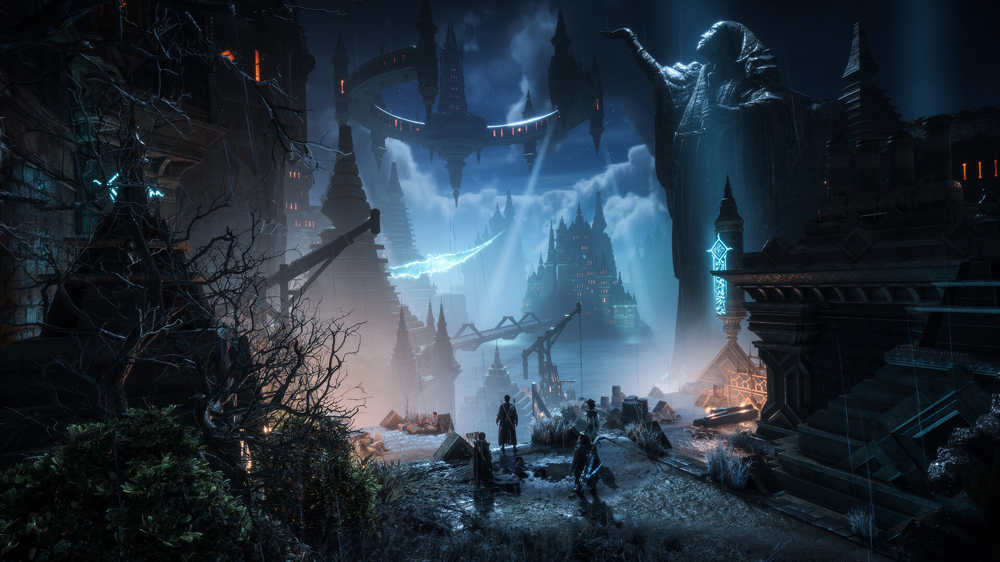
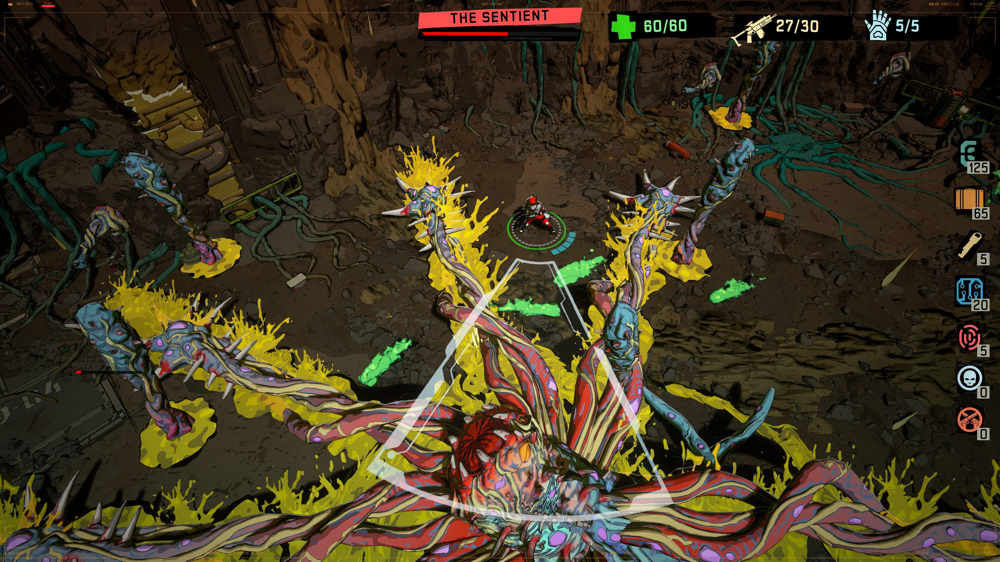

+++
title = "Dragon Age : The Veilguard, le nouveau Life is Strange : le récap des sorties de la semaine (03/11)"
date = 2024-11-03T07:00:02+01:00
draft = false
author = "Félix"
tags = ["C’est dispo"]
image = "http://nostick.fr/articles/2024/0311-dragon-age-lis-les-sorties-de-la-semaine/dragon.jpg"
+++

Entre la garderie, les courses et la nuit qui tombe à 17 h, vous n’avez peut-être pas eu le temps de vous intéresser aux nouveautés du moment. Qu’à cela ne tienne : voici les sorties de ces derniers jours qui ont retenu notre attention.

## Le dernier dragon

10 ans après son dernier opus, la licence ***Dragon Age*** revient d’entre les morts avec ***The Veilguard***, un nouveau action-RPG maousse costaud signé Bioware. Je ne vais pas vous faire l’audace d’essayer de résumer le scénario (il y a des elfes des nains des voleurs des dragons bref vous voyez le topo) et on va directement aller à l’essentiel : les avis sont très mitigés. La licence abandonne son aspect monde ouvert pour se concentrer sur la narration, avec des niveaux plus linéaires remplis de combats en temps réel moins tactique et plus portés sur l’action. Forcément le côté RPG perd en profondeur, ce qui a déplu à certains joueurs déplorant une mise en scène en retrait. Certains tests sont dithyrambiques là où d’autres y voient un 6/10 à tout casser, ce qui rappelle un peu la réception de *Starfield*. Bref, à votre place je ne foncerais pas dessus, d’autant plus que ça a l’air velu et plutôt lent à se lancer. Comptez [60 € sur PC](https://store.steampowered.com/app/1845910/Dragon_Age_The_Veilguard/), sûrement 10 balles de plus sur Xbox et PS5.

## Max la menace

Max Caulfield, l’héroïne du premier *Life is Strange*, est de retour dans un nouvel opus baptisé *‌Double Exposure*. Développé par le studio Deck Nine (à qui l’on doit plusieurs spin-offs moyens), cette suite directe est visiblement… passable ? Max est désormais assistante à l'université d’une petite ville enneigé du Vermont. Son amie Safi se fait mystérieusement assassiner, réveillant ses pouvoirs et lui permettant d’explorer deux lignes temporelles : une dans laquelle Safi et saine et sauve, et une autre dans laquelle elle va devoir éviter que le drame ne se produise. Comme d’hab il va falloir beaucoup marcher, analyser tout ce qui passe et papoter avec tout un tas de PNJ. Si le pitch est intéressant, le déroulé de l’intrigue est visiblement plutôt moyen avec un rythme inégal et un manque de moments forts. Rien de loupé et ça se laisse suivre, mais les tests décrivent un jeu assez plat qui n’atteint pas la finesse du premier *LiS*. Pourquoi pas pour les fans, mais les autres peuvent sans doute attendre une promo. 50 balles [sur PC](https://store.steampowered.com/app/1874000/Life_is_Strange_Double_Exposure/), Xbox et PlayStation 5.

 

## Rogue de l’espace

Vous vous souvenez peut-être de *The Calisto Protocol*, un *Dead Space* en moins bien sorti fin 2022. Ses créateurs remettent le couvert avec un spin-off pour le moins original : ***[REDACTED]***, un roguelike en vue isométrique sauce dungeon crawler à la *Hades*. Deux salles deux ambiances donc avec ce nouveau jeu invitant à trouver la sortie d’une prison glacée remplie de monstres en tout genre. La map se divise en 4 zones avec autant de boss ainsi que quelques rivaux venant vous mettre des bâtons dans les roues. Le titre se démarque par son style de comics très joli et quelques bonnes idées, comme le fait que votre cadavre se transforme en ennemi à chaque nouvelle partie. Les tests évoquent un jeu bon mais sans plus, difficile à conseiller si vous n’avez pas retourné les deux *Hades* mais qui devrait plaire aux fans du genre. [Vendu 24,50 €](https://store.steampowered.com/app/2229940/REDACTED/), ça devrait faire le taf pour quelques parties rapides sur votre Steam Deck. Également dispo sur Xbox et PS5.

## Achetez-les tous !

Une fois n’est pas coutume on va parler d’un jeu mobile cette semaine : ***Pokémon Trading Card Game Pocket***, qui cherche à tirer sur la corde nostalgique en rappelant les bons souvenirs des échanges de cartes à la récré. Est-ce que ça vaut le coup ? Pas vraiment. Nintendo n’a pas fait les choses à moitié avec des cartes rares aux superbes effets 3D et d’autres au design plus vintage pour les vieux de la vieille. Comme on pouvait s’y attendre, le jeu est bardé de microtransactions plutôt agressives. Malgré des paquets gratuits réguliers, c’est la disette passé les premiers jours et il faudra patienter de longues semaines (mois ?) avant de tomber sur la carte manquante à son deck. Un Pass Premium est présent pour 10 € / mois ainsi qu’un paquet de monnaies in-game, évidemment bien trop rare pour acheter des cartes sympas. Le système de combat a été simplifié pour donner une plus grande part à la chance, ce qui ne plaira pas aux joueurs aguerris. Bref du gros gacha qui tâche, mais on ne s’attendait pas à mieux pour l’adaptation d’un jeu de cartes à collectionner. Dispo sur [iOS](https://apps.apple.com/fr/app/pokémon-tcg-pocket/id6479970832)/[Android](https://play.google.com/store/apps/details?id=jp.pokemon.pokemontcgp&hl=en).



## Un peu de rab’

Qu’est-ce que l’audace ? Si la question a fait fumer les méninges de plus d’un bachelier, elle a beaucoup moins fait réfléchir les petits gars de Rockstar : le studio vient de sortir **le premier *Red Dead*** et son DLC avec quelques améliorations (4K native, éclairage HDR) à [50 balles sur Steam](https://store.steampowered.com/app/2668510/Red_Dead_Redemption/?snr=1_4_4__129_2). Pour un jeu qui a presque 15 ans, c’est osé. Sony n’a pas de leçon à donner étant donné qu’elle vient d’envoyer le **remaster d’*Horizon Zero Dawn***, un jeu de 2017 qui n’en demandait pas tant (50 € aussi sur PS5/[PC](https://store.steampowered.com/app/2561580/Horizon_Zero_Dawn_Remastered/)). Plus original, notons la sortie ***d’Albatroz***, un « RPG de randonnée » qui a l’air très joli ([30 €](https://store.steampowered.com/app/2171880/Albatroz/)) ou encore de ***Fruitbus***, qui invite à gérer son food-truck tout mignon ([24,50 €](https://store.steampowered.com/app/2484130/Fruitbus/)). Et puisqu’il fallait un jeu d’horreur low-poly cette semaine, c’est ***Tostchu*** qui s’y colle en nous proposant de prendre la tête d’un magasin de toasts dans une zone rurale déserte de Turquie. Les retours des joueurs sont excellents, comptez 12,79 € [sur Steam](https://store.steampowered.com/app/2221500/Tostchu/).
