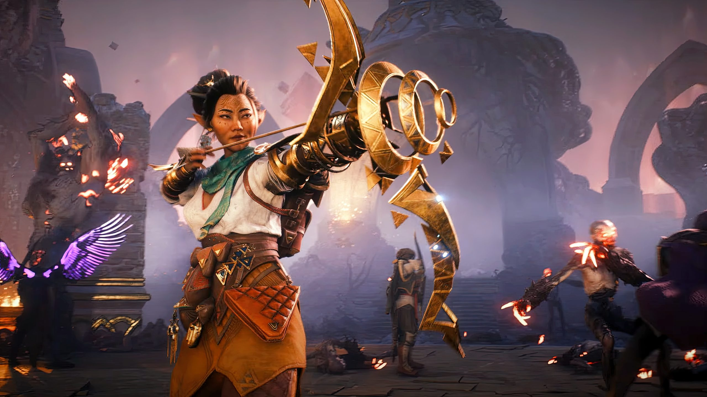

+++
title = "Dragon Age: The Veilguard n'aura aucun DLC"
date = 2024-11-04T08:00:32+01:00
draft = false
author = "Mickael"
tags = ["Actu"]
type = "telex"
+++

 

*Dragon Age: The Veilguard* va occuper les joueurs pendant de longues heures — c'est le genre de jeu qui peut vous emmener au-delà de la centaine d'heures si on n'y prend pas garde ! Alors du coup, pas la peine d'espérer un DLC : John Epler, directeur créatif du jeu chez BioWare, a [annoncé](https://www.rollingstone.com/culture/rs-gaming/dragon-age-the-veilguard-john-epler-interview-1235147001/) chez *Rolling Stone* qu'il n'y avait aucun projet d'extension. 

Les DLC de *Dragon Age* sont reconnus pour leur qualité, que ce soit l'extension « The Awakening » pour *Origins*, « Legacy » pour *Dragon Age 2*, ou « Trespasser » dans *Inquisition*. *The Veilguard* n'aura droit à aucune histoire supplémentaire !

Toute l'attention du studio se porte désormais sur le prochain *Mass Effect*, ce qui est plutôt une bonne nouvelle pour les fans de la franchise en souffrance. *Andromeda* remonte à 2017 et n'avait pas eu droit non plus à un DLC, mais le titre n'ayant pas réellement convaincu les joueurs, c'est ce qui a poussé BioWare vers d'autres horizons comme l'admet John Epler à demi-mot.