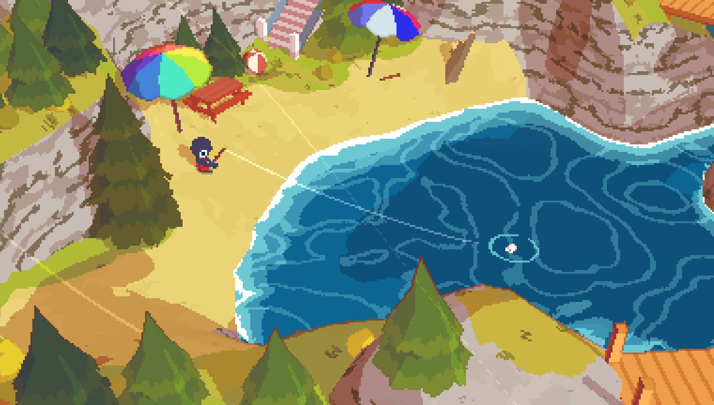

+++
title = "Ça va faire votre soirée : A Short Hike"
date = 2024-11-04T16:01:01+01:00
draft = false
author = "Félix"
tags = ["XXL"]
image = "https://nostick.fr/articles/2024/juillet/1407-anger-foot-once-human-sorties-de-la-semaone/anger.jpg"
+++

**Les jeux qui exigent une attention de tous les instants pendant des dizaines d'heures, OK, c'est sympa, mais parfois on préférerait quelque chose de court et d'efficace. C'est pourquoi nous allons vous proposer chaque jour de la semaine un jeu à commencer et à terminer en une soirée ! Aujourd'hui : *A Short Hike*.**

Difficile de ne pas parler de ***A Short Hike***, qui représente bien l’idée qu’on peut proposer une expérience fun et incroyablement attachante se bouclant en moins de deux heures. Ce jeu en 3D vue du dessus nous invite à incarner Claire, un oiseau parti se reposer sur une île remplie d’animaux anthropomorphiques que l’on croirait sorti d’un demake d’*Animal Crossing*. Faute de réseau sur l’île, l’objectif du jeu est simple : gravir la montagne centrale du parc naturel pour aller passer un coup de fil.

L’exploration de la petite île se fait de manière ouverte, le joueur pouvant arpenter les différents sentiers à son rythme. Il est possible de sortir des chemins pour grimper à droite à gauche, *A Short Hike* disposant d’un système d’escalade similaire aux *Zelda* sur Switch. Les multiples PNJ sont là pour tailler le bout de gras à travers des dialogues bon enfant, mais aussi donner de petites missions. La curiosité est récompensée étant donné qu’on pourra trouver des trésors un peu partout en plus d’un tas d’activités annexes : pêcher, jouer au beach-volley, faire la course avec un joggeur… Au fur et à mesure de sa progression, notre personnage récupère des plumes dorées permettant d’augmenter sa jauge d’endurance et donc d’atteindre des zones auparavant inaccessibles.

Comme vous pouvez le voir sur les captures d’écran de la page Steam, *A Short Hike* est un jeu très mignon et bienveillant : il n’y a aucun combat, les dialogues sont rigolos et il est difficile de ne pas parcourir l’aventure sans un sourire béat greffé au visage. Mention spéciale pour l’OST, tout simplement excellente et au sentiment de progression bien condensé dans ce petit bonbon d’un peu moins de deux heures. Vous pouvez foncer les yeux fermés.

- ***A Short Hike*** est disponible sur PC, Mac, Linux, Switch, PS5, PS4 Xbox Series et Xbox One [pour 6,50 €](https://store.steampowered.com/app/1055540/A_Short_Hike/).