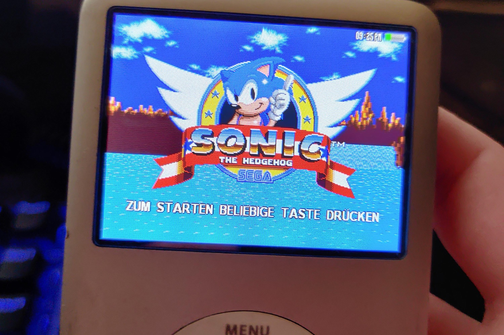
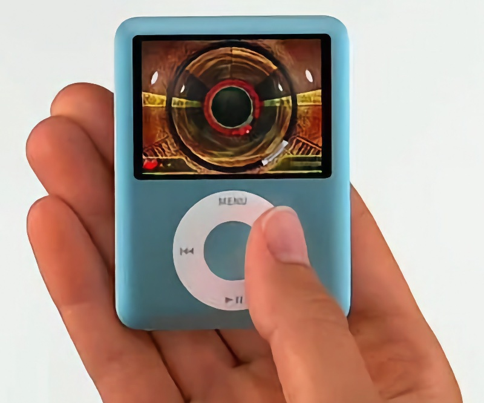

+++
title = "Les jeux de l'iPod reviennent à la vie"
date = 2024-11-04T08:07:32+01:00
draft = false
author = "Mickael"
tags = ["Actu"]
image = "https://nostick.fr/articles/vignettes/novembre/ipod-sonic.jpg"
+++

Il fut un temps où Apple était une entreprise innovante qui tentait des choses originales, quitte à ce que ça ne rencontre pas le succès escompté. Il y a par exemple eu cette tentative de transformer l'iPod — oui, le baladeur MP3 — en mini console de jeux ! Pendant un peu moins de trois ans, de la fin 2006 à 2009, les utilisateurs d'iPod pouvaient acheter des jeux (5 € pièce) sur l'iTunes Store, et y jouer en utilisant la fameuse molette et le clic central.

[54 jeux](https://en.wikipedia.org/wiki/IPod_game) (ou 56 suivant les décomptes) ont été lancés pour l'iPod, avec quelques réussites (comme *Peggle* ou *Phase*) et pas mal de loupés (*Sonic The Hedgehog*, un effort louable mais injouable). Apple avait fait du pied à plusieurs éditeurs de premier plan, comme Sega, Electronic Arts, Namco et Square Enix pour porter leurs titres sur le baladeur.

 

Ça n'a pas connu un succès foudroyant, mais pouvoir jouer, même pas très bien, à *Bomberman* ou *Asphalt 4* sur son iPod, ça avait la classe. Et ça occupait 5 minutes entre deux bus ! Cette parenthèse enchantée a pris fin aux premières heures de la transformation de l'iPhone en plateforme de jeux vidéo, ce qui a été quasiment immédiat avec l'ouverture de l'App Store en 2008.

Les jeux pour iPod ne sont guère nombreux, ils ne sont pas spécialement amusants (enfin, à part un ou deux), mais malgré tout ce n'est pas une raison de les abandonner à leur triste sort. Il existe toujours une vraie communauté autour de l'iPod, malgré la fin de la production et de la commercialisation des baladeurs : l'iPod Classic a été retiré de la vente en 2014, l'iPod shuffle et l'iPod nano en 2017, l'iPod touch en 2022. Quant aux jeux, ils ont disparu de l'iTunes Store dès 2011.

Les vaillants utilisateurs de l'iPod aujourd'hui voudraient bien tâter de ces jeux, et les historiens veulent conserver une trace de cette bizarrerie. Malheureusement, le DRM « [FairPlay](https://en.wikipedia.org/wiki/FairPlay) » apposé à ces jeux est très difficile à craquer : il existe bien des [archives](https://archive.org/details/ipod-click-wheel-games-archive) des jeux iPod (ces derniers sont proposés dans le format compressé IPG), mais il est quasiment impossible de les installer. 

Il n'existe en fait qu'une seule méthode impliquant l'iPod Classic de 5e génération et un [firmware patché](https://www.reddit.com/r/ipod/comments/r39967/guide_how_to_install_extra_clickwheel_games_onto/?utm_source=share&utm_medium=ios_app&utm_name=iossmf). Il se trouve que FairPlay lie chaque fichier IPG non seulement avec le compte iTunes avec lequel le jeu a été acheté, mais aussi avec l'identifiant matériel du PC ou du Mac qui a servi à synchroniser le baladeur avec le jeu.

Tenter de synchroniser un de ces jeux sur un nouvel iPod, autrement dit avec une autre version d'iTunes, requiert le jumelage entre l'IPG d'origine et le compte iTunes sur lequel a été effectué l'achat du jeu. Dans ces conditions, comment faire ?

Une solution a été trouvée, comme le relate *[ArsTechnica](https://arstechnica.com/gaming/2024/11/ipod-fans-evade-apples-drm-to-preserve-54-lost-clickwheel-era-games/#gsc.tab=0)*. En autorisant plusieurs comptes sur une même installation d'iTunes, celle-ci peut devenir une sorte de bibliothèque centrale permettant de partager des jeux avec plusieurs iPod, sans limite ni vérification en ligne par Apple. 

Olsro, un bidouilleur français, a lancé il y a quelques semaines un projet de préservation des jeux pour iPod, en s'appuyant sur cette méthode. L'idée est de construire une machine virtuelle communautaire contenant l'intégralité des jeux iPod ; la machine virtuelle peut être ensuite téléchargée et installée par tout un chacun afin de synchroniser son baladeur et ainsi, récupérer tous les jeux.

La machine virtuelle Qemu proposée sur [GitHub](https://github.com/Olsro/ipodclickwheelgamespreservationproject) est une version allégée de Windows 10 qui peut démarrer très rapidement, sans avoir besoin d'activer la virtualisation matérielle. Elle peut être installée sur un PC — c'est la configuration recommandée — mais aussi sur un Mac mais les performances seront plus modestes. Il faut aussi synchroniser un iPod formaté Windows. Autant prévenir tout de suite : les manipulations ne sont pas nécessairement à la portée du premier venu. Néanmoins, c'est disponible pour les courageux !

Actuellement, Olsro a collecté 47 jeux, et il propose à tous ceux qui auraient un jeu traînant dans un iPod poussiéreux de le contacter sur le Discord « inurayama » pour réaliser le transfert. Une opération relativement simple, à réaliser avec le bidouilleur en direct. Ça prend une [quinzaine de minutes](https://old.reddit.com/r/ipod/comments/1fydso6/preservation_of_ipod_clickwheel_games_read_this/) et franchement, ça vaut le coup avant qu'Apple décide de débrancher les serveurs servant à autoriser les iPod — si cela devait arriver, la bibliothèque iTunes d'Olsro ne pourra plus accueillir de nouveaux jeux. 