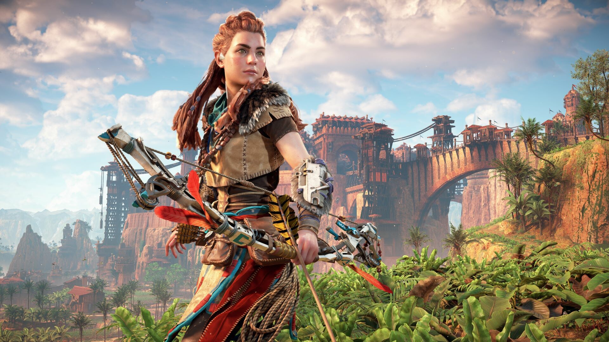

+++
title = "Le remaster d’Horizon Zero Dawn n’attire pas les foules sur PC"
date = 2024-11-04T07:50:02+01:00
draft = false
author = "Félix"
tags = ["Actu"]
image = "https://nostick.fr/articles/2024/novembre/0411-remaster-horizon-zero-dawn-attire-pas-les-foules/horizon.jpg"
+++

 

Les remasters et autres portages PC de Sony n’ont plus le vent en poupe. La toute fraîche [nouvelle version](https://store.steampowered.com/app/2561580/Horizon_Zero_Dawn_Remastered/) d’*Horizon Zero Dawn* aux graphismes améliorés a attiré 2 538 curieux en simultané sur Steam selon [les données de SteamDB](https://steamdb.info/app/2561580/charts/). C’est beaucoup moins que la version d’origine, sortie en 2020 et qui avait alors intrigué [56 557 joueurs](https://steamdb.info/app/1151640/charts/). Ironiquement et à l’heure où j’écris ces lignes, plus de gens sont d’ailleurs en train de jouer à la version de base qu’au remaster. Sony propose pourtant une option pour obtenir cette mise à jour graphique pour seulement 10 $.

Alors oui la comparaison entre les deux n’est pas très équitable vu que le remaster vient de sortir, mais ça montre quand même que les joueurs PC intéressés par la licence ne se sont pas jetés sur l’upgrade. Le remaster a été plutôt tièdement reçu par les joueurs, les évaluations Steam étant « moyennes » : de nombreuses critiques pointent des bugs ainsi que l’obligation d’avoir un compte PSN, ce qui n’est pas le cas de la première édition (qui est étonnamment [toujours en vente](https://store.steampowered.com/app/1151640/Horizon_Zero_Dawn_Complete_Edition/)).

L’annonce de ce remaster a été accueillie avec scepticisme : ce ravalement de façade était-il bien nécessaire alors que le jeu de 2017 reste très joli à regarder ? Il s’agit du deuxième remaster de Sony à souffrir d’un démarrage poussif sur Steam cet automne. La version 2024 d’*Until Dawn* a attiré seulement [2 607 curieux](https://nostick.fr/articles/2024/octobre/0810-remake-until-dawn-peine-a-trouver-son-public/) sur Steam le jour de son lancement début octobre. Il s’agissait pourtant de sa première sortie sur PC, mais le jeu a été balancé pour 70 balles sans promo là où *Horizon Zero Dawn Remastered* est au tarif plus doux de 50 €.

