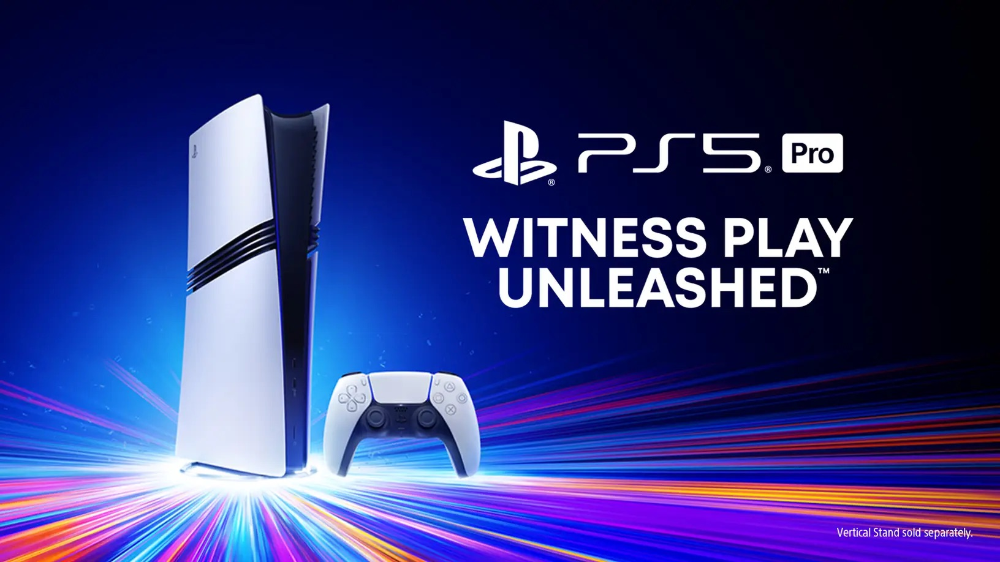
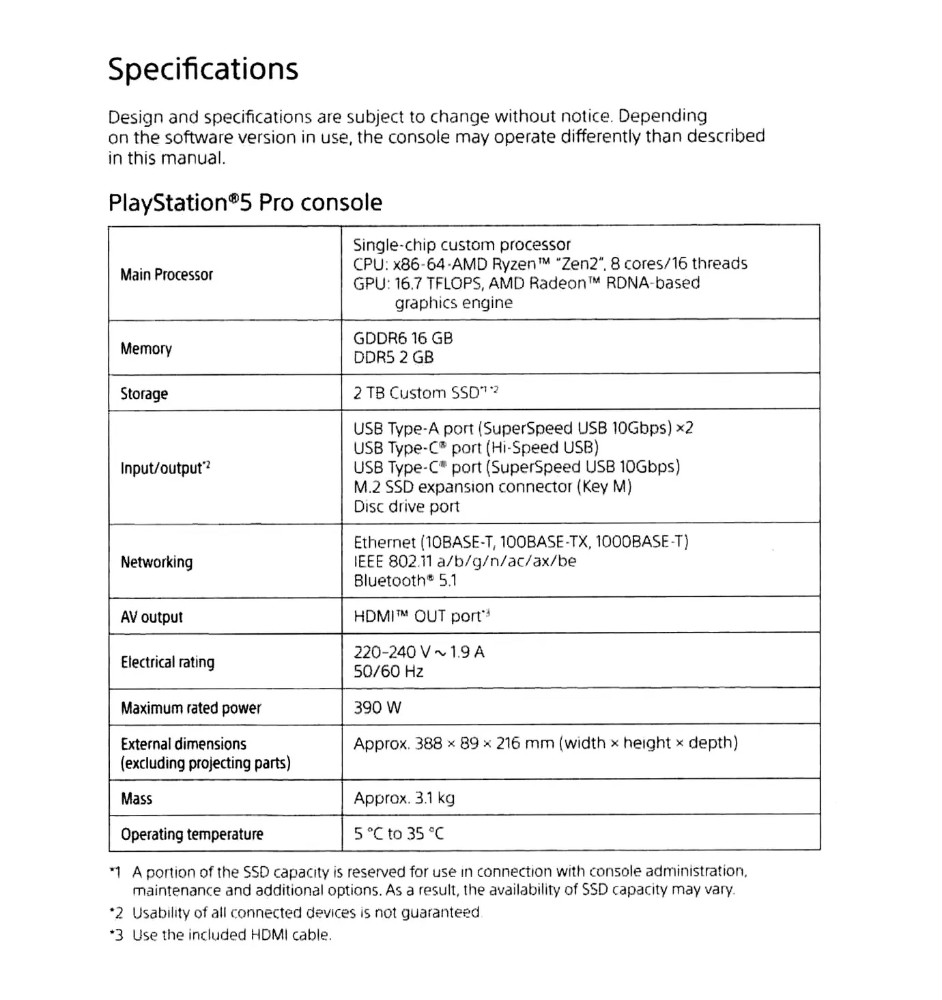

+++
title = "Les specs de la PS5 Pro enfin connues"
date = 2024-11-04T16:47:32+01:00
draft = false
author = "Mickael"
tags = ["Actu"]
image = "https://nostick.fr/articles/vignettes/novembre/ps55.jpg"
+++

Sony espère sans doute que le lancement de la PS5 Pro sera moins sujet aux polémiques que sa présentation : l'événement, [mis en ligne le 10 septembre dernier](https://nostick.fr/articles/2024/septembre/1009-enfin-une-ps5-pour-les-pro/), n'a pas convaincu grand monde sur les gains graphiques annoncés, et le clou du spectacle — le prix de 800 €, sans lecteur de disque ! — a [refroidi les dernières ardeurs](https://nostick.fr/articles/2024/septembre/1409-backlog-ps5-pro-destiny-2-the-crew-2/#la-grosse-info-de-la-semaine--le-retour-de-lhubris-de-playstation).

 

Néanmoins, grâce à quelques aperçus un peu plus sérieux, on a pu s'apercevoir que [la PS5 Pro n'était pas un coup d'épée dans l'eau](https://nostick.fr/articles/2024/septembre/2109-backlog-xbox-ps5-pro-concord-sims-4-gta-online/#la-bonne-nouvelle-de-la-semaine--finalement-cest-pas-si-pourri-la-ps5-pro) et que les promesses d'une qualité graphique au top à 60 FPS étaient possibles ! Pour le lancement du 7 novembre, Sony [annonce](https://blog.playstation.com/2024/11/04/ps5-pro-50-enhanced-games-available-at-launch-november-7/) d'ailleurs plus d'une cinquantaine de jeux optimisés, dont *Alan Wake 2*, *Dragon Age: The Veilguard*, *Diablo IV*, *Stellar Blade*, etc.

Tout cela est bel et bon, mais on ignore encore beaucoup de choses de la PS5 Pro, à commencer par les specs ! Et puisque Sony a décidé que ce n'était pas son rôle de renseigner les futurs joueurs, *Digital Foundry* a [partagé](https://www.eurogamer.net/digitalfoundry-2024-playstation-5-pro-weve-removed-it-from-its-box-and-theres-new-information-to-share) la fiche technique. On y apprend que la PS5 Pro embarque un processeur AMD Ryzen Zen 8 cœurs/16 trends, a priori similaire à celui de la PS5 Slim. On ne s'attendait à aucun miracle sur ce point.

Plus intéressant en revanche, le GPU est un AMD Radeon basé sur l'architecture RDNA qui produit une puissance de 16,7 TFLOPS, à comparer avec les 10,28 TFLOPS de la PS5 tout court. Il y a clairement un gain ici, d'ailleurs Sony a vanté un bond de 45 % pour le rendu graphique.

La PS5 Pro embarque également 16 Go de RAM GDDR6 ultra-rapide (comme sur la PS5 standard), et surprise, 2 Go supplémentaires de DDR5, qui suffiront amplement pour les tâches qui ne relèvent pas des jeux. Cette RAM en plus permet aux développeurs d'exploiter davantage de GDDR6, ce qui explique certainement la promesse du constructeur d'une mémoire vive 28 % plus rapide.

Pour le reste, la nouvelle console contient comme prévu un SSD de 2 To, elle peut aussi tirer jusqu'à 390W de puissance, contre 340W sur la PS5. Ça confirme que la PS5 Pro requiert plus de jus pour certains jeux.