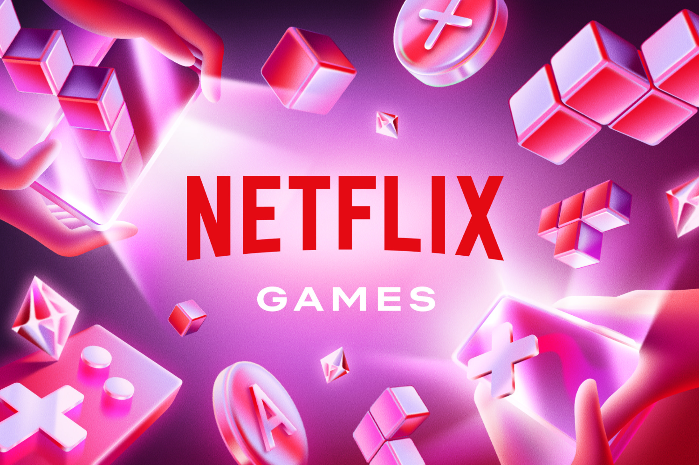

+++
title = "Netflix va mettre le paquet sur l’IA générative pour ses futurs jeux mobiles"
date = 2024-11-05T06:50:02+01:00
draft = false
author = "Félix"
tags = ["Actu"]
image = "https://nostick.fr/articles/2024/novembre/0511-netflix-met-le-paquet-ia-generative/netflix.png"
+++

 

Vous vous souvenez de l’époque où on [vous disait](https://nostickreloaded.substack.com/i/137536106/netflix-gaming) que Netflix avait une stratégie prometteuse dans le domaine du JV ? Vous pouvez oublier. Après avoir [fermé](https://nostick.fr/articles/2024/octobre/2210-netflix-studio-aaa-team-blue/) le studio interne en charge de son premier AAA, l’entreprise a annoncé avoir nommé son ancien vice-président des jeux comme « VP of GenAI for Games ». Autrement dit, boss de l’IA générative pour les jeux. Ouais, ça pue.

« *Je suis enfin prêt à parler de ce que je fais maintenant : je travaille sur un point d'inflexion inédit pour le développement de jeux et l'expérience des joueurs en utilisant l'IA générative* », a-t-il déclaré dans [un post LinkedIn](https://www.linkedin.com/posts/mike-verdu-2a6113_new-role-at-netflix-vp-genai-for-games-activity-7259029850827423744-YMg4/). « *Cette technologie de transformation accélérera la vitesse de développement et permettra d'offrir des expériences de jeu inédites qui surprendront, raviront et inspireront les joueurs* », ajoute-t-il sans trembler des genoux. Évidemment, il affirme que les talents créatifs resteront au centre du projet, l’IA jouant seulement « *un rôle de catalyseur et d'accélérateur* ».

Si Netflix a réussi à mettre la main sur un catalogue sexy (*GTA, Sonic Prime Dash, Tera Nil, Kentucky Route Zero, Immortality*), on avait senti un changement de stratégie dans [le courant de l’été](https://nostick.fr/articles/2024/juillet/2307-netflix-continue-dinvestir-jeux-mobile/) : la boîte avait annoncé vouloir mettre l’accent sur les jeux narratifs interactifs, décrits comme « *plus faciles à construire* ». L’idée semble donc être de mettre le paquet là-dessus pour accélérer la cadence et sortir environ un jeu par mois. On verra ce que ça donne, mais on ne se fait pas trop d’espoirs. À l’avenir, le catalogue Netflix gagnera sans doute plus souvent des visual novel *Emily in Paris* aux décors générés par IA que des pépites comme *Death Door*, et c’est bien dommage.