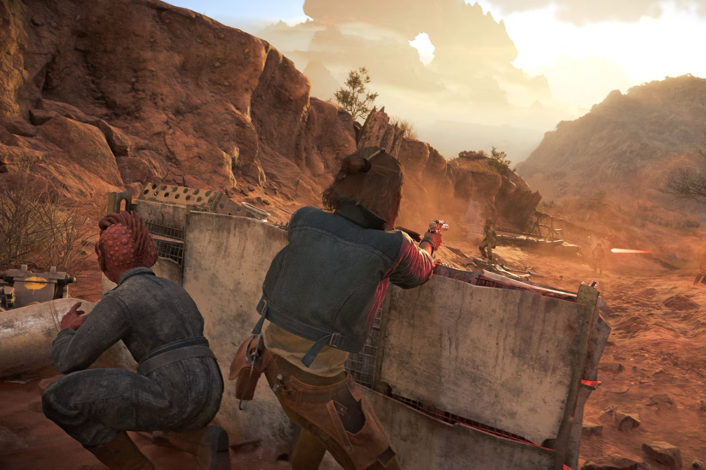

+++
title = "Star Wars Outlaws va tout revoir du sol au plafond"
date = 2024-11-05T07:15:32+01:00
draft = false
author = "Mickael"
tags = ["Actu"]
image = "https://nostick.fr/articles/vignettes/novembre/star-wars-outlaws.jpg"
+++

Les joueurs qui se sont précipités sur *Star Wars Outlaws* (il parait qu'ils ne sont pas si nombreux) ont-ils joué à une version bêta ? Drew Rechner, le nouveau directeur créatif de Massive, le studio d'Ubisoft qui a développé le titre, a en effet [annoncé](https://www.ubisoft.com/en-gb/game/star-wars/outlaws/news-updates/7n2akTSlEV3Wk1aRRwONFZ/star-wars-outlaws-dev-update-1-pushing-into-hyperdrive) une longue série d'améliorations dans trois domaines qui devraient donner un tout nouveau visage au jeu. D'abord pour tout ce qui est combat, « *où nous voyons une vraie opportunité d'ajouter plus de profondeur et d'excitation, qui vont récompenser la tactique et la précision* ».

Deuxième domaine : les phases d'infiltration, « *qui ne consiste pas seulement à améliorer la lisibilité et la cohérence de la détection des ennemis, mais aussi à offrir des choix dans la manière d’aborder chaque rencontre* ». Et finalement, troisième point, l'équipe veut se concentrer sur les contrôles de l'héroïne : améliorer le système de couverture, augmenter la réactivité durant les phases d'escalade et lorsqu'elle s'accroupit pour se planquer.

*Star Wars Outlaws* n'a pas été trop mal accueilli, mais le lancement sur PS5 a été frappé par un bug ayant obligé les joueurs à recommencer le jeu de zéro. Plus globalement, le gameplay manquait un peu de pep's, en particulier dans… les combats et l'infiltration. Des changements ont déjà été apportés, mais le titre mérite certainement mieux, ce d'autant qu'Ubisoft a clairement fait entendre qu'il voulait l'améliorer pour en tirer des revenus sur le long terme.

Toutes ces améliorations seront dans la version 1.4 du jeu, livrée le 21 novembre en même temps que le premier DLC, « Wild Card », et surtout le lancement sur Steam. La boutique de Valve sera à partir de dorénavant servie en même temps que le store Ubisoft et l'Epic Games Store. Il était temps !