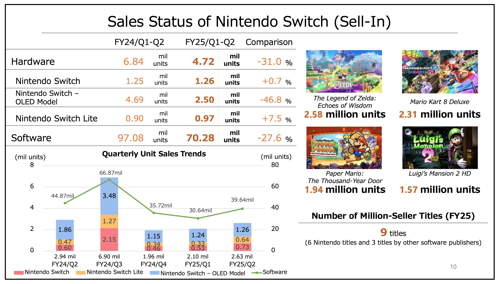
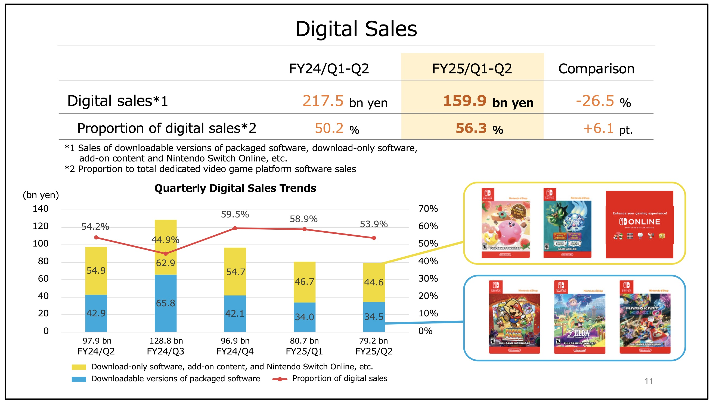

+++
title = "La Switch 2 doit toujours être annoncée dans les 5 prochains mois "
date = 2024-11-05T10:47:32+01:00
draft = false
author = "Mickael"
tags = ["Actu"]
image = "https://nostick.fr/articles/vignettes/novembre/switch-jeux.jpg"
+++

")

Nintendo a toujours l'intention de dévoiler la successeure de la Switch avant la fin de l'année fiscale de l'entreprise, c'est à dire avant la fin mars 2025. Shuntaro Furukawa, le président du groupe, l'a une fois de plus [confirmé](https://www.reuters.com/technology/nintendo-cuts-annual-operating-profit-forecast-switch-sales-slow-2024-11-05/) durant les résultats trimestriels. Il n'y a aucun changement dans la stratégie annoncée il y a belle lurette, mais il est vrai que temps se fait long pour tous ceux qui attendent une Switch 2, ou peu importe le nom bizarre qu'aura choisi le constructeur.

Et cette attente est d'autant plus insupportable que Nintendo paie sa volonté de presser tout le jus possible de la Switch. Les prévisions de bénéfice pour l'année fiscale 2024/2025 ont été [revues](https://www.nintendo.co.jp/ir/pdf/2024/241105_5e.pdf) à la baisse : le bénéfice devrait ainsi reculer de 32 % (c'était -24 % jusqu'à présent) et les ventes trébucher de 23 % (au lieu de 19 %). Quant au résultat annuel, il faut s'attendre à un gadin de 39 %, à environ 1,8 milliard d'euros.

Durant les six premiers mois de son année fiscale, Nintendo a vendu 4,7 millions de Switch (2,6 millions sur le trimestre), contre 6,8 millions il y un an, soit -31 %. Les ventes totales attendues pour l'année sont de 12,5 millions, ce qui représenterait un recul de 20 % par rapport aux 15,7 millions d'unités écoulées en 2023/2024. Et d'un million par rapport aux objectifs originaux. En tout, Nintendo a vendu 146 millions de Switch, et si les prévisions révisées se réalisent, la console hybride pourrait accrocher la PS2 (160 millions d'unités).

En termes de jeux, là aussi c'est la soupe à la grimace avec 70,3 millions de copies écoulées au premier semestre, soit 27,6 % de moins que l'an dernier. Il est vrai que la comparaison est délicate, *Tears of the Kingdom* étant sorti en mai 2023 avec le succès que l'on sait. Le hic, c'est que la fin de l'année ne s'annonce pas folichonne non plus en l'absence d'un jeu Pokémon (*Legends Z-A* est prévu pour 2025). En tout, Nintendo prévoit de vendre 160 millions de jeux durant l'année fiscale (-5 %).

« *Pour une plateforme qui est sur le marché depuis huit ans, le matériel et les logiciels bénéficient d'une demande stable et de ventes dynamiques* », a affirmé Shuntaro Furukawa. « *Mais les ventes jusqu'à présent ont été en deçà de nos prévisions initiales. En tenant compte des ventes réalisées au cours du premier semestre, nous avons révisé nos prévisions pour le matériel et les logiciels, ce qui a conduit à la révision des bénéfices* », ajoute-t-il.

Nintendo mange du pain noir depuis quelques trimestres. Et cela devrait donc continuer, car on voit mal comment le constructeur pourrait présenter une nouvelle console avant la fin de l'année, alors qu'il faut écouter les stocks de Switch pour Noël.