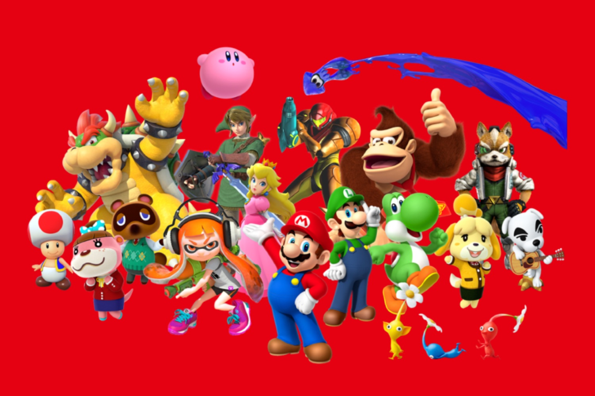
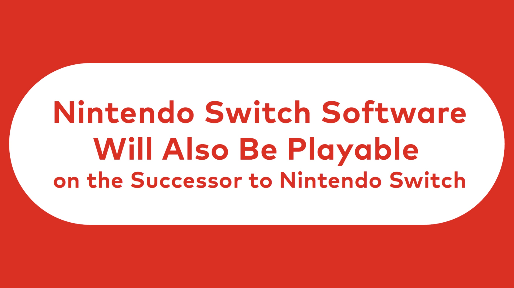
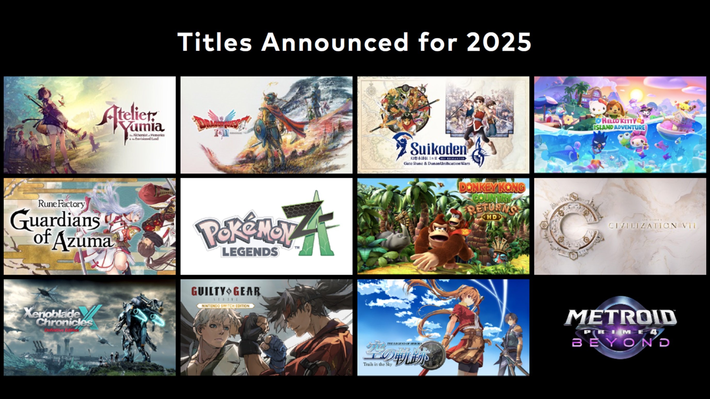
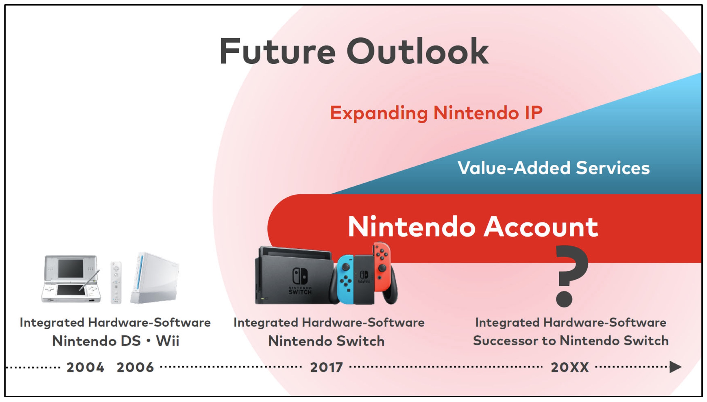

+++
title = "On pourra jouer aux jeux Switch sur la future console de Nintendo, c'est confirmé"
date = 2024-11-06T00:07:32+01:00
draft = false
author = "Mickael"
tags = ["Actu"]
type = "une"
image = "https://nostick.fr/articles/vignettes/novembre/nintendo-switch-jeux.jpg"
+++

Quel meilleur moment que la nuit de l'élection américaine pour faire une annonce surprise ? Nintendo profite que tout le monde a les yeux ailleurs pour annoncer non pas la Switch 2 (ouf !), mais que les jeux Switch seront jouables sur la future console qui n'a toujours pas de nom.

Shuntaro Furukawa, le président de Nintendo, a [porté](https://x.com/NintendoCoLtd/status/1853972163033968794) la bonne parole qui va soulager des millions de joueurs Switch : ils s'inquiétaient du sort de leurs jeux patiemment achetés ces 8 dernières années. Bien sûr, les rumeurs avaient déjà largement défloré la rétro-compatibilité, mais avoir la confirmation officielle est une excellente nouvelle.

Et au passage, c'est aussi un message aux clients qui se demandaient s'ils pourraient acheter un jeu Switch pour Noël, sachant que [la future console arrive dans les prochains mois](https://nostick.fr/articles/2024/novembre/0511-switch-2-toujours-annoncee-5-mois/). Alors vous pouvez y aller et dépenser sans compter ! Y compris en 2025 d'ailleurs, Nintendo a partagé quelques uns des gros titres attendus en début d'année :

Les comptes Nintendo, lancés fin 2015, sont devenus une pierre angulaire du business du constructeur : il y en a plus de 366 millions. Et ils seront la cheville ouvrière qui permettra de jouer à ses jeux Switch sur la Switch 2 : « *Nous estimons qu'il est important pour l'avenir de Nintendo de tirer parti [des comptes Nintendo] et de maintenir la bonne relation que nous avons établie avec plus de 100 millions d'utilisateurs actifs chaque année sur la Nintendo Switch pour son successeur* », lit-on dans le [document](https://www.nintendo.co.jp/ir/pdf/2024/241106e.pdf) pour les investisseurs.

Shuntaro Furukawa annonce aussi que le Nintendo Switch Online (NSO), qui propose des services dans le nuage ainsi qu'une sélection de jeux rétro, sera aussi disponible sur le successeur de la Switch. Le NSO comptait 34 millions de membres au 30 septembre dernier, mais l'entreprise a relevé une diminution des recrutements ces douze derniers mois « *en raison de la baisse des nouvelles sorties axées sur le jeu en ligne* ».

Nintendo n'a certes pas dévoilé sa future console, mais à la lecture de tout ce que le constructeur a mis en ligne cette nuit, il semble assez évident que l'appareil sera très proche dans son concept du modèle actuel.