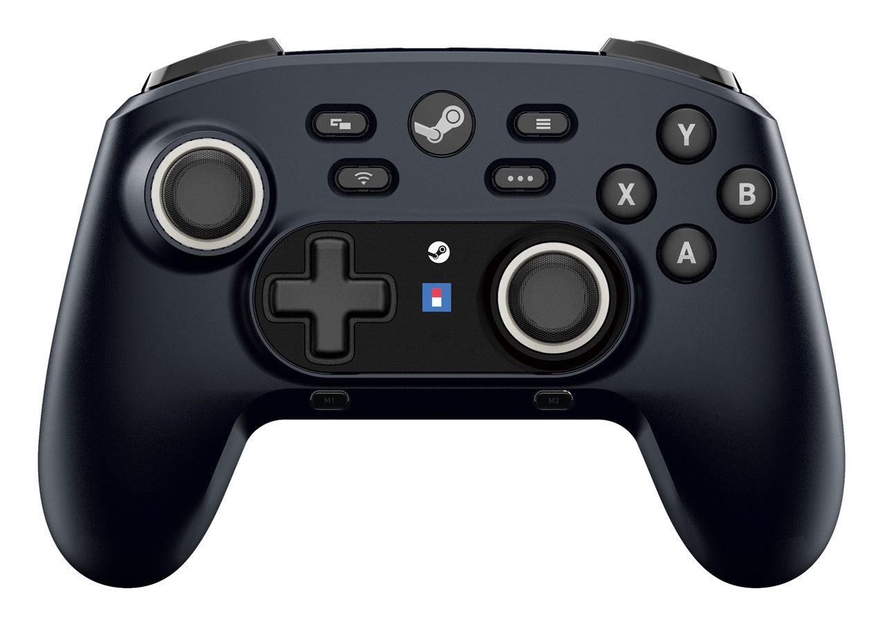
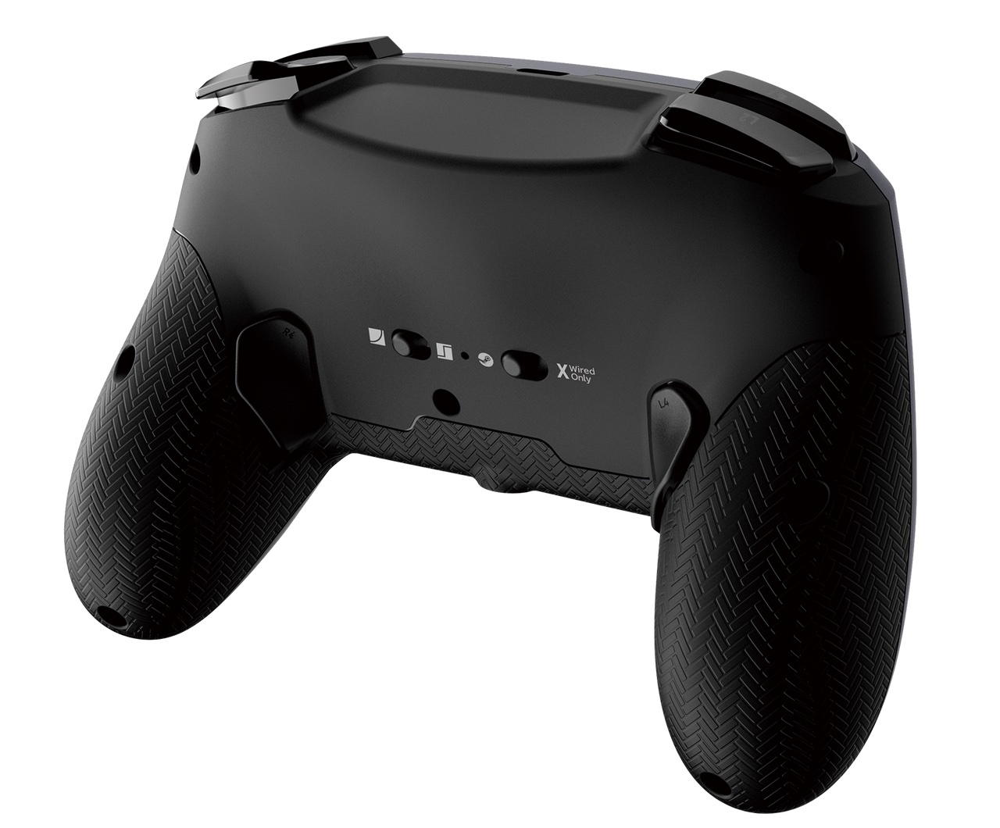

+++
title = "La seule manette officielle pour Steam sort du Japon"
date = 2024-11-06T08:44:32+01:00
draft = false
author = "Mickael"
tags = ["Actu"]
type = "telex"
+++

Peut-être qu'un jour, vous verrez, Steam aura retrouvé l'envie de lancer une nouvelle manette[^1]. Malheureusement, la boutique de Valve a enterré le périphérique en 2019 et si la rumeur d'un nouveau modèle revient régulièrement nous mordre les talons, on n'a toujours rien vu venir de concret. Mais peut-être que ça finira un jour par revenir ?

Ceux qui recherchent une manette réellement optimisée pour Steam peuvent se tourner vers Hori. Le fabricant a [lancé en juin dernier la Wireless Horipad for Steam](https://nostick.fr/articles/2024/juin/2906-backlog-semaine-epic-mickey-emulation-ps3-palworld/#une-manette-officielle-pour-steam-mais-pas-chez-valve), mais hélas, uniquement au Japon. Depuis quelques jours, elle a franchi les frontières nipponnes pour être [vendue](https://stores.horiusa.com/hpc-055U) aux États-Unis, au prix de 60 $, avec des livraisons prévues à partir du 16 décembre. Avec un peu de chance, l'Europe finira par arriver bientôt…

La manette intègre des boutons pour accéder aux différents menus de Steam, deux touchpad, un gyroscope, des boutons programmables, et on peut jouer avec sur le Steam Deck si on a envie.

[^1]: Et, peut-être, une Steam Machine qui soit l'équivalent du Steam Deck pour le salon !