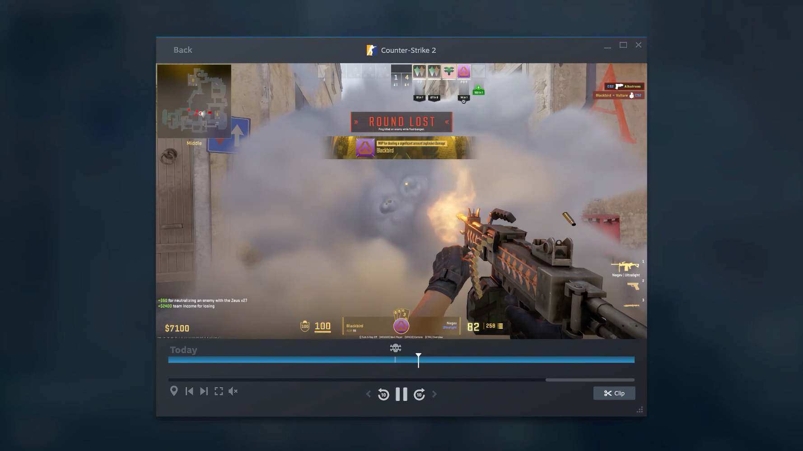

+++
title = "Steam enregistre et partage les parties chez tout le monde"
date = 2024-11-06T08:00:32+01:00
draft = false
author = "Mickael"
tags = ["Actu"]
type = "telex"
+++

Enregistrer ses plus grands exploits ou ses défaites les plus misérables, c'est largement faisable aujourd'hui avec les outils intégrés de GeForce, Adrenalin (AMD), la Game Bar de Xbox et bien d'autres solutions. Il était temps que Steam se joigne à la fête, et c'est le cas depuis cette nuit : la fonction [Enregistrement de parties](https://store.steampowered.com/gamerecording) est désormais disponible pour tous, après [un bêta test qui a débuté en juin](https://nostick.fr/articles/2024/juin/2706-enregistrement-parties-steam-partage-video/).

Cette fonction, disponible sur PC, Mac et Steam Deck, permet de lancer un enregistrement vidéo de la partie en cours avec l'aide d'une hotkey (par défaut : control + F11). Une option permet d'enregistrer en arrière-plan automatiquement. Dans ce dernier cas, les 120 dernières minutes de la partie seront conservées, mais il est possible de définir une durée d'enregistrement et des niveaux de qualité propres à chaque jeu.

Une fois la vidéo enregistrée, on pourra en couper des bouts pour les partager, que ce soit en MP4 ou sous la forme d'un lien temporaire. Les développeurs peuvent intégrer des repères — la « timeline Steam » — dans leurs jeux pour indiquer un événement important (un boss ou un objet caché) ; ces repères s'accompagnent de détails supplémentaires sur la séquence.

Tous les jeux Steam sont compatibles, ainsi que les jeux non Steam pris par en charge par l'overlay du service. La boîte à outils est fournie avec la [dernière version](https://steamcommunity.com/games/593110/announcements/detail/4472730495692571025) du client Steam, qui au passage lâche Windows 7/8, ainsi que les Mac sous macOS 10.13 (High Sierra) et 10.14 (Mojave).