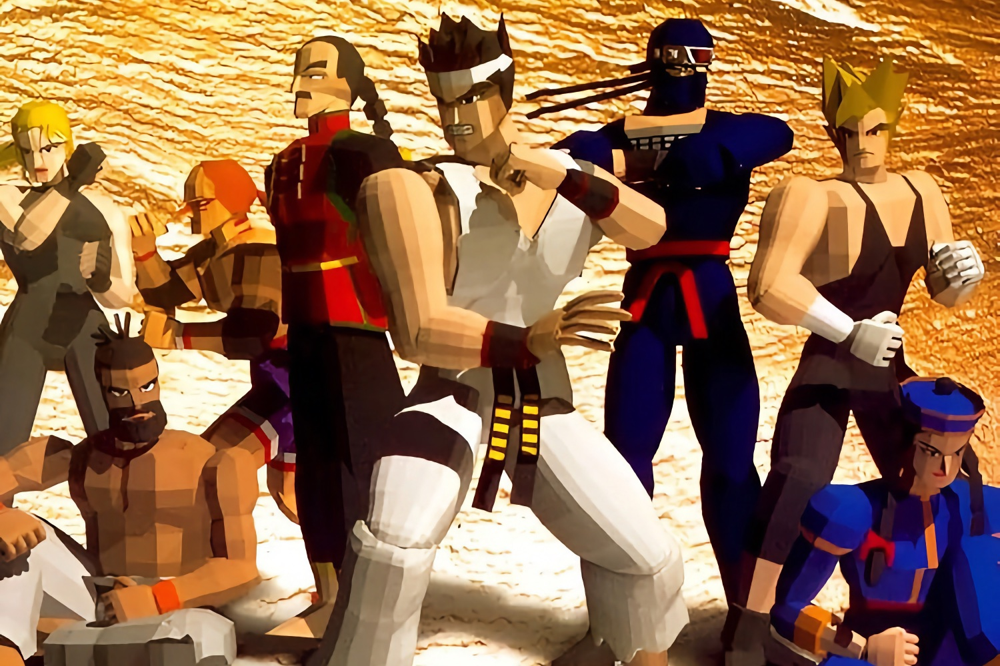

+++
title = "Virtua Fighter va revenir d'entre les morts chez Sega"
date = 2024-11-06T11:47:32+01:00
draft = false
author = "Mickael"
tags = ["Actu"]
image = "https://nostick.fr/articles/vignettes/novembre/virtua-fighter.jpg"
+++

Sega carbure en ce moment. Le succès des derniers jeux *Sonic* (et des films !), celui des franchises *Like a Dragon*, *Persona* et *Metaphor: ReFantazio*, et tout le reste dope l'éditeur qui a une autre carte à jouer : celle de la nostalgie des joueurs qui ont usé leur fond de culotte sur la Master System et la Mega Drive. Maintenant qu'ils ont 40 ou 50 ans (snif), ces joueurs sont prêts à replonger dans leurs franchises de jeunesse.

Ça tombe bien, Sega a dans ses tuyaux plusieurs remakes/reboots de franchises mythiques que les jeunes générations ont perdu de vue : *Jet Set Radio*, *Shinobi*, *Golden Axe*, *Streets of Rage* et *Crazy Taxi* sont tous en préparation. Et ça n'est pas terminé.

 

Dans une interview pour *VGC*, Justin Scarpone, le nouveau patron du groupe transmédia chez Sega, a par accident (ou peut-être pas…) [annoncé](https://www.videogameschronicle.com/features/interviews/why-sega-is-reviving-classics-like-shinobi-and-jet-set-radio-across-games-film-and-tv/) qu'un jeu *Virtua Fighter* étant aussi dans les tuyaux. Cette franchise a quasiment inventé le jeu de baston en 3D moderne avec le premier opus en 1993. Le dernier opus, *Virtua Fighter 5 Final Showdown*, remonte à 2012. 

Reste à voir ce que *Virtua Fighter* a à proposer aujourd'hui, alors que le genre compte déjà d'excellents représentants qui ont largement dépassé le maître. On attend aussi de quel bois se chauffe les autres remakes ! Sega a été remarquablement silencieux sur les dates de lancement.