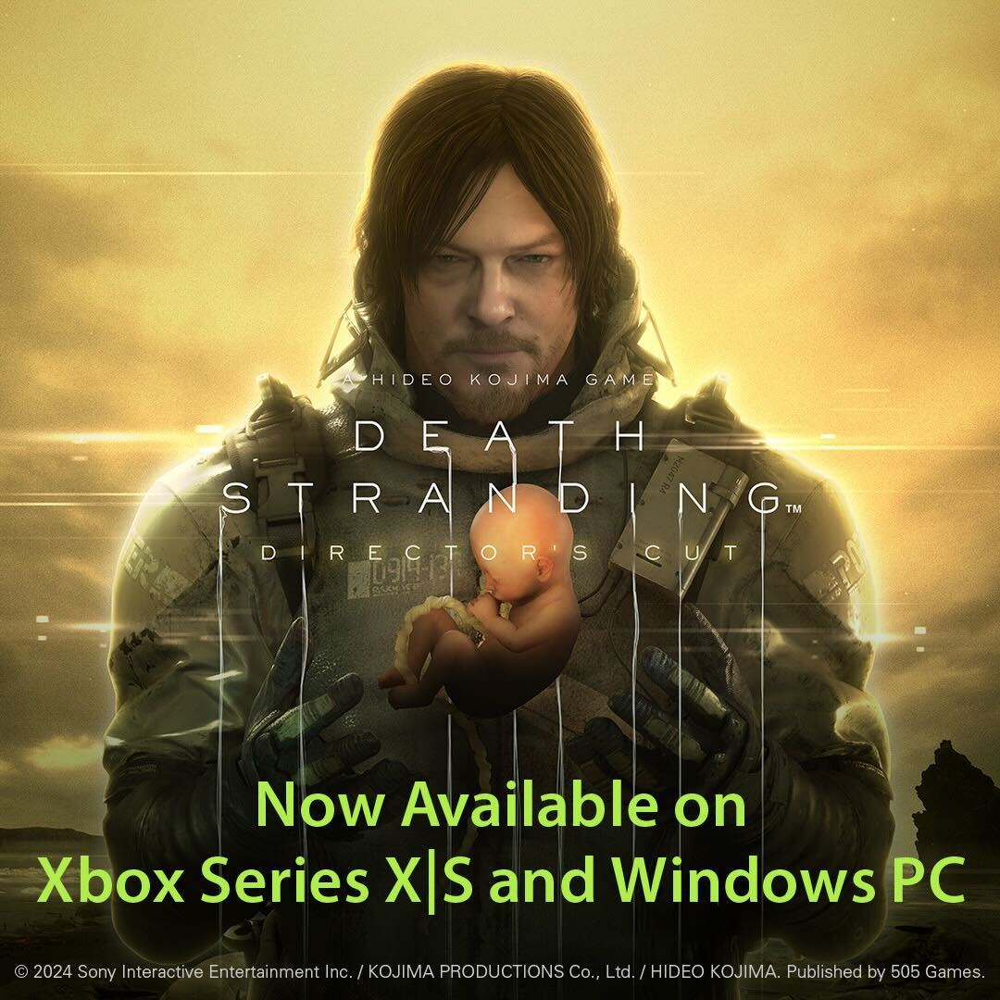

+++
title = "Death Stranding livre enfin sur Xbox"
date = 2024-11-07T10:44:32+01:00
draft = false
author = "Mickael"
tags = ["Actu"]
type = "telex"
+++

On va pouvoir compter sur les doigts d'une main à trois doigts les plateformes sur lesquelles *Death Stranding* n'est pas sorti[^1]. Après la version Mac sortie en début d'année, le jeu Kojima Productions se [lance](https://www.xbox.com/en-GB/games/store/death-stranding-directors-cut/9nqgn8tgnt8p) par surprise sur Xbox aujourd'hui ! Et à moitié prix, une vingtaine d'euros. En même temps, c'est un jeu qui a cinq ans désormais, donc bon.

 

*Death Stranding* se veut un bon citoyen de la plateforme avec le support des succès Xbox, les sauvegardes dans le nuage, la prise en charge de la fonction Play Anywhere, et les fonctions du Director's Cut (mode photo, support des moniteurs ultra wide, etc.). Le jeu, une exclusivité PS4 à l'origine, va connaitre une suite, *On The Beach*, prévue pour l'année prochaine et elle aussi dispo en exclu sur PS5 (et en 2029 pour la Xbox ? Si la console existe toujours).

[^1]: On croise les doigts pour une version Playdate.