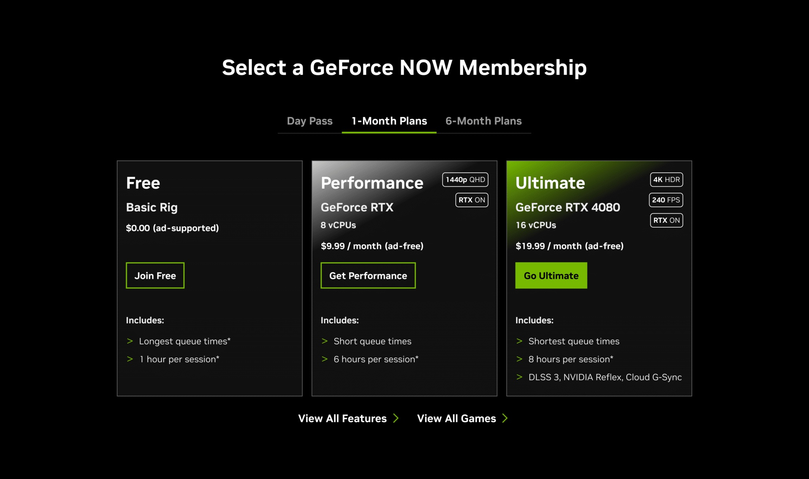

+++
title = "GeForce Now s'améliore sans augmenter de prix, mais gare à ne pas jouer trop longtemps"
date = 2024-11-07T11:47:32+01:00
draft = false
author = "Mickael"
tags = ["Actu"]
image = "https://nostick.fr/articles/vignettes/novembre/geforce-now-nvidia-1.jpg"
+++

GeForce Now était déjà la meilleure offre de cloud gaming sur le marché, ce qui n'est pas très compliqué vu que c'est la seule formule qui permet de jouer à ses jeux Steam, Xbox ou Ubisoft dans le nuage (plus de 2 000 titres compatibles). Le Xbox Cloud Gaming se compare davantage à un « Netflix du jeu vidéo » avec une sélection de jeux, même si ça pourrait changer : Microsoft pourrait permettre de streamer les jeux de sa bibliothèque.

Nvidia [rebaptise](https://blogs.nvidia.com/blog/geforce-now-thursday-performance-membership/) la formule Prioritaire qui devient Performance, et surtout l'améliore en augmentant la résolution maximale à 1440p, au lieu du 1080p habituel. Les résolutions ultra wide sont aussi prises en charge, tout comme la sauvegarde des réglages graphiques pour chaque jeu ; on les retrouvera d'une session à l'autre.

La formule Gratuit ne change pas, tout comme Ultime avec ses graphismes RTX 4080 jusqu'à 4K et 120 FPS (ou 1080p à 240 FPS). Bonne surprise : les prix restent les mêmes, soit 10,99 € par mois pour l'abonnement Performance (54,99 € pour six mois) ou 21,99 € par mois pour Ultime (109 € pour six mois).

La « mauvaise » surprise, c'est que Nvidia imposera à partir du 1er janvier 2025 une limite de consommation de 100 heures par mois. Au-delà, on pourra payer des blocs de 15 heures supplémentaires (2,99 $ en Performance, 5,99 $ en Ultime), ou tomber dans le rig gratuit aux performances réduites. L'entreprise voulait éviter d'augmenter les tarifs, c'est pourquoi cette limite mensuelle a été mise en place. Elle conviendra à « *94 % des joueurs, qui profitent généralement du service dans ce laps de temps* », explique-t-elle.

Histoire de faire passer la pilule, jusqu'à 15 heures de temps de jeu inutilisées seront reportées au mois suivant. Et les abonnés actuels, et ceux qui s'abonneront jusqu'à la fin de l'année, profiteront du jeu sans limite de temps jusqu'au 1er janvier 2026.