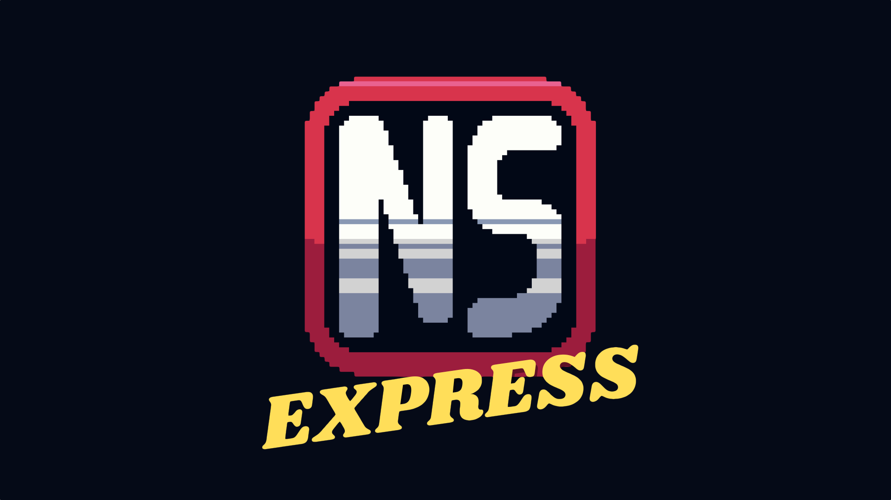
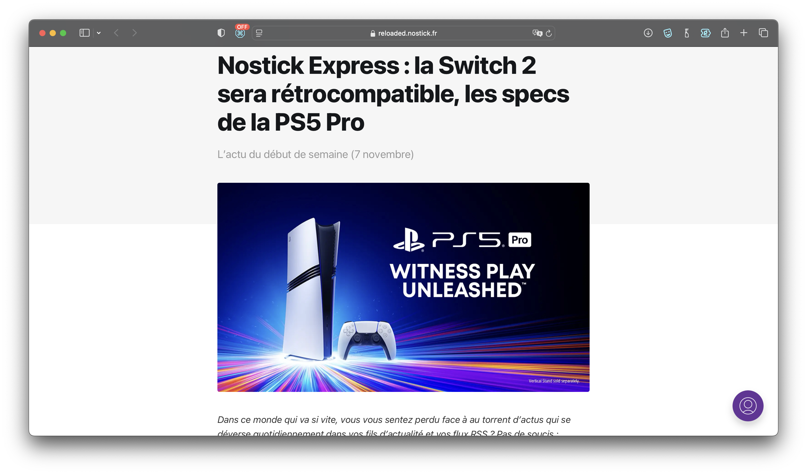

+++
title = "Nostick Express : votre nouveau récap' du jeudi matin !"
date = 2024-11-07T07:00:02+01:00
draft = false
author = "Félix"
type = "une"
tags = ["Actu"]
image = "https://nostick.fr/articles/2024/novembre/0711-nostick-express-rendezvous-du-jeudi/nstckexpress.png"
+++

 

Chez Nostick, on aime bien les récaps. Vous nous connaissez sans doute via [notre résumé hebdo](https://reloaded.nostick.fr/nintendo-annonce-tout-sauf-la-switch-2-dragon-age-the-veilguard-divise/), qui a le défaut de ne paraître qu’une fois par semaine : certaines actus urgentes sont un peu rassies en arrivant, tandis que le format condensé est parfois juste pour caler tout ce qu’on voudrait dire.

Face à ce constat, on s’est dit qu’on avait largement assez de matière pour lancer un second récap'. Chaque jeudi matin, **Nostick Express** vous apporte les grosses infos du début de la semaine dans un format court allant à l’essentiel. La première édition est en ligne sur notre site Ghost, que vous pouvez lire [à cette adresse](https://reloaded.nostick.fr/nostick-express-la-switch-2-sera-retrocompatible-les-specs-de-la-ps5-pro/).

Ce premier article n’est pas un brouillon, mais presque : les rubriques vont sans doute évoluer, la structure aussi. Si ce n’est pour le moment qu’un simple article, le but serait d’en faire une seconde infolettre destinée à ceux qui voudraient un peu plus de lecture dans leur boîte mail chaque semaine. Il sera nécessaire de s’y abonner, car nous ne souhaitons pas imposer une deuxième newsletter aux abonnés de *Nostick Reloaded* sans leur consentement explicite.

Bref, on est curieux d’avoir votre avis sur ce nouveau projet ! Vous pouvez vous abonner dès maintenant à *Nostick Express* pour recevoir la prochaine édition par email. On fera une annonce plus officielle après une petite période de rodage. Le cœur de l’infolettre restera gratuit, mais sur le long terme, il n’est pas exclu qu’une partie soit réservée à nos [abonnés Ulule](https://fr.ulule.com/nostick/). N’hésitez pas à nous dire ce que vous en pensez dans les commentaires.

