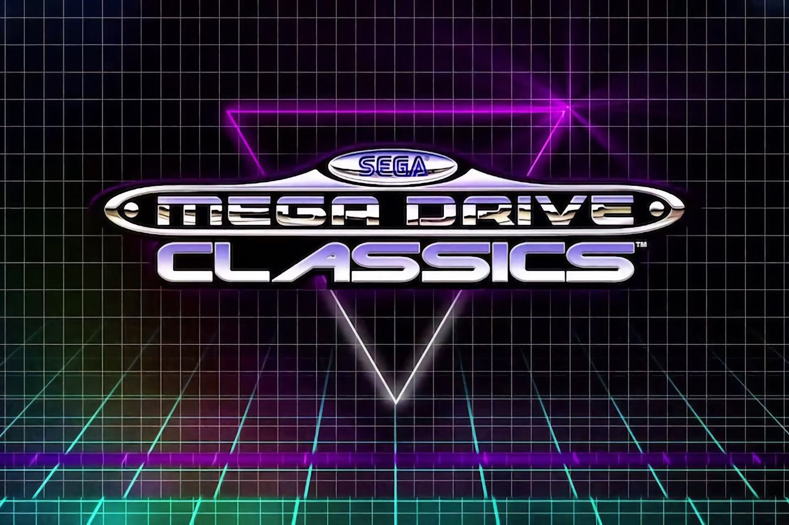

+++
title = "Sega vire des dizaines de jeux rétro des boutiques en ligne"
date = 2024-11-08T08:07:32+01:00
draft = false
author = "Mickael"
tags = ["Actu"]
image = "https://nostick.fr/articles/vignettes/novembre/sega-mega-drive-classics.jpg"
+++

 

Gros ménage chez Sega. L'éditeur a [décidé](https://support.sega.com/hc/en-us/articles/29776767664145-SEGA-Classics-FAQ#h_01JBWBDWT9PXWHVDPMSZB9EB90) de retirer de la vente des dizaines et des dizaines de ses jeux rétro. La compilation *Sega Mega Drive Classics* (qui contient 50 titres) va être délistée de Steam, de l'eShop, de la boutique Xbox et du PS Store, plus une dizaine de titres supplémentaires sur Steam.

 

Parmi les jeux qui vont tirer leur révérence, on trouve *Jet Set Radio*, *Crazy Taxi*, *Shinobi*, *Streets of Rage* ou encore *Golden Axe*… Si cette liste vous rappelle quelque chose, c'est bien normal : ce sont tous les jeux qui vont bénéficier d'un reboot, auquel [on ajoutera pour la bonne forme *Virtua Fighter*](https://nostick.fr/articles/2024/novembre/0611-virtua-fighter-revenir-morts-sega/). Ça ne fait qu'une poignée, cependant : il n'est pas prévu de remakes pour la grande majorité des jeux délistés.

Rassurez-vous, si vous avez acheté ces jeux ou la compile, vous y aurez toujours accès (y compris au retéléchargement). Mais il ne sera plus possible de l'acheter à partir du 6 décembre. Sega est coutumier du fait, avant le lancement de *Sonic Origins* en juin 2022, l'éditeur avait viré des boutiques une bonne partie des anciens jeux Sonic.

Peut-être que Sega a en tête de remettre sur pied une nouvelle compilation comme celle de la Mega Drive. On l'espère du moins, car il serait triste et fâcheux de devoir pirater tous ces classiques faute d'une offre légale et payante.