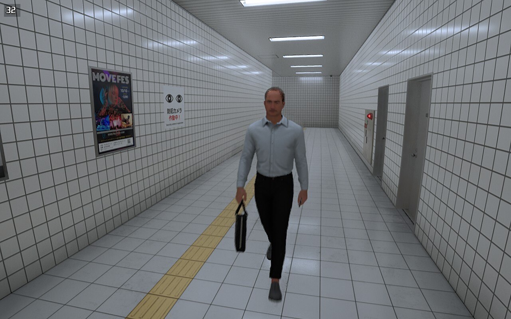
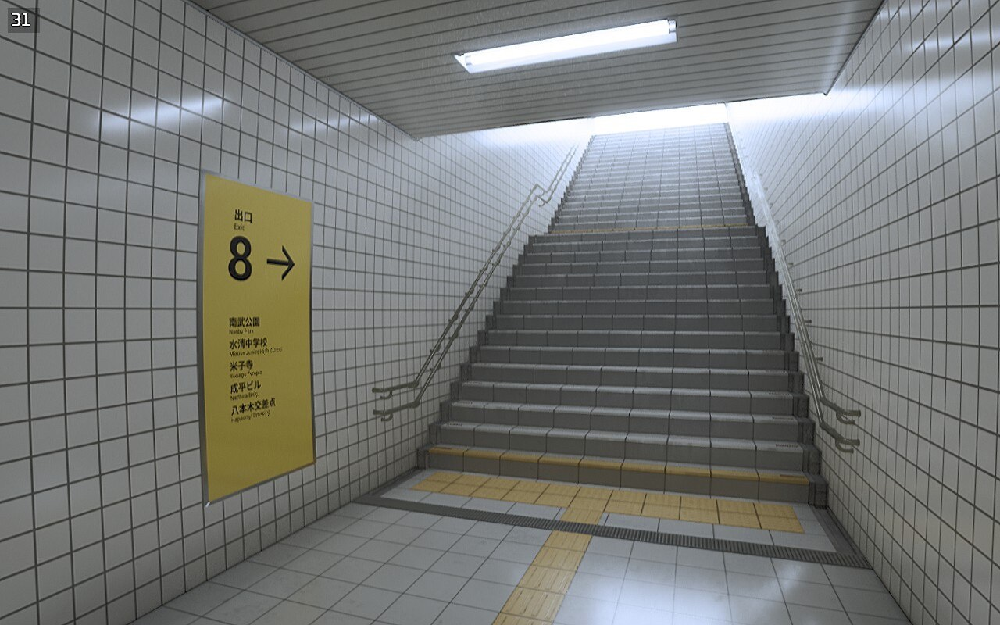

+++
title = "Ça va faire votre soirée : The Exit 8"
date = 2024-11-07T17:00:32+01:00
draft = false
author = "Mickael"
tags = ["Test"]
type = "une"
image = "https://nostick.fr/articles/vignettes/octobre/the-exit-8-1.jpg"
+++

**Les jeux qui exigent une attention de tous les instants pendant des dizaines d'heures, OK, c'est sympa, mais parfois on préférerait quelque chose de court et d'efficace. C'est pourquoi nous allons vous proposer chaque jour de la semaine un jeu à commencer et à terminer en une soirée ! Aujourd'hui : *The Exit 8*.**

Je ne m'attendais pas à ce qu'un jeu qu'on peut boucler en 10 minutes puisse me tenir éveillé toute une nuit. *The Exit 8*, sorti l'an dernier, est une version cauchemardesque du jeu des 7 erreurs. Enfermé dans ce qui ressemble à une boucle temporelle, le joueur arpente un couloir du métro de Tokyo, à la recherche de la sortie 8. Mais avant de retrouver l'air libre et sortir de cet enfer, il faudra faire preuve d'un grand sens de l'observation. Et avoir l'estomac bien accroché.

Le jeu consiste à traverser sempiternellement le même couloir qui présente les mêmes affiches de pub, les mêmes portes, les mêmes grilles de ventilation. Mais au fur et à mesure que vous arpenterez encore et encore les lieux, des anomalies vont commencer à apparaitre : ici, une affiche qui n'est pas tout à fait la même que la dernière fois. Là, une porte entrebâillée. Et il y a ce mystérieux et inquiétant *salaryman* qui croise régulièrement votre chemin. 

À chaque différence, il faudra rebrousser chemin. Votre meilleur allié et votre pire ennemi sera un panneau jaune dont le numéro s'incrémente au fur et à mesure de vos trouvailles. Et si vous avez loupé une anomalie, bim, le compteur et le panneau retombe à zéro, la boucle du cauchemar reprend de plus belle. Jusqu'à la délivrance ? À vous de faire attention aux petits détails…

*The Exit 8* est ce qu'il y a de plus proche d'un simulateur de marche dans un [espace liminaire](https://fr.wikipedia.org/wiki/Espace_liminaire), ces lieux plus ou moins vides d'où émanent une certaine bizarrerie. Une fois plongé dans l'univers du jeu, tout finit par devenir très oppressant et le moindre changement provoque un jump scare… surtout quand on y fait des rencontres dignes de *Shining* !

Le jeu peut être très court comme très long. Et même si finalement vous trouvez le chemin de la sortie, retournez-y : il y a une trentaine d'anomalies à découvrir…

- ***The Exit 8***, disponible sur PC, Switch, PS4/PS5 et en VR. À partir de [5 €](https://store.steampowered.com/app/2653790/8/) environ.