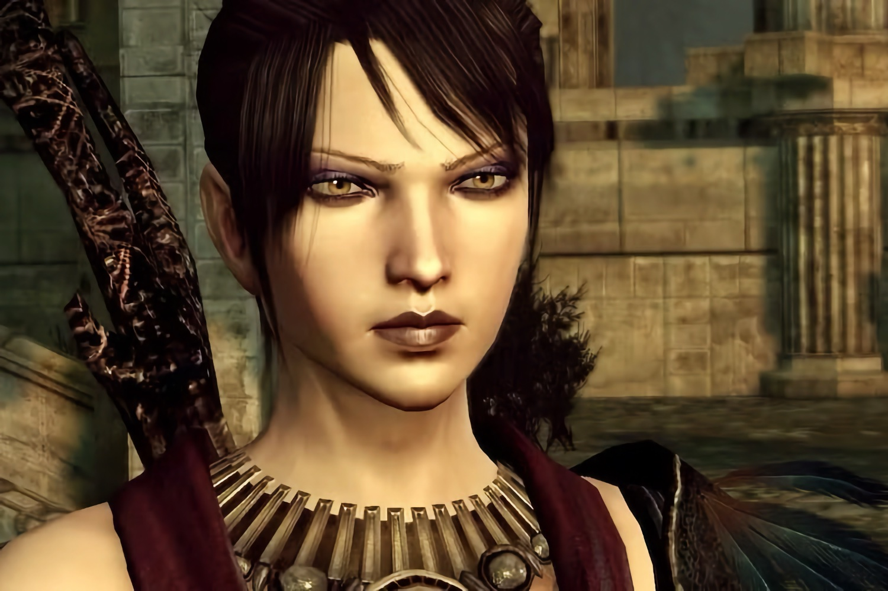

+++
title = "Ça va être compliqué d'avoir un remaster de la trilogie Dragon Age"
date = 2024-11-07T07:30:32+01:00
draft = false
author = "Mickael"
tags = ["Actu"]
type = "telex"
+++

 

On peut espérer bien des choses, en sachant qu'elles n'arriveront jamais. Même en le voulant très fort, Donald Trump ne sera probablement pas un président compatissant envers les minorités, les trans, les gays, les femmes, les immigrés légaux et illégaux, les athées, les gens normaux. Nintendo n'arrêtera sans doute jamais sa croisade idiote contre l'émulation. Félix ne se fera sûrement pas pousser la moustache une seconde fois. On pourrait multiplier les exemples, mais arrêtons-nous sur celui-ci : aurons-nous droit un jour à un remake/remaster de la trilogie *Dragon Age* ?

Ce n'est pas gagné. Il se trouve que les deux premiers épisodes, *Origins* (2009) et *Dragon Age II* (2011), ont été développés avec le moteur Eclipse Engine. Or, « *je pense que je suis une des 20 personnes qui, à BioWare, sont les dernières à avoir utilisé Eclipse* », a [expliqué](https://www.rollingstone.com/culture/rs-gaming/dragon-age-the-veilguard-john-epler-interview-1235147001/) John Epler, le directeur créatif du studio, à *Rolling Stone*. 

Par conséquent, il ne va pas être facile de reprendre ces deux titres pour les moderniser. *Dragon Age: Inquisition*, sorti en 2014, sera peut-être moins compliqué puisqu'il s'appuie sur le moteur Frostbite, plus courant. Ça avait été plus simple pour la Legendary Edition de la trilogie *Mass Effect*, sortie en 2021. Les fans espéraient que *Dragon Age* allait subir le même sort à l'occasion de la sortie de *The Veilguard*, mais… c'est beau d'espérer des choses.