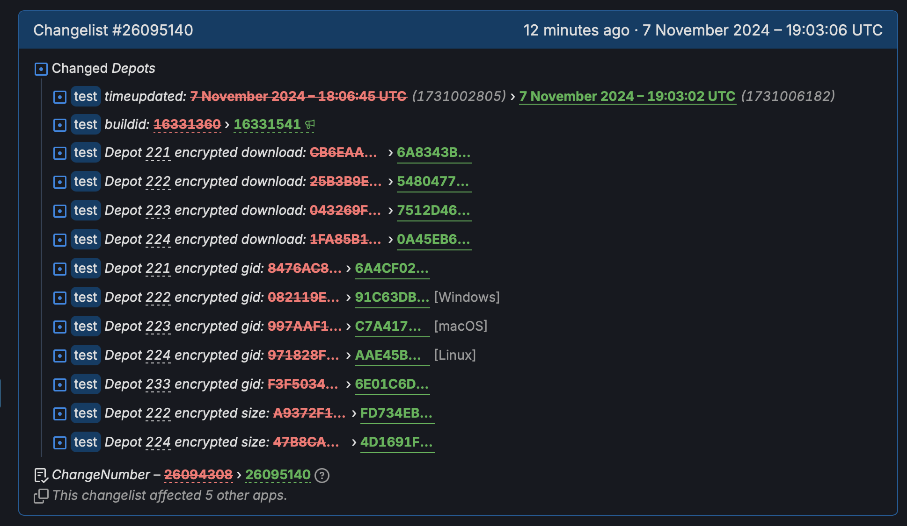

+++
title = "Valve a l’air de préparer une mise à jour anniversaire pour Half-Life 2"
date = 2024-11-07T19:00:32+01:00
draft = false
author = "Félix"
tags = ["Actu"]
type = "telex"
+++

*Half-Life 2* soufflera sa vingtième bougie le 16 novembre prochain, et Valve a visiblement une surprise dans ses cartons. Le studio a ajouté une branche « test » à son célèbre FPS il y a un mois, qui a été mise à jour régulièrement depuis. Les choses s’accélèrent et celle-ci est parfois [trifouillée](https://steamdb.info/app/220/history/) plusieurs fois par jour, ce qui laisse à penser qu’on va avoir droit à une grosse mise à jour pour l’occasion.

 

Valve nous avait déjà fait le coup pour les 25 ans d’*Half-Life* premier du nom : le jeu avait eu droit à [d’une grosse MAJ](https://nostickreloaded.substack.com/i/138963186/tout-sauf-half-life) apportant du contenu coupé, une meilleure prise en charge du Steam Deck et plusieurs nouvelles maps pour le mode multijoueur. Le titre était passé gratuit pendant une semaine tandis qu’un chouette documentaire avait [été mis en ligne](https://www.youtube.com/watch?v=TbZ3HzvFEto). On espère quelque chose de similaire, et pourquoi pas du neuf sur un prochain jeu ?