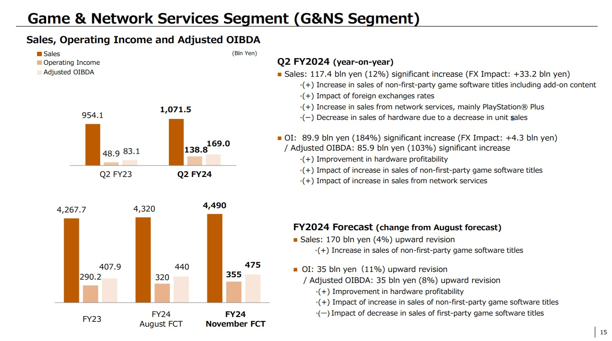

+++
title = "Astro Bot : petite mascotte, grandes retombées pour Sony"
date = 2024-11-08T11:47:32+01:00
draft = false
author = "Mickael"
tags = ["Actu"]
image = "https://nostick.fr/articles/vignettes/novembre/astro-bot.jpg"
+++

Il n'en a pas l'air avec sa petite tête trop mignonne, mais *Astro Bot* a plus que contribué à la bonne fortune de PlayStation au dernier trimestre ! Sony a [dévoilé](https://www.sony.com/en/SonyInfo/IR/library/presen/er/pdf/24q2_sonypre.pdf) ses résultats financiers estivaux, et révélé que le jeu de plateformes de la Team Asobi s'était vendu à 1,5 million d'exemplaires durant les neuf premières semaines de sa carrière (entre le 6 septembre et le 3 novembre).

À titre de comparaison, *Spider-Man 2* avait franchi le seuil des [2,5 millions](https://www.ign.com/articles/marvels-spider-man-2-sony-announces-big-day-one-sales) de copies 24 heures après son lancement, et plus de [5 millions](https://x.com/insomniacgames/status/1722511138058109076) en 11 jours. Les ventes cumulées de *God of War Ragnarok* a atteint le seuil des [5,1 millions](https://x.com/PlayStation/status/1595432230750674945) durant sa première semaine, et [11 millions](https://x.com/SonySantaMonica/status/1620844673924227074) cinq mois après son lancement.

Alors 1,5 million de copies c'est bien, mais Astro n'a pas encore la carrure des autres stars du catalogue PlayStation (mais pas le même budget de développement non plus). Sony livre une statistique intéressante au passage : 37 % de tous ceux qui se sont offert *Astro Bot* n'avaient pas acheté de jeux des studios maison ces deux dernières années. Astro a donc attiré de nouvelles têtes, ou des joueurs qui ne s'intéressaient plus aux jeux *first party* (certes, il n'y en a pas eu des masses ces derniers temps).

Quoi qu'il en soit, *Astro Bot* a fait sa part du boulot pour soutenir la division « Jeux et services en ligne » de Sony au troisième trimestre : elle a engrangé l'équivalent de 7 milliards de dollars, soit 12 % de mieux qu'il y a un an. Ce sont surtout les ventes de jeux tiers qui ont contribué aux ventes, notamment *Black Myth: Wukong* et *EA Sports FC25*. Le résultat d'exploitation a atteint 900 millions, soit 184 % (!) de plus, un nouveau record.

Les ventes de jeux (PS4 et PS5) ont augmenté de 10,1 millions pour un total de 77,7 millions sur le trimestre. 70 % étaient des jeux dématérialisés. Tout n'est pas rose pour autant. Durant le trimestre, Sony a livré 3,8 millions de PS5, une chute brutale de 29 %. Seul, *Astro Bot* n'a donc pas pu faire de miracles. L'absence d'autres jeux *first party* pèse sur les ventes de consoles. Au total, la console en est à 65,5 millions d'unités… soit 2 millions de moins que la PS4 durant la même période. 