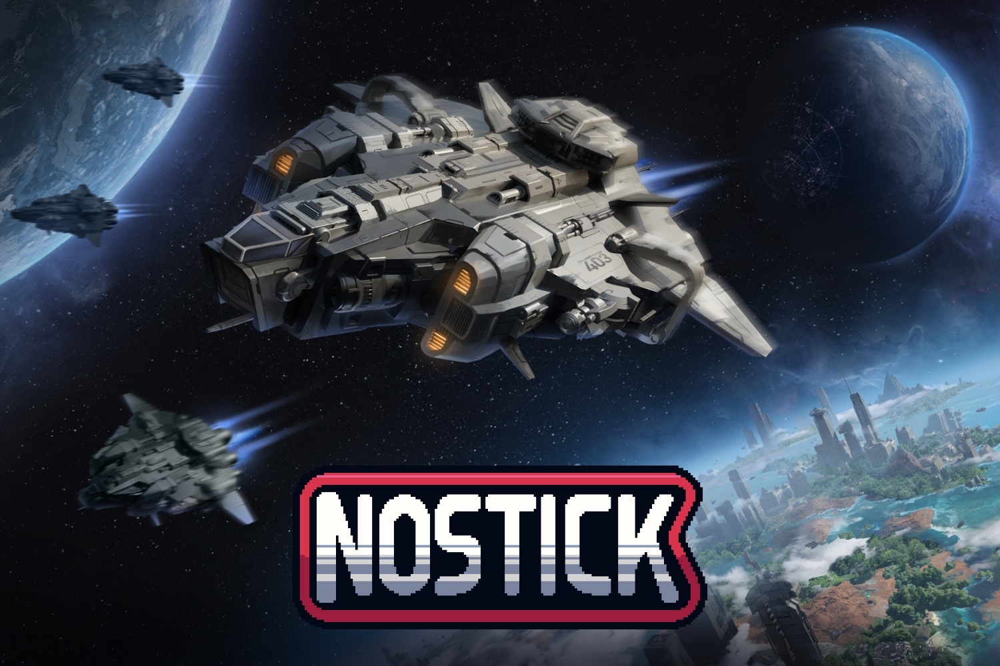

+++
title = "Le premier podcast de Nostick a la tête dans les étoiles avec Beyond Astra !"
date = 2024-11-08T07:10:32+01:00
draft = false
author = "Mickael"
tags = ["Actu"]
type = "une"
image = "https://nostick.fr/articles/vignettes/novembre/podcast-nostick-beyond-astra.jpg"
+++

**Hé oui, on se lance dans le podcast ! Dans chaque épisode, nous voulons vous faire découvrir un jeu et son développeur, ses univers, comment il travaille, les joies et les difficultés de créer un jeu… Pour cette grande première, place à *Beyond Astra*.**

Malgré l'ampleur de *Beyond Astra*, un jeu de stratégie pour conquérir l'univers, c'est le travail d'un seul développeur acharné, Valentin Simonelli. En gestation depuis quatre ans, le 4X a participé au Next Fest de Steam où il a fait sensation, avant le lancement de la version finale prévu courant 2025.

Il n'en fallait pas plus pour rameuter la fine équipe de *Nostick* ! Armé de notre micro, nous sommes allés à la rencontre de Valentin pour tout savoir de *Beyond Astra* : quelles sont ses inspirations ? Comment travaille-t-il ? Quelle est l'ambition du jeu ? Et pourquoi se lancer dans un tel bazar, bon sang de bois ?

Écoutez les réponses à toutes ces questions et bien plus encore (peut-on espérer des bagarres dans l'espace ??) dans ce tout premier épisode du podcast de *Nostick* !

- Pour écouter le podcast de Nostick : [Apple Podcasts](https://podcasts.apple.com/us/podcast/nostick/id1777492094) ou [Spotify](https://open.spotify.com/show/208w9hkiwdG3SISYVXjul1)
- Site web de [⁠Beyond Astra](https://www.beyondastra.com/)

*Si vous avez aimé ce premier épisode, laissez-nous cinq étoiles dans votre app de podcast et partager l'émission avec votre communauté !*

 

___

*Si vous préférez lire plutôt qu'écouter, voici la transcription du podcast, légèrement éditée pour des questions de clarté.*

Salut à tous et bienvenue dans le podcast de Nostick ! Oui, on se lance dans la grande aventure du podcast et en attendant de trouver le bon rythme, on va vous proposer des hors-série où l'idée c'est de vous présenter des jeux et surtout les développeurs qui se cachent derrière. Pour ce tout premier épisode, on a vu les choses en grand, en très grand même. C'est carrément l'espace tout entier qu'on va investir avec *Beyond Astra*, un jeu de stratégie à grande échelle qui sortira en 2025. Et malgré l'ampleur du projet, c'est un développeur tout seul qui gère, Valentin Simonelli. Salut Valentin ! 

Bonjour ! 

**Alors dis-moi, comment ça s'est passé cette idée ? Tu t'es levé un matin et tu t'es dit « bon allez, je vais faire un 4X ».** 

Alors c'est presque ça, mais c'est quand même une envie que j'avais depuis petit. Mes jeux préférés c'était des jeux de stratégie, j'avais *Age of Empires*, *Empire Earth*, *Master of Orion*, si ça vous dit quelque chose. Et j'ai toujours rêvé de pouvoir lier deux aspects, la gestion de planète et celle de l'espace en même temps. Mais les jeux ne le proposaient pas vraiment encore puisqu'on avait toujours une scission entre les deux, ou alors on n'avait que l'un des deux. Donc je me suis dit que c'était peut-être un bon départ pour réaliser ce rêve. 

**Alors aujourd'hui il y a des budgets pour des jeux qui se chiffrent en centaines de millions avec des équipes partout dans le monde, et parfois ça donne des jeux tout pourris. Pour un développeur tout seul comme toi, ça ne doit pas être facile tous les jours, mais j'imagine quand même qu'il y a des gens qui t'aident quand même ?**

Oui, alors tout à fait. Quand on fait ce genre de projet, on n'est jamais seul, même si je suis autodidacte. Je fais partie d'une communauté de développeurs et on s'entraide beaucoup. Donc on échange sur nos projets et on a toujours des choses à se dire pour s'aider à développer quelque chose ou une idée ou une autre. 

Pour *Beyond Astra*, par contre, je suis le seul développeur sur le jeu. Je m'occupe aussi des interfaces et je fais de la musique puisque je suis compositeur de métier à la base. Et mon co-créateur m'aide pour le marketing, pour développer l'univers du jeu. Et par contre, évidemment, pour tout ce qui est les éléments 3D, les objets en 3D, les bâtiments, les vaisseaux, aussi la 2D, les illustrations, les effets visuels et sonores, là je fais appel à des indépendants, puisque évidemment je ne peux pas tout faire moi-même non plus. Et voilà. Donc là, par contre, jusqu'à présent, je fais tout sur mes fonds propres.

**Quand est-ce que le développement a commencé ?** 

Eh bien, on a commencé fin 2020. Début 2020, pardon. 

**J'imagine que pendant la pandémie, ça a dû t'aider peut-être ou pas du tout ?**

Alors, oui, ça m'a permis de faire la transition finalement, puisque comme je le disais, je suis compositeur de musique. Et donc, à cette période, j'avais plusieurs contrats de musique de film. Et forcément, il y a eu pas mal de studios qui ont fermé, voire qui ont même été en liquidation. Donc tout a été annulé. Du jour au lendemain, je me suis retrouvé un petit peu comme ça. Et finalement, ce projet que j'avais commencé à initier, il est passé devant. Et puis j'ai pu me lancer pleinement dessus. 

**Alors, un 4X, c'est avant tout un jeu de stratégie. Donc en gros, si vous avez déjà tâté de *Civilization* et des autres jeux dont tu parlais tout à l'heure, vous voyez un peu comment ça marche, les mécanismes. *Beyond Astra*, comme son nom l'indique, c'est un jeu de stratégie spatiale. J'ai une question un peu bête, mais est-ce que tu peux nous décrire un peu comment ça se passe, une partie typique ?** 

*Beyond Astra*, c'est un jeu de grande stratégie 4X. Alors 4X, pour les non-initiés, ça veut dire « *Explore, expand, exploit, exterminate* ». C'est un petit peu le mantra. Et donc, *Beyond Astra*, lui, est en temps réel, comme le serait un *Age of Empires*, mais avec une pause active. C'est-à-dire qu'à tout moment, on peut mettre pause, mais on peut délivrer des ordres et ensuite reprendre. Ça permet un petit peu de prendre du recul. Donc, dans le jeu, tout commence par une personnalisation d'une civilisation. On définit son adaptabilité au climat. Ses besoins, ses traits, son régime politique, son leader. Et on paramètre aussi, évidemment, la partie. Donc là, ça va être la taille de la carte, la densité des systèmes. Et puis, c'est parti. 

On commence sur une planète. Donc, notre planète de départ, qui est parfaite pour notre civilisation. Et le but, c'est de se développer. Donc, on va suivre le mantra des 4X. Donc, « Explore, expand, exploit, exterminate ». On va explorer la planète. On va construire des bâtiments pour améliorer le bien-être de notre population, composer les bases d'une économie. Et tout ça pour nous permettre de continuer à nous développer. Et une fois suffisamment avancé technologiquement, l'aventure va continuer dans l'espace. Donc là, on va conquérir des nouvelles planètes, exploiter des astéroïdes, construire des bases spatiales. Et tout ça en gardant une interconnexion avec tous les mondes. 

Et puis, le jeu va avancer encore. Et là, on va rencontrer d'autres civilisations venues d'autres mondes. Et il va falloir forcément gérer des relations amicales ou tendues avec elles. Du coup, le jeu se termine selon 7 conditions de victoire. C'est le moyen le plus facile de résumer les objectifs. Donc, ça va être la victoire économique, la victoire scientifique, la victoire militaire, la victoire diplomatique, la victoire culturelle et la victoire religieuse. Et en plus, on a une victoire par score mais la partie n'arrive pas à trouver un vainqueur par les autres types de victoire. 

**Est-ce que Beyond Astra, c'est un jeu solo ou un multi ? Ou est-ce qu'il y a un mode multi ?** 

Le jeu est en solo. Pour le moment. Parce que forcément, alors comme on est en seul développeur sur un projet comme ça, c'est très compliqué d'inclure des mécaniques de multijoueur. Donc, j'ai déjà pensé le jeu pour le multi, mais aussi l'équilibrer pour le multi, et après derrière, le coder pour le multi, qui est aussi une grosse épreuve. 

Donc, moi, je n'exclus pas une fois le jeu sorti, s'il y a une demande et qu'on peut trouver un équilibrage intéressant, par exemple, peut-être jouer que dans un système, ou sur une carte plus réduite, ou avec des mécaniques propres, pourquoi pas ? Mais forcément, ça demande plusieurs années de travail encore. Donc, c'est pour ça que j'ai préféré m'arrêter au solo. 

**Est-ce que c'est possible, par exemple, de jouer uniquement en étant un guerrier, ou un diplomate, ou un religieux ? Ou est-ce qu'il faut vraiment combiner toutes ces compétences pour pouvoir espérer « gagner » ?**

Alors, oui, tout est possible. Donc, en fait, vous pouvez gagner la partie sans jamais vous battre. Ou alors, au contraire, en faisant que la guerre et en s'attaquant à toutes les espèces, là, le joueur est vraiment libre dans son approche. Il peut viser, comme je disais, une victoire spécifique. Ou alors, mélanger plusieurs stratégies en même temps, commencer avec un état religieux, et puis finalement, passer par la diplomatie pour mieux insérer sa religion dans les autres civilisations. Il y a vraiment une multitude de possibilités. Ça permet aussi une rejouabilité infinie. Donc, il y a de quoi s'amuser. 

**Est-ce que dans le jeu, il faut tout « micro-manager » ou est-ce qu'il y a des systèmes d'automatisation à un moment donné ?** 

Moi, personnellement, j'adore le « micro-management ». Mais je sais que ça peut vite devenir difficile, surtout quand on a plein de planètes à gérer. Donc, on a pensé les choses. Je vais prendre un exemple. Par exemple, en fonction des climats et des biomes, il y a certains types de villes qui sont plus efficaces. Vous allez forcément faire une ville qui va produire de l'énergie sur… Je ne sais pas, moi, par exemple, avec que des panneaux solaires sur une planète désertique. Ou alors, vous allez trouver une planète très fertile, vous allez faire beaucoup de nourriture. Ou alors, une planète où vous allez pouvoir utiliser l'activité volcanique pour développer une forte industrie. Bien que vous pouvez tout mélanger comme vous le souhaitez, mais la spécialisation est très utile. 

Et donc, par exemple, sur ce système d'automatisation, au lieu de reconstruire des villes de zéro à chaque fois, vous pouvez sauvegarder des modèles de villes et les reproduire sur d'autres planètes pour qu'ils se développent petit à petit selon le modèle que vous avez choisi. En plus de tout ça, il y a des tableaux de gestion aussi, où vous allez avoir la liste de toutes les villes et donc sur lesquelles vous allez pouvoir faire des actions globales. Donc au bout d'un moment, si vous voulez changer les taxes de la moitié des villes de la galaxie, vous avez juste à les sélectionner et à changer la taxe. Et voilà, c'est parti. 

**On parle de taxes, de choses très basiques, mais moi ce que je veux savoir surtout, est-ce qu'il y aura des grosses batailles dans l'espace ?** 

Oui, tout à fait, oui. C'était indispensable ! Donc oui, évidemment, et pas qu'un peu, il y aura des batailles spatiales et en plus des batailles terrestres. Mais pour l'espace, effectivement, là on a la possibilité de personnaliser les vaisseaux, donc de mettre les modules qu'on veut, si on veut des lasers, des missiles. Et il y a huit catégories de vaisseaux différents avec chacun leurs avantages pendant la bataille. 

Donc oui, les batailles spatiales sont au cœur. En plus, les vaisseaux peuvent se déplacer librement. Vous aurez aussi des petites créatures spatiales à rencontrer. Donc du coup, aussi la particularité de *Beyond Astra*, c'est qu'en plus des combats dans l'espace, il y a les combats au sol. Ça apporte deux fronts. Parce que par la nature de notre jeu, en fait, où on a les cartes qui sont chargées intégralement et qui permettent de naviguer de la surface à l'espace en un coup de molette. 

**Est-ce que l'univers de *Beyond Astra* est infini ou est-ce qu'il y a un certain nombre de planètes à conquérir ?** 

L'univers est limité puisqu'il faut quand même garantir une bonne fluidité. Et moi, ma volonté première, c'était qu'il n'y ait aucun chargement une fois la partie commencée. Donc l'objectif, vraiment, c'est comme je le disais juste avant, de pouvoir naviguer d'une planète à une autre instantanément ou en quelques coups de molette. Donc actuellement, la plus grande carte, elle contient 40 étoiles et ça peut aller jusqu'à 300 planètes et astéroïdes. Donc sachant qu'il y a la surface de tout ça à explorer, ça fait quand même pas mal de… 

**Il y a de quoi s'occuper, effectivement.**

Voilà, tout à fait. 

**Je vois que tu as les bonnes références, comme *Metropolis*, *2001*, *Star Wars* ou *Star Trek*. Comment est-ce que tous ces univers de fiction se sont retrouvés dans ton jeu ?**

Je viens de la musique de film, du cinéma. J'adore le cinéma allemand des années 20, le cinéma expressionniste allemand avec *Metropolis*. En fait, dans le jeu, le cœur du jeu, c'est la ville. C'est un peu le cœur de la civilisation, le cœur de la société. Et donc, toutes les villes du jeu sont un peu des Metropolis où il faut gérer la force de travail, les opinions politiques et religieuses, les accès aux services et les tensions qu'il peut y avoir forcément entre les espèces organiques et les machines ou entre les classes sociales. 

Donc voilà, on a vraiment ça. Après, pour ce qui est des films comme *2001, l'Odyssée de l'Espace*, là, c'est le traitement de l'image, donc les couleurs et la mise en scène, mais aussi le traitement pour la musique. Alors sur *2001*, c'est un film qui n'a pas de musique originale. Ce ne sont que des musiques existantes, mais c'est une bande originale classique. On va avoir le *Beau Danube bleu* dans l'espace où on voit les vaisseaux, la station orbitale danser presque. 

Et donc moi, j'ai fait ce choix aussi pour la musique parce que je ne voulais pas d'instruments électroniques, je ne voulais pas de grand orchestre pour que ça sonne comme John Williams, mais pas aussi bien forcément. Et donc voilà, j'ai fait un choix plus intimiste avec un quatuor à cordes et de l'orgue parce que je suis organiste. Donc ça me permet de naviguer entre l'intimisme et le gigantisme, tout en ayant une réduction en instruments. 

Et donc après, *2001, l'Odyssée de l'Espace* aussi, va forcément ajouter tout le questionnement existentiel et l'exploration que je voulais dans le jeu. Le joueur sera amené à faire des choix difficiles pour son espèce. Et dans quel but ? Peut-être l'ascension, l'expansion, la survie. Ce sont des questions qu'on commence à se poser avec l'exploration spatiale, ce qu'on se pose depuis longtemps dans la science-fiction. Mais là, j'ai envie un petit peu que le joueur se retrouve dans des situations où il faudra qu'il se pose des questions. 

Et donc après, forcément *Star Wars*, *Star Trek*, *X-Men*, ou même *Fondation* d'Asimov. Là, on a des univers très riches qui m'ont toujours fait rêver. Et j'aimerais réussir à créer un petit univers en marchant un peu dans les pas de ces grandes œuvres. Et donc forcément, je suis extrêmement inspiré par tous ces univers. Et c'est pour moi la meilleure façon d'immerger le joueur dans le jeu. 

**Alors, je vais avouer quelque chose, je ne suis pas le plus grand joueur de 4X au monde. J'ai essayé de me mettre à *Star Trek Infinite*, et même quand on est fan de la série comme moi, c'est quand même très difficile de rentrer dedans, de piger comment fonctionnent tous ces systèmes et tout ça. Est-ce que *Beyond Astra* est un jeu, on va dire, accueillant pour les débutants ?** 

Alors, on essaie de faire en sorte de le rendre le plus intuitif possible. Donc, on va mettre le maximum d'informations claires pour que tout le monde puisse comprendre et utiliser chaque aspect du jeu. Je pense qu'il y aura quand même un petit temps d'adaptation parce que tous les 4X ont une courbe de progression. Maintenant, on va essayer de rendre cette courbe la plus douce possible pour essayer de rendre ça le plus fluide et instinctif possible. 

**Alors, les 4X, c'est des jeux surtout pour les velus. Il y a des gens dans ce bas monde qui ne font que jouer à ce genre de jeux toute leur vie et on ne va pas les juger ici, mais est-ce que *Beyond Astra* est suffisamment costaud pour satisfaire les vétérans de la stratégie ?**

Alors, c'est notre volonté. Moi, je suis un grand fan de 4X depuis tout petit, comme je le disais. Donc, j'espère que ce jeu plaira à tous les passionnés comme moi. Je pense déjà que d'avoir l'espace et les planètes intégrées sans chargement dans un jeu de stratégie, c'est quelque chose de partagé par beaucoup de fans de 4X. Et je pense qu'ils s'y retrouveront dans chaque victoire qu'on a composée en condition de victoire. Ils trouveront vraiment de quoi gérer leur civilisation, la customiser et aller en profondeur dans chaque aspect. 

**On va faire un petit tour dans la cuisine. Est-ce que tu peux me dire un peu comment ça se passe, le développement de *Beyond Astra* ? Et c'est quoi tes outils pour concevoir le jeu ?**

Je développe le jeu sous Unreal Engine. C'est un moteur graphique qui est de plus en plus connu aujourd'hui puisqu'il y a quand même beaucoup de jeux qui sortent dessus. La plupart des jeux sur Unreal sont des FPS ou des TPS, des jeux à la première personne ou troisième personne. Mais là, on essaie un peu d'arranger le moteur, puisqu'il faut quand même faire quelques modifications pour l'adapter à un jeu de stratégie de ce type. Donc, il faut tout écrire en C++. Donc, j'ai appris le C++ pour ça. Voilà, c'est très utile ! Et puis après, c'est énormément de documents, donc des Excel et des Word pour tout noter, toutes les données, faire des tests, notamment d'équilibrage. Donc, c'est le moteur, le cœur du jeu finalement. 

**Tu as participé au dernier Steam Next Fest où on pouvait tester la démo de *Beyond Astra*. C'est quoi les retours que tu as reçus et est-ce que ça va changer des choses dans les mécaniques du jeu ?** 

Totalement, parce qu'en fait, pendant les cinq dernières années où j'ai travaillé sur *Beyond Astra*, je n'en ai pas trop parlé publiquement, parce que je voulais d'abord arriver à une version le plus proche de ce que j'avais en tête, avant de montrer quoi que ce soit. Et donc, on a officialisé le jeu début septembre avec la publication de la page Steam et du trailer. Et donc, les retours, par contre, ont dépassé nos espérances. C'était assez incroyable. 

On a eu une très bonne couverture presse aussi, c'est super. Je les remercie, notamment *Nostick*, mais aussi *PCGameN*, *GameStar* ou *Automaton Japan*. Et ça nous a permis d'arriver au Next Fest, finalement, avec ce qu'on appelle les « wish lists », c'est-à-dire des gens qui sont intéressés par le jeu et qui l'ont mis dans leur liste de souhaits sur Steam. Et donc, ça nous a donné plus de visibilité et ça nous a permis d'avoir pas mal de joueurs qui ont testé le preview. C'est une petite démonstration du début du jeu, qui est encore en alpha. 

Et là, on a eu des centaines et des centaines de retours, des fois des paragraphes et des paragraphes. Donc là, on a pu voir, on pouvait reconnaître les joueurs de 4X et les non-joueurs de 4X. Et par contre, c'était indispensable parce qu'en étant seul, on ne peut pas penser à tout. Et c'est aussi pour ça que derrière des jeux, des grands jeux comme chez Ubisoft, il faut du monde parce qu'il y a tellement de choses à penser et à préparer, et c'est énorme. 

Et là, on se rend compte qu'il y a un joueur qui va nous dire « Ah, peut-être que si tu mettais le bouton un peu plus à droite ici, ça ferait moins de distance pour la souris. » Et effectivement, il a raison, ça permet de gagner un peu de temps. Enfin, il y a plein de détails. Et vraiment, les joueurs m'ont vraiment donné beaucoup d'informations, et ça, c'est essentiel. Et donc, ça va complètement changer la suite. Ça oriente forcément notre voie pour améliorer tout ça. 

**Depuis mi-octobre, je crois, tu as lancé un Kickstarter, et la bonne nouvelle, c'est que l'objectif a été pulvérisé. Alors déjà, bravo et félicitations. Il y a d'ailleurs une super boîte collector, si ça vous branche. À quoi ce projet va servir finalement ?** 

Jusqu'à présent, je suis sur mes fonds propres. Mais forcément, mes fonds propres ne sont pas illimités. Donc, le financement… A priori, on est bien pour terminer le jeu sans le Kickstarter, mais effectivement, le Kickstarter fait partie de nos efforts pour faire connaître le jeu et lui permettre d'aller au-delà, surtout visuellement. Puisque les fonds récoltés serviront principalement à ajouter des éléments visuels que je ne peux pas faire moi-même. 

Et en fait, là, c'est la partie dont on parlait tout à l'heure. Je développe le jeu, je fais la musique, je fais les interfaces, mais il y a d'autres gens derrière qui font des objets en 3D, des effets spéciaux, des effets sonores. Et donc, ces personnes-là, il faut quand même les payer parce qu'elles sont très talentueuses et elles sont indispensables pour le jeu, tout simplement. Donc, voilà à quoi va servir le Kickstarter. 

Du coup, on a eu beaucoup de contacts grâce à ça avec des éditeurs qui sont intéressés par le jeu. Mais on n'a pas encore décidé si on allait en choisir un ou pas puisque, en fait, le Kickstarter et le Steam Next Fest, ils étaient là un peu en test pour prendre la température auprès des joueurs et pour voir du coup si on pouvait réussir tout ça par nous-mêmes. Vu tout ce qu'on a récolté en si peu de temps et les retours qu'on a eus pendant le Steam Next Fest, et on remercie d'ailleurs sincèrement tous ceux qui nous soutiennent, et il y en a qui nous soutiennent déjà depuis quelques années puisque j'ai un petit Discord qui s'est rempli petit à petit. Mais voilà, c'est indispensable quand même pour mener bien le projet confortablement et avoir un beau jeu à la fin. 

**La date de sortie de *Beyond Astra*, c'est pour 2025, ça laisse un petit peu de marge. Où en est le développement aujourd'hui et est-ce que ce n'est pas le gros stress ?**

Alors oui, tout à fait ! Surtout après tout ça, quand on nous a fait des retours et qu'on se dit « Bon, ça, il faut changer complètement ». Donc ça refait du code. Mais le code moteur, le squelette du jeu, c'est terminé. Donc c'était le plus gros. C'est pour ça que ça a pris du temps aussi. En fait, Unreal Engine, c'est un super moteur. Mais pour les jeux de stratégie, il faut quand même beaucoup le modifier. 

Ce qui va rester à faire là maintenant, c'est finalement peaufiner l'interface utilisateur, rendre le jeu plus accessible, comme on en a parlé aussi, équilibrer les mécaniques de gameplay. Il y a certaines boucles aussi qu'on doit terminer, on n'est pas encore tout à fait satisfait. Et puis finaliser surtout l'IA. Et tout ça, normalement, on espère, on va essayer de faire notre maximum pour que ça soit terminé avant la fin 2025. Donc bon, ça nous laisse quand même un an de travail acharné. Mais on va faire tout pour que ça rentre dans ses délais. 

**Est-ce que les joueurs peuvent espérer une autre démo, un aperçu dans le courant de l'année prochaine, par exemple ? Avant la version finale ?**

Oui, avant la version finale, il y aura la bêta, tout simplement. Ce sera une bêta fermée, puisque ceux qui ont investi dans le Kickstarter, qui nous soutiennent, auront accès automatiquement à cette bêta, en premier. Et ensuite, on verra si on peut l'ouvrir à un peu plus de monde. Mais effectivement, en cours d'année, on va faire la bêta, puisque les retours des joueurs sont indispensables, donc il faut en profiter aussi. 

 