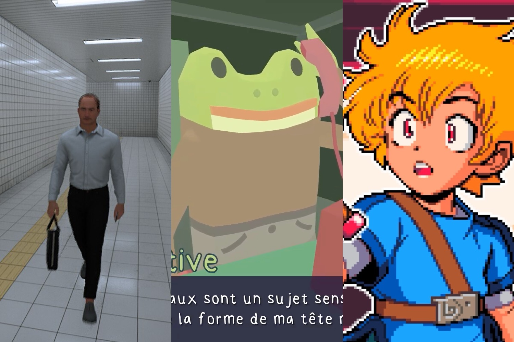

+++
title = "On vide le backlog de la semaine : le carton de Pokémon JCC Pocket, PS5 Pro vs Switch 2, podcast Beyond Astra…"
date = 2024-11-09T07:55:32+01:00
draft = false
author = "Mickael"
tags = ["XXL"]
image = "https://nostick.fr/articles/vignettes/novembre/pokemon-pikachu.jpg"
+++

L’actualité du jeu vidéo ne s’arrête pas à la poignée d’articles publiés sur *Nostick* ! Histoire de rattraper le retard accumulé, voici un retour rapide sur quelques unes des infos les plus importantes (ou insignifiantes) de la semaine.

## L'image de la semaine : qui a dit que Nintendo ne savait plus innover ?

On savait que Kirby avait bon appétit, mais peut-être pas autant. Nintendo vend, au Japon bien évidemment, une peluche à l'effigie de la petite boule rose dont la bouche fait office de distributeur de papier-cul (propre, hein). Pratique, finalement.

Vendue une vingtaine d'euros, ce [Kirby des toilettes](https://store-jp.nintendo.com/item/goods/VM_NSL_8_AAADA) peut également servir à stocker plusieurs rouleaux de PQ et ainsi, sauver l'utilisateur d'une humiliation certaine une fois sur le trône. Non, je ne viens pas de le commander.

## Le chiffre de la semaine : 30 millions…

… comme le nombre de [téléchargements](https://x.com/PokemonTCGP/status/1854728092717129756) pour *Pokémon JCC Pocket* en 9 jours !  Le jeu mobile cartonne, et ça n'est finalement pas si étonnant. La Pokémon Company a fait monter la sauce pendant des mois, il n'y a pas eu de nouveau jeu Pokémon pour la Switch cette année, et puis… on parle de pokémon ici ! 

Et ouvrir des boosters, ça rapporte évidemment énormément d'argent. Selon AppMagic, le jeu a [rapporté](https://www.pocketgamer.biz/pokemon-tcg-pocket-has-second-best-mobile-launch-in-the-franchise-beaten-only-by-pokmon-go/) 33,7 millions de dollars durant sa première semaine ! Il va maintenant falloir que l'éditeur ouvre les échanges entre joueurs et multiplie les événements (plusieurs ont déjà eu lieu) pour maintenir l'intérêt.

## Les soirées bien occupées de la semaine

On ne peut pas dire que la semaine écoulée a été de tout repos. C'est pourquoi *Nostick* vous a proposé chaque jour le mini-test d'un jeu à boucler en une soirée ! Petit récap'.

On a commencé avec [*A Short Hike*](https://nostick.fr/articles/2024/novembre/0411-ca-va-faire-votre-soiree-a-short-hike/), un jeu en 3D vue du dessus dans lequel on incarne un piaf parti gravir la montagne pour passer un coup de fil. Une aventure digne d'être vécue !

Continuons avec [*Turnip Boy Commits Tax Evasion*](https://nostick.fr/articles/2024/novembre/0511-test-turnip-boy-commits-tax-evasion/), une histoire toute mignonne et un peu burlesque au début… qui cache en fait des éléments d'histoire vraiment glauque. Puisqu'on est dans le glauque, pourquoi ne pas poursuivre avec *[Mouthwashing](https://nostick.fr/articles/2024/novembre/0611-ca-va-faire-votre-soiree-moutwashing/)*, un jeu d'horreur qui se déroule dans un vaisseau spatial à la dérive.

Comme si les derniers jours n'avaient pas été suffisamment angoissants, vous pouvez lire (et craquer !) pour l'univers angoissant de *[The Exit 8](https://nostick.fr/articles/2024/novembre/0711-test-the-exit-8/)* dans lequel il faut trouver la porte de sortie (vers un monde meilleur ?). Dans *[Frog Detective](https://nostick.fr/articles/2024/novembre/0811-ca-va-faire-votre-soiree-frog-detective/)*, il faudra résoudre des énigmes dans une ambiance bon enfant et qui donne le sourire. On bouclera la semaine avec *[Castaway](https://nostick.fr/articles/2024/novembre/0911-test-castawy/)*, un jeu d'aventures très inspiré de *Link's Awakening*. Une fois les 3 donjons terminés, le jeu propose une aventure supplémentaire beaucoup plus longue. À découvrir !

## Les deux consoles de la semaine : le successeur de la Switch emballe plus que la PS5 Pro

Deux consoles, deux ambiances. La semaine a été marquée par la PS5 Pro, dont la commercialisation ce 7 novembre n'a pas vraiment soulevé l'enthousiasme des foules. Il faut dire que le tarif demandé — 799,99 €, sans lecteur optique ni support vertical — a [pas mal refroidi les ardeurs](https://nostick.fr/articles/2024/septembre/1409-backlog-ps5-pro-destiny-2-the-crew-2/#la-grosse-info-de-la-semaine--le-retour-de-lhubris-de-playstation). Et puis la démonstration des capacités graphiques de la console n'a guère été probante.

Les tests [parus](https://www.pushsquare.com/features/round-up-ps5-pro-reviews-love-new-tech-and-its-glimpse-of-ps6-potential) la veille du lancement n'ont pas été tellement plus éclairants sur la PS5 Pro. Certes, les heureux testeurs ont pu apprécier des améliorations comme l'upscale PSSR, le ray-tracing, les 2 To de stockage, le Wi-Fi 7 ou encore la fusion des modes performances et qualité rendue possible grâce au [GPU plus puissant](https://nostick.fr/articles/2024/novembre/0411-specs-ps5-pro-enfin-connues/). C'est globalement positif, mais il y a pas mal de nuances à prendre en compte.

Les améliorations graphiques sont les bienvenues si on possède un bon téléviseur (préférez l'OLED), mais ça n'est pas spécialement révolutionnaire pour autant. Le sentiment qui se dégage, c'est que si vous êtes content de votre PS5, il n'y a pas vraiment de raison valable — à part se faire plaisir, ce qui est souvent suffisant — de passer à la caisse.

De son côté, Nintendo a fait du Nintendo, c'est à dire balancer une bombe alors que tout le monde attendait fiévreusement les résultats de l'élection US ! Mais contrairement au résultat des urnes américaines, l'annonce du constructeur a été autrement plus réjouissante : Shuntaro Furukawa, le président du groupe, a confirmé finalement que [les jeux Switch seront compatibles avec sa future console](https://nostick.fr/articles/2024/novembre/0611-jeux-switch-compatibles-future-console-nintendo/) ! 

Une inconnue plane toujours sur la présence d'un port cartouche, mais [vu combien de jeux physiques vend Nintendo](https://nostick.fr/articles/2024/octobre/2610-backlog-ubisoft-jeux-physiques-3ds/#la-grosse-info-de-la-semaine--le-physique-sur-une-voie-de-garage-le-démat-en-force), ce dernier serait bien fou de s'en priver sur sa prochaine console. Le document [publié](https://www.nintendo.co.jp/ir/pdf/2024/241106e.pdf) par Nintendo à l'occasion du trimestre fiscal dessine aussi en creux à quoi pourrait ressembler cette fameuse console. 

Elle conservera l'aspect hybride de la Switch, c'est à dire qu'on pourra y jouer sur la télé ou en mobilité. Le concept a été un succès stratosphérique pour l'entreprise (146 millions d'unités écoulées !) et pourquoi réparer ce qui n'est pas cassé ? De fait, il faut s'attendre à un design très proche de celui qu'on connait, comme [les rumeurs l'ont déjà défloré depuis des mois](https://nostick.fr/articles/2024/mai/0905-switch-2-tout-ce-que-lon-sait/) (voire des années).

L'abonnement payant Nintendo Switch Online (NSO) sera aussi disponible sur cette Switch 2, avec ses services et son catalogue de jeux rétro. Le compte Nintendo sera la passerelle entre les deux consoles ; le constructeur serait bien bête de s'en priver : il en dénombre en effet plus de 366 millions.

Il ne manque plus qu'à la présenter, cette foutue console ! Shuntaro Furukawa a rappelé que que [l'annonce est toujours prévue avant fin mars 2025](https://nostick.fr/articles/2024/novembre/0511-switch-2-toujours-annoncee-5-mois/)…

## On n'a pas eu le temps cette semaine, mais on pense à eux

 

Qui n'aurait pas le désir profond de devenir un maître du Taiko ? Mais si, vous savez, ce petit tambour traditionnel japonais héros de *Taiko no Tatsujin* ! La franchise Bandai Namco, lancée en 2001, connait un nouvel épisode, *Rhythm Festival*. Bon, c'est un jeu de rythme musical évidemment, 76 chansons sont proposées avec 4 modes de difficulté. Ça a l'air aussi coloré qu'entraînant, et c'est dispo sur à peu près toutes les plateformes (50 balles sur [Steam](https://store.steampowered.com/app/2288630/Taiko_no_Tatsujin_Rhythm_Festival/)).

 

De l'action ! De l'aventure ! De la baston ! De la pizza ! Et des tortues bien sûr, puisque *Les Tortues Ninja - Le destin de Splinter* est sorti sur toutes les plateformes, après une exclusivité Apple Arcade remontant à cet été. C'est un roguelike sorti cette semaine, et qui est plutôt bien apprécié sur [Steam](https://store.steampowered.com/app/2996040/Les_Tortues_Ninja__Le_destin_de_Splinter/?l=french) où on le trouvera à 25 € environ.

## Le podcast de la semaine : Nostick la tête dans les étoiles, avec Beyond Astra

Évidemment, on n'allait pas vous laisser sans parler de notre nouveau média, le podcast de Nostick ! De temps en temps, nous vous proposerons de découvrir un jeu et le développeur qui se cache derrière. Pour ce tout premier épisode, on part dans l'espace avec Valentin Simonelli, qui développe depuis quatre ans *Beyond Astra*, un jeu de stratégie 4X qui s'annonce aussi impressionnant que bien fichu.

Avec Valentin, on revient sur le développement du jeu, ce qu'il a à offrir aux joueurs, et surtout… s'il y a des batailles dans l'espace ! C'est à écouter sur [Apple Podcasts](https://podcasts.apple.com/us/podcast/nostick/id1777492094) ou [Spotify](https://open.spotify.com/show/208w9hkiwdG3SISYVXjul1). Vous trouverez un transcript de l'épisode [dans cette actu](https://nostick.fr/articles/2024/novembre/0811-podcast-nostick-beyond-astra/).

Et si ce podcast vous plait et que vous en voulez d'autres, n'hésitez pas à le faire savoir en mettant 5 étoiles et en le partageant sur vos réseaux (sauf Twitter) !

Puisqu'on est à parler tambouille, n'oubliez pas non plus que nous avons lancé le test d'une nouvelle newsletter, « Nostick Express » : l'idée est de proposer un récap' de l'actu JV en milieu de semaine. [Jetez-y un œil](https://nostick.fr/articles/2024/novembre/0711-nostick-express-rendezvous-du-jeudi/)… et [abonnez-vous](https://reloaded.nostick.fr/nostick-express-la-switch-2-sera-retrocompatible-les-specs-de-la-ps5-pro/) !

## osef

Le bide monumental du film *Bordelands* ? Même pas mal pour le patron de Take-Two, qui édite la saga. « *De toute évidence, ce film a été décevant* », a t-il euphémisé auprès d'*[IGN](https://www.ign.com/articles/take-two-ceo-says-borderlands-movie-was-disappointing-but-didnt-hurt-at-all)*. « *Cela dit, il a en fait augmenté les ventes du catalogue. Donc, je ne pense pas que cela ait eu un effet négatif, au contraire, je pense que cela a peut-être même aidé un peu* ». Ah bah alors comme ça, tout le monde est content finalement.

## Dans le reste de l'actu déchaînée

- Les jeux de l'iPod, vous vous rappelez ? Oui, il fallait y jouer à la molette ! Bon, c'était pas terrible, mais il y a quand même eu une grosse cinquantaine avant qu'Apple arrête les frais. Et si vous possédez un baladeur qui traine dans un tiroir poussiéreux, vous pouvez même y jouer : [voici comment](https://nostick.fr/articles/2024/novembre/0411-jeux-ipod-reviennent-vie/).
- La PS5 Pro est finalement disponible depuis cette semaine, et bizarrement Sony a été très avare de détails techniques. Heureusement, [on en sait un peu plus maintenant](https://nostick.fr/articles/2024/novembre/0411-specs-ps5-pro-enfin-connues/) !
- Netflix ne veut pas s'embêter à développer des jeux trop compliqués : l'IA générative va faire le boulot. Mais on se demande à quoi ça va ressembler [dans cette actu](https://nostick.fr/articles/2024/novembre/0511-netflix-met-le-paquet-ia-generative/).
- Star Wars Outlaws va avoir une seconde chance de briller le 21 novembre avec une grosse mise à jour et un lancement sur Steam. Trop peu, trop tard ? En tout cas, [Ubisoft met le paquet](https://nostick.fr/articles/2024/novembre/0511-star-wars-outlaws-vraie-version/).
- Non, la Switch 2 n'a pas été dévoilée cette semaine et désormais, il faudra attendre probablement début 2025, en tout cas on sera au parfum avant la fin mars comme l'a encore assuré Nintendo [dans cette actu](https://nostick.fr/articles/2024/novembre/0511-switch-2-toujours-annoncee-5-mois/).
- On a peine à y croire, mais on a fêté cette semaine les 10 piges de *The Binding of Isaac: Rebirth*, qui offre pour l'occasion le mode co-op en ligne tant attendu. [On fête l'anniv' par ici](https://nostick.fr/articles/2024/novembre/0611-mode-co-op-ligne-10-ans-binding-isaac/).
- *Virtua Fighter*, ça sent les bornes d'arcade du samedi après-midi, la clope froide et la bière éventée dans les salles d'arcade. Une ambiance charmante que Sega veut nous faire revivre avec [un nouveau jeu dans la franchise](https://nostick.fr/articles/2024/novembre/0611-virtua-fighter-revenir-morts-sega/) !
- *GTA 6* est toujours prévu pour l'automne prochain, même si Donald Trump est de retour à la Maison Blanche : il parait qu'il n'aime pas du tout les jeux vidéo violents. [Explications nécessaires dans cette actu](https://nostick.fr/articles/2024/novembre/0711-gta-6-sortira-automne-2025-trump/).
- GeForce Now, le service de cloud gaming de Nvidia, améliore sa formule intermédiaire sans changer de prix. Mais en échange, il y aura une limite de temps de jeu mensuelle. [On fait le point ici](https://nostick.fr/articles/2024/novembre/0711-geforce-now-nvidia-limite-temps/).
- Sega fait le ménage dans ses jeux rétro : des dizaines de titres vont être supprimés des différentes boutiques en ligne. Pourquoi tant de haine ? [On s'en reparle dans cette actu](https://nostick.fr/articles/2024/novembre/0711-sega-vire-dizaines-jeux-retro-boutiques-ligne/).
- *Astro Bot* a fait son petit effet depuis son lancement en septembre ! Le jeu de plateformes a largement contribué à la bonne santé (financière) de PlayStation. [Des chiffres et des petits robots par ici](https://nostick.fr/articles/2024/novembre/0811-astro-bot-petit-robot-grandes-retombees-sony/).