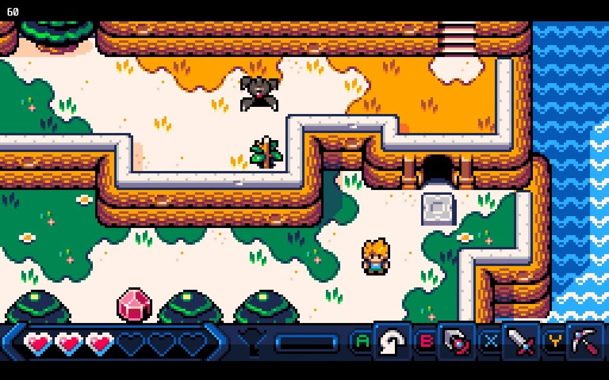
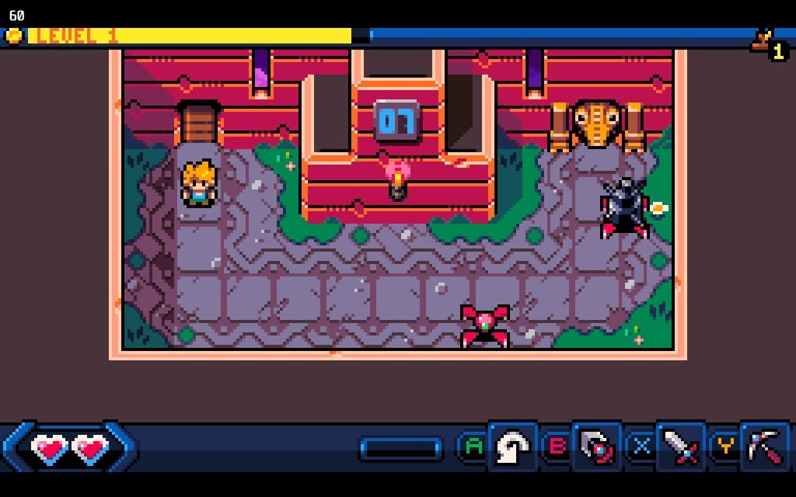

+++
title = "Ça va faire votre soirée : Castaway"
date = 2024-11-09T17:00:32+01:00
draft = false
author = "Mickael"
tags = ["Test"]
image = "https://nostick.fr/articles/vignettes/octobre/castaway-3.jpg"
+++

**Les jeux qui exigent une attention de tous les instants pendant des dizaines d'heures, OK, c'est sympa, mais parfois on préférerait quelque chose de court et d'efficace. C'est pourquoi nous allons vous proposer chaque jour de la semaine un jeu à commencer et à terminer en une soirée ! Aujourd'hui : *Castaway*.**

## Castaway

*Link's Awakening* n'a pas fini d'inspirer les développeurs. *Castaway* est le dernier membre du club (le jeu est sorti cet été), mais pas le moins intéressant ! L'île plus ou moins déserte sur laquelle s'échoue le héros — un vaisseau spatial plutôt qu'un bateau — est pleine de secrets… et de trois donjons qu'il faudra parcourir pour récupérer l'équipement perdu dans le crash, ainsi que son chien.

Le mode Histoire est très court : on peut le terminer en moins de 45 minutes sans trop forcer. C'est d'ailleurs un peu dommage : les donjons sont agréables et on en aurait bien pris un ou deux de plus ! Agencés comme des casse-tête à la Zelda, ces passages obligés nécessitent de faire chauffer la matière grise et d'exploiter les équipements retrouvés. Ils se terminent par des boss pas trop difficiles, même si un peu d'agilité et de réactivité ne seront pas de trop.

*Castaway* ne s'arrête pas là. On pourrait même dire que le vrai jeu débute après cette petite aventure. Il faut en effet grimper une tour de 50 étages, qui sont autant de niveaux qui mettront les nerfs à rude épreuve. On démarre la grimpette avec toutes ses armes, mais seulement deux cœurs qui, en cas d'épuisement du stock, seront synonymes de retour tout en bas de l'échelle.

Mises bout à bout, ces deux séquences représentent 3 ou 4 heures de jeu. Pas si mal pour un « micro jeu d'action-aventure », comme l'appelle le studio Canari Games ! Si on apprécie les graphismes pixel-art qui évoquent immanquablement le jeu de Nintendo, ainsi que la bande-son chiptune, *Castaway* souffre de petits soucis de gameplay : l'épée a parfois du mal à toucher les ennemis positionnés en diagonale[^1], le perso n'est pas très rapide, et puis le mode Tour aurait beaucoup gagné à être un roguelite. Les niveaux ne sont pas générés aléatoirement, du coup à chaque mort on se retrouve à devoir franchir les mêmes embûches, ce qui finit par être lassant.

On passe malgré tout un bon moment devant *Castaway*, grâce à des graphismes mignons comme tout et sa bonne ambiance. Que vouloir de plus pour une soirée ?

- ***Castaway*** est disponible sur Steam pour [7,99 €](https://store.steampowered.com/app/2564860/Castaway/).

[^1]: Une mise à jour récente améliore la gestion des collisions et la précision des hitboxes.