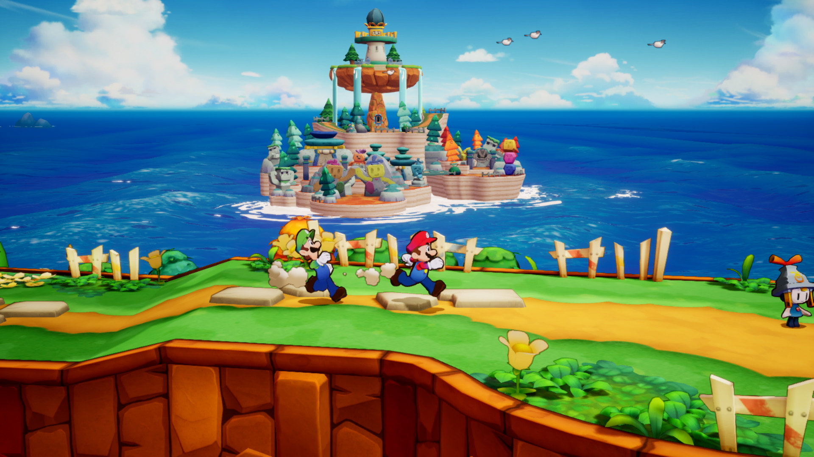
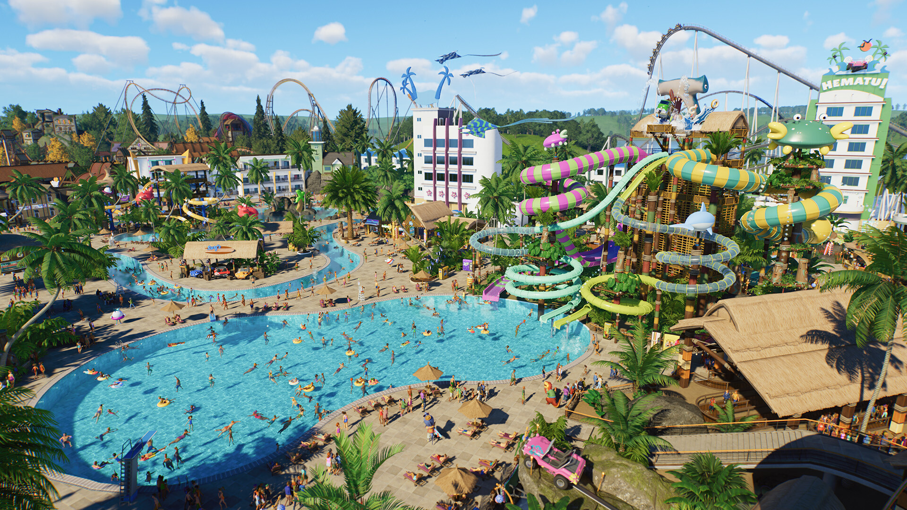

+++
title = "Mario & Luigi : l’Épopée Fraternelle, Slitterhead : le récap des sorties de la semaine (10/11)"
date = 2024-11-10T06:00:02+01:00
draft = false
author = "Félix"
tags = ["C’est dispo"]
image = "https://nostick.fr/articles/2024/1011-les-sorties-de-la-semaine/mariol.jpg"
+++

Entre la garderie, les courses et le retour de Trump, vous n’avez peut-être pas eu le temps de vous intéresser aux nouveautés du moment. Qu’à cela ne tienne : voici les sorties de ces derniers jours qui ont retenu notre attention.

## À deux, c’est pas toujours mieux

Retour en demi-teinte pour la saga de RPG *Mario & Luigi*. Presque dix ans après le dernier épisode, les deux frères reviennent dans une ***Épopée fraternelle*** invitant à découvrir le monde maritime de Connexia et ses différentes îles. Pas question de sauter de Goomba en Goomba ici, mais plutôt d’explorer sans se presser avant de se battre au tour par tour pour engranger des points d’XP. Comme d’habitude, le jeu tire parti du fait que l’on contrôle un duo de personnages pour rythmer les combats et les puzzles. Malheureusement, l’accueil a été tiède : les testeurs déplorent un jeu assez plat dans son humour comme son histoire, pas aidé par une partie technique aux fraises et un aspect répétitif. Les combats funs renouvelés par de nouvelles mécaniques sauvent un peu les meubles, mais quand *JVC* mets 14/20 et qu’*IGN* tape du poing en collant un 5/10, c’est que c’est quand même pas terrible. En espérant que la prochaine sera la bonne et qu’il ne faudra pas attendre une décennie de plus pour un nouvel opus. 60 € [sur Switch](https://www.nintendo.com/fr-fr/Jeux/Jeux-Nintendo-Switch/Mario-Luigi-L-epopee-fraternelle-2590264.html).

## La fête du Slit

Le créateur du premier *Silent Hill*, de *Gravity Rush* et de la série *‌Forbidden Siren* a lancé cette semaine son nouveau jeu : ***Slitterhead***. On le sentait moyen étant donné qu’il avait prévenu que celui-ci serait « [brut de décoffrage](https://www.videogameschronicle.com/news/toyama-says-like-silent-hill-slitterhead-will-be-rough-around-the-edges/) », et ça n’a pas loupé : les premiers retours ne sont pas très encourageants. On y explore une ville inspirée de Hong-King bardée de néons dans laquelle des extraterrestres suceurs de cerveaux se font passer pour des humains, à la *The Thing*. Pour les contrer, le joueur incarne un esprit pouvant prendre contrôle de n’importe quel être vivant à proximité (garde, policier, mais aussi chien, grand-mère…). Si ça a l’air de donner des combats foutraques et un chouette univers, le jeu souffre d’un manque de budget et n’est pas à la hauteur de ses ambitions. Les testeurs critiquent des passages d’infiltration limités, une absence de doublage, un manque de liberté et un côté répétitif, ce qui commence à faire beaucoup. Pourquoi pas dans quelques mois à -50 % sur Steam, mais en l’état et pour 60 balles ça fait cher le 6/10. Dispo [sur PC](https://store.steampowered.com/app/2631250/Slitterhead/), Xbox et PS5. 

 

## The ride never ends

La licence ***Planet Coaster*** rempile pour un deuxième épisode promettant de nous faire retrouver les sensations du vénérable *Roller Coaster Tycoon*. On y construit et gère son parc d’attractions, avec comme principale nouveauté l’ajout de manèges aquatiques allant de l’espace piscine/toboggan aux montagnes russes passant dans l’eau. Évidemment, cela se traduit par un système de filtration de la flotte et l’embauche de maîtres-nageurs. Ce second *Planet Coaster* peaufine une formule qui marchait déjà très bien et brille par ses options de personnalisation (les autres pourront télécharger des manèges en ligne via la boutique incluse). Les tests décrivent une bonne pioche si vous êtes client du genre, mais les joueurs ne sont pas contents : ils se plaignent d’une interface pensée pour les pads et d’un manque de contenu par rapport au jeu d’origine. À vous de voir selon votre profil, sachant que le nombre d’options et les tutoriels pourront effrayer les petits nouveaux. 60 € [sur Steam](https://store.steampowered.com/app/2688950/Planet_Coaster_2/), Xbox et PS5.

##  Un peu de tactique dans ce monde de brutes

La licence **Metal Slug** cherche à se renouveler avec un nouvel opus **Tactics** qui tente la carte tactical-RPG. Pas question de courir partout en canardant tout ce qui bouge étant donné qu’on est ici face à du tour par tout en vue isométrique. Le titre garde la mentalité run n’ gun en forçant à déplacer ses troupes pour venir à bout des boss et autres ennemis. Chaque personnage dispose d’armes et de capacités spéciales, et il va donc falloir bien préparer son équipe pour profiter des combos les plus adaptés. Les missions durent une petite vingtaine de minutes et sont variées : liquider tous les ennemis, sauver des otages, survivre un certain nombre de tours… Le jeu tire sur la fibre nostalgique avec de délicieux graphismes en pixel art donnant vie aux PNJ, ennemis et autres véhicules vus sur bornes d’arcade. Les tests sont positifs, mais mettent tout de même en avant un gros paquet de bugs et une sensation que le jeu est sorti un peu vite du four. Un titre à glisser en wishlist et à acheter dans quelques semaines le temps que les développeurs patchent tout ça. 25 € sur toutes les consoles (même les vieilles), [Steam](https://store.steampowered.com/app/1590760/Metal_Slug_Tactics/) et inclus dans le Game Pass.

 

## Mais aussi

Les fans de réalité virtuelle ayant fait le tour du dernier *Batman* seront peut-être tentés par ***Metro Awakening***, une aventure souterraine dans laquelle le port du casque (VR) est obligatoire. Malheureusement les tests sont mitigés et décrivent un jeu au début sympa mais qui s’essouffle rapidement : au vu du tarif [de 40 €](https://store.steampowered.com/app/2669410/Metro_Awakening/), il n’y a pas d’urgence à se jeter dessus. Le joli STR tiré du roman ***Les Fourmis*** est sorti cette semaine sur PC et consoles et se tape de bons retours, alors pourquoi pas si vous avez [40 € qui traînent](https://store.steampowered.com/app/2287330/Les_Fourmis/?l=french) et que vous n’avez pas piqué du nez sur les bouquins. Le jeu multi rigolo ***‌Unrailed*** a cette semaine gagné une suite en accès anticipé qui devrait vous plaire si vous cherchez de quoi vous occuper avec quelques copains ([20 €](https://store.steampowered.com/app/2211170/Unrailed_2_Back_on_Track/?curator_clanid=42040139)). Terminons en évoquant la sortie de ***Mirthwood***, un RPG cozy à la patte graphique très chouette qui a eu de bonnes notes ici et là. Comptez 25,50 €, sachant qu’il y a une démo [sur Steam](https://store.steampowered.com/app/2272900/Mirthwood/).
