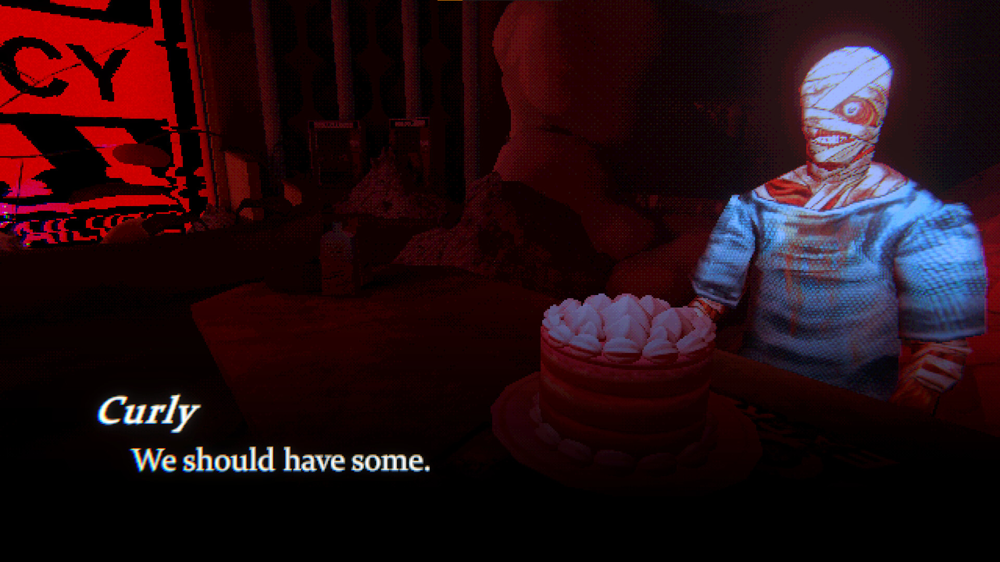

+++
title = "Ça va faire votre soirée : Mouthwashing"
date = 2024-11-06T16:00:01+01:00
draft = false
author = "Félix"
tags = ["XXL"]
image = "https://nostick.fr/articles/2024/juillet/1407-anger-foot-once-human-sorties-de-la-semaone/anger.jpg"
+++

***Mouthwashing*** est un jeu d’horreur durant environ 2h30 et  se savourant comme un bon film. Le pitch est simple : on suit le personnel d’un vaisseau spatial dont le capitaine a pété les plombs et foncé dans un astéroïde. Celui-ci ayant loupé son suicide, le cargo est à la dérive et l’équipage se sait condamné à une lente agonie. Le capitaine n’est pas mort et passe ses journées à gober des antidouleurs en gémissant dans l’infirmerie tandis que les autres comptent les dernières rations de bouffe.

Difficile d’en dire plus sans spoiler, mais sachez que ce jeu d’horreur low-poly aborde un paquet de thèmes : la folie bien sûr, mais aussi l’humanité, le fait de prendre ses responsabilités, le monde du travail… L’horreur se traduit par les situations traversées (tout le monde pète un boulon) mais aussi par des scènes oniriques métaphoriques marquantes s’amusant du médium vidéoludique. Pas de screamer cheap ou de gore excessif à signaler, même si on notera quelques séquences peu ragoûtantes sur la fin.

*Mouthwashing* est un jeu qui réussit à faire beaucoup avec peu. Les graphismes en low-poly donnent une patte très sympathique participant à l’atmosphère stressante, et si le gameplay se résume globalement à marcher ou à résoudre de petites énigmes, le malaise est bien présent et on a envie de voir la fin. Tout n’est pas parfait, mais le jeu suinte l’envie de bien faire et est très peaufiné pour un jeu indé. Si vous cherchez un jeu flippant à poncer en une soirée, vous ne devriez pas regretter votre choix.

- **Moutwashing** est disponible uniquement sur PC [pour 12,79 €](https://store.steampowered.com/app/2475490/Mouthwashing/#app_reviews_hash).