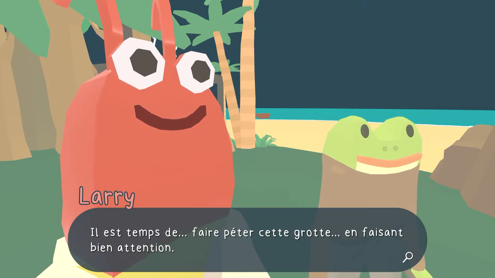

+++
title = "Ça va faire votre soirée : Frog Detective"
date = 2024-11-08T16:00:01+01:00
draft = false
author = "Félix"
tags = ["XXL"]
image = "https://nostick.fr/articles/2024/juillet/1407-anger-foot-once-human-sorties-de-la-semaone/anger.jpg"
+++

**Les jeux qui exigent une attention de tous les instants pendant des dizaines d'heures, OK, c'est sympa, mais parfois on préférerait quelque chose de court et d'efficace. C'est pourquoi nous allons vous proposer chaque jour de la semaine un jeu à commencer et à terminer en une soirée ! Aujourd'hui : *Frog Detective*.**

## Frog Detective

Je suis tombé sur ***Frog Detective*** un peu au pif après avoir reçu un mois d’abonnement au Game Pass. Divisé en trois épisodes, ce jeu pour-enfants-mais-pas-que nous invite à enchausser les bottes de la Grenouille Détective, qui a reçu pour mission de résoudre différents mystères. Tout est très *feel good*, avec des graphismes patauds, des personnages-animaux mignons et une atmosphère enfantine réussie. Chaque épisode se boucle en une heure et n’implique pas vraiment de réfléchir étant donné qu’il suffit globalement de parler à X, Y puis Z pour faire avancer l’intrigue.

Mais alors, pourquoi diable jouer à *Frog Detective* si on a plus de 8 ans ? Parce que c’est un titre qui donne le sourire : le jeu est globalement charmant avec sa galerie de personnages hauts en couleur tous très bavards. Les dialogues sont prétexte à une avalanche de blagues et de *running-gags* bêtes, mais faisant très souvent mouche. Chaque nouvel épisode se révèle plus profond que le précédent, et le tout est servi par une traduction française excellente.

Si vous avez un môme ou que vous avez un coup de mou en ce moment (ou les deux !), vous *devez* jouer à *Frog Detective*. Ce trio d’aventures vous fera à coup sûr souffler du nez derrière votre écran et dispose d’un look qui redonnerait le moral à n’importe qui. On regrettera juste que le premier épisode soit un peu en deçà du reste, les deux développeurs ayant réellement trouvé leur rythme de croisière à partir du deuxième. *[The Operator](https://nostick.fr/articles/2024/octobre/0410-nos-lecteurs-ont-du-talent-the-operator/)* sera peut-être plus dans vos cordes si vous cherchez une enquête sérieuse, mais si vous cherchez de petites aventures absurdes remplies de situations loufoques, *Frog Detective* est un immanquable.
 
- Les trois opus de ***Frog Detective*** sont disponibles [pour 20 €](https://store.steampowered.com/bundle/28689/Frog_Detective_1__2__3/) sur PC, Mac, PS4/PS5 et Xbox Series dans un bundle appelé « Le Mystère tout entier ».